* TOC
{:toc}

## Shaping and layout

I've called this book "Fonts and Layout for Global Scripts", because I wanted it to be about the whole journey of getting text through a computer and out onto a display or a piece of paper. Having the fonts designed and engineered correctly is the first step in this; but there's a lot more that needs to be done to use those fonts.

There are a number of stages that the letters and numbers you want to typeset go through in order to become the finished product. To begin with, the user (or in some cases, the computer) will choose what font the text should be typeset in; the text, and the choice of font and other typographic details, are the inputs to the process. These two inputs pass through some or all of the following stages before the text is set:

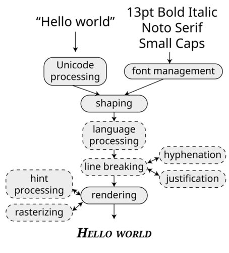

We can understand most of these steps by taking the analogy of letterpress printing. A compositor will be given the text to be set and instructions about how it is to look. The first thing they'll do is find the big wooden cases of type containing the requested fonts. This is *font management*: the computer needs to find the file which corresponds to the font we want to use. It needs to go from, for example, "Arial Black" to `C:\\Windows\\Fonts\\AriBlk.TTF`, and so it needs to consult a database of font names, families, and filenames. On libre systems, the most common font management software is called [fontconfig](https://www.fontconfig.org); on a Mac, it's [NSFontManager](https://developer.apple.com/documentation/appkit/nsfontmanager?language=objc).

They'll also have to make sure they can read the editor's handwriting, checking they have the correct understanding of the input text. In the computer world, correctly handling some scripts may require processes of reordering and re-coding required so that the input is correctly interpreted. This is called Unicode processing, and as we will see in the next chapter, is often done using the [ICU](http://site.icu-project.org) library.

> Yes, that example was a bit of a stretch. I know.

Next, the hand compositor will pick the correct metal sorts for the text that they want to typeset.

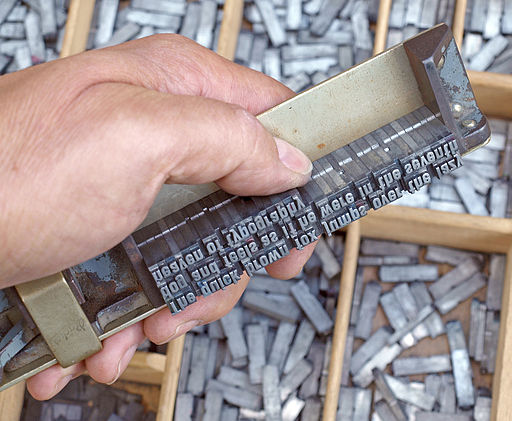{: width="120px" }

They will need to be aware of selecting variants such as small capitals and swash characters. In doing this, they will also *interpret* the text that they are given; they will not simply pick up each letter one at a time, but will consider the desired typographic output. This might mean choosing ligatures (such as a single conjoined "fi" sort in a word with the two letters "f" and "i") and other variant forms when required. At the end of this process, the input text - perhaps a handwritten or typewritten note which represents "what we want to typeset" - will be given concrete instantiation in the actual pieces of metal for printing. When a computer does this selection, we call it *shaping*. On libre systems, this is usually done by [HarfBuzz](https://www.harfbuzz.org/); the Windows equivalent is called [DirectWrite](https://docs.microsoft.com/en-us/windows/win32/directwrite/direct-write-portal) (although this also manages some of the later stages in the process as well).

At the same time that this shaping process is going on, the compositor is also performing *layout*. They take the metal sorts and arrange them on the compositing stick, being aware of limitations such as line length, and performing whatever spacing adjustments required to make the text look natural on the line: for some languages, this will involve hyphenation, the insertion of spaces of different widths, or even going back and choosing other variant metal sorts to make a nicer word image. For languages such as Thai, Japanese or Myanmar which are written without word breaks, they will need to be aware of the semantic content of the text and the typographic conventions of the script to decide the appropriate places to end a line and start a new one.

In a computer, this layout process is normally done within whatever application is handling the text - your word processor, desktop publishing software, or design tool - although there are some libraries which allow the job to be shared.

Finally, the page of type is "locked up", inked, and printed. In a computer, this is called *rendering*, and involves *rasterizing* the font - turning the outlines into black and white (and sometimes other colored!) dots, taking instructions from the font about how to make the correct selection of dots for the font size requested. Once the type has been rasterized, it's generally up to the application to place it at the appropriate position on the screen or represent it at the appropriate point in the output file.

So using a font - particularly an OpenType font - is actually a complex dance between three actors: the top level providing *layout* services (language and script handling, line breaking, justification), the *shaping* engine (choosing the right glyphs for the input), and the font itself (which gives information to the shaping engine about its capabilities). John Hudson calls this the "OpenType collaborative model", and you can read more about it in his [Unicode Conference presentation](http://www.tiro.com/John/Hudson_IUC39_Beyond_Shaping.pdf).

## Characters and glyphs

We've been talking loosely about "letters" and "numbers" and "stuff you want to typeset". But that's a bit cumbersome; we need a better way to talk about "letters and numbers and symbols and other stuff." As it happens, we're going to need *two* specific terms to be able to talk about "letters and numbers and symbols and other stuff."

The first term is a term for the things that you design in a font - they are *glyphs*. Some of the glyphs in a font are not things that you may think need to be designed: for example, the space between words is a glyph. Some fonts have a variety of different space glyphs. Font designers still need to make a decision about how wide those spaces ought to be, and so there is a need for space glyphs to be designed.

Glyphs are the things that you draw and design in your font editor - a glyph is a specific design. My glyph for the letter "a" will be different to your glyph for the letter "a". But in a sense they're both the letter "a". Their semantic content is the same.

So we are back to needing a term for the generic version of any letter or number or symbol or other stuff, *regardless of how it looks*: and that term is a *character*. "a" and `a` and *a* and **a** are all different glyphs, but the same character: behind all of the different designs is the same Platonic ideal of an "a". So even though your "a" and my "a" are different, they are both the character "a"; this is something that we will look at again when it comes to the chapter on Unicode, which is a *character set*.

## Dimensions, sidebearings and kerns

As mentioned above, part of the design for a font is deciding how wide, how tall, how deep each glyph is going to be, how much space they should have around them, and so on. The dimensions of a glyph have their own set of terminology, which we'll look at now.

### Units

First, though, how do you measure stuff in a font? When fonts were bits of metal, it was easy: you could use callipers or a micrometer to measure the sort, and get an answer in millimeters or printers points. But digital fonts, as we've seen in the previous chapter, are meant to be scalable; that is, usable at any size. With scalable fonts, there isn't such a thing as a 12pt Times Roman as distinct from a 16pt Times Roman; there isn't any *size* there at all.

So coordinates and size values inside digital fonts are defined in terms of an *em square*, which is itself divided into an arbitrary number of *units*, typically 1000, 1024 or 2048. If we want to display text at 12 points, we draw the *em square* at that size, and then scale up the design to match.

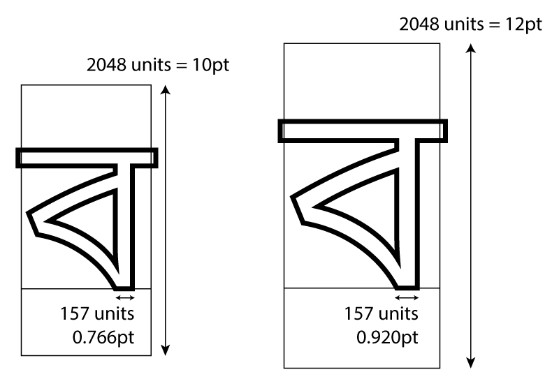

We can see a number of things from this diagram. First, we notice that the glyph outline doesn't need to be contained within the em square itself. It's just a notional rectangular box, a kind of digital type sort. (Yes, the old lining-up-boxes model of typography again.) In this case, with Bengali script, we want to make sure that the headline is always connected, so there is a slight overlap between the glyphs to make this happen, leading to the outline of the headline jutting out the left and right side of the em square.

Notice also that the baseline and full height of the glyph are not determined by the em square itself; the designer decides where to put the outlines within the em square, and even how high to make the outlines. This can mean that different digital fonts which are notionally the same type size actually appear at different sizes!

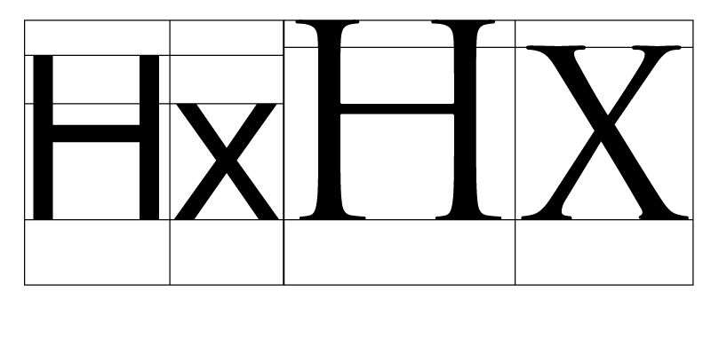

Here the designers of Noto Sans and Trajan have placed the outlines in the em square in different ways: Trajan uses a bigger body, a higher x-height, and fills up the square more, whereas Noto Sans leaves space at the top. (Both of them leave space at the bottom for descenders.) We'll look at the differing heights used in font design a little later, but for now just remember that because the em-square is a notional size and designers can put outlines inside it however they like, a 12pt rendering of one font may be "bigger" than a 12pt rendering of another, even if the em square is scaled to be the same size.

However, dividing this notional square up into a number of units gives us a co-ordinate system by which we can talk about where the outlines fall on the glyph. Instead of saying "make the horizontal stem width about a tenth of the height", we can say "make the horizontal stem width 205 units wide", and that'll be scalable - true for whatever size of font we're talking about.

We'll use these *font units* every time we talk about the dimensions within a font.

### Advance widths

You may have also noticed that while we call it an em *square*, there's nothing really square about it. It's more of an em *rectangle*. Let's think about the dimensions of this rectangle.

Let's first assume that we're designing a horizontal font; in that case, one of the most important dimensions of each glyph is the width of the em square - not just the black part of the glyph, but also including the space around it. You will often hear this referred to as the *advance width*, or the *horizontal advance*. This is because most layout systems, working on the typographic model we saw at the beginning of this book, keep track of the X and Y co-ordinates of where they are going to write glyphs to the screen or page; after each glyph, the writing position advances. For a horizontal font, a variable within the layout system (sometimes called the *cursor*) advances along the X dimension, and the amount that the cursor advances is... the horizontal advance.

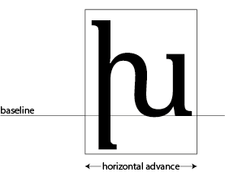

Glyphs in horizontal fonts are assembled along a horizontal baseline, and the horizontal advance tells the layout system how far along the baseline to advance. In this glyph, (a rather beautiful Armenian letter xeh) the horizontal advance is 1838 units. The layout system will draw this glyph by aligning the dot representing the *origin* of the glyph at the current cursor position, inking in all the black parts and then incrementing the X coordinate of the cursor by 1838 units.

Note that the horizontal advance is determined by the em square, not by the outlines.

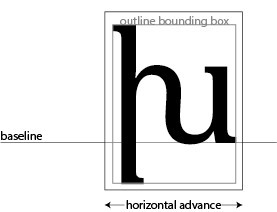

The rectangle containing all the "black parts" of the glyph is sometimes called the *ink rectangle* or the *outline bounding box*.  In the Bengali glyph we saw above, the horizontal advance was *smaller* than the outline bounding box, because we wanted to create an overlapping effect. But glyphs in most scripts need a little space around them so the reader can easily distinguish them from the glyphs on either side, so the horizontal advance is usually wider than the outline bounding box. The space between the outline bounding box and the glyph's bounding box is called its sidebearings:

As in the case of Bengali, there will be times where the ink rectangle will poke out of the side of the horizontal advance; in other words, the sidebearings are negative:

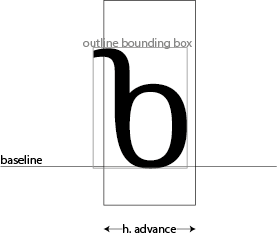

In metal type, having bits of metal poking out of the normal boundaries of the type block was called a *kern*. You can see kerns at the top and bottom of this italic letter "f".

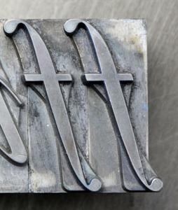

In digital type, however, the word "kern" means something completely different...

### Kerns

As we have mentioned, a layout system will draw a glyph, move the cursor horizontally the distance of the horizontal advance, and draw the next glyph at the new cursor position.

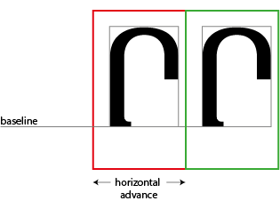

However, to avoid spacing inconsistencies between differing glyph shapes (particularly between a straight edge and a round) and to make the type fit more comfortably, the designer of a digital font can specify that the layout of particular pairs of glyphs should be adjusted.

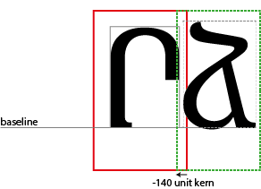

In this case, the cursor goes *backwards* along the X dimension by 140 units, so that the backside of the ja is nestled more comfortably into the opening of the reh. This is a negative kern, but equally a designer can open up more space between a pair of characters by specifying a positive kern value. We will see how kerns are specified in the next two chapters.

### Heights

But first, let's think a little bit about the different measurements of height used in a glyph. Again, we're going to be assuming that we are designing for a horizontal writing system.

The first height to think about is the *baseline*. We have mentioned this already, as the imaginary line on which the glyphs are assembled. In a sense, it's not really a height - in terms of a co-ordinate grid, this is the origin; the y co-ordinate is zero. This doesn't necessarily mean that the "black part" of the glyph starts at the baseline. Some glyphs, such as this plus sign, have the black parts floating above the baseline:

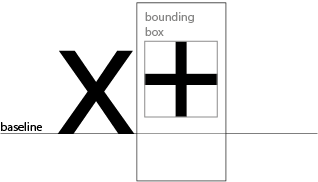

In this case, the baseline is coordinate zero; the glyph begins 104 units above the baseline. But the plus sign needs to be placed above the baseline, and having a baseline as the origin tells us how far above it needs to be placed.

Within a font, you will often have various heights which need to "line up" to make the font look consistent. For example, in the Latin script, all capital letters are more or less lined up at the same height (modulo some optical correction) - this is called the "cap height". All of the ascenders and descenders will fall at the same position, as will the tops of the lower-case letters (this last height is called the "x-height"). As we have seen, these notional lines can be positioned anywhere in the em-square you like, as your design calls for it; and different designs, even within the same script, will have them at differing heights: we saw in our example above that Trajan has a very high x-height relative to its cap height, and a taller cap height in absolute terms than Noto Serif. The different design heights for a font are called their *vertical metrics*. Here are some vertical metrics for a typical Latin typeface, all given in font units:

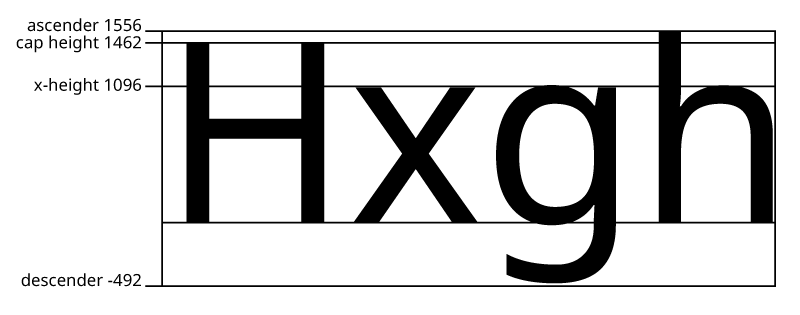

For some scripts, though, these concepts won't make any sense - Chinese, Japanese and Korean fonts, for instance, just have an em square. In other cases, glyphs aren't arranged according to their baselines in the way that Latin expects; particularly Indic scripts like Devanagari, arrange glyphs along other lines, the so-called "headline":

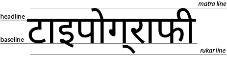

For the purposes of font technology, this headline doesn't really exist. OpenType is based on the Latin model of arranging glyphs along the baseline, and so even in a script with a headline, the font needs to be designed with the baseline in mind, and you still have to declare nominal x-heights, ascender heights, descender heights and so on when you design the vertical metrics of your glyph. The Latin pull of digital typography is, unfortunately, really strong.

### Vertical advance

Not all scripts are written horizontally! Computers are still pretty bad at dealing with vertical scripts, which is why we need books like this, and why we need readers like you to push the boundaries and improve the situation.

In a vertical environment, the baseline is considered the middle of the glyph, and the distance to be advanced between em-squares is the *vertical advance*:

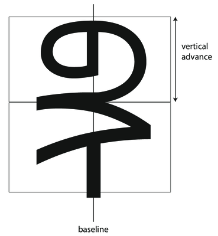

For fonts which have mixed Latin and CJK (Chinese, Japanese, Korean), just ignore the Latin baseline and cap heights and put the glyph outlines in the middle of the em square.

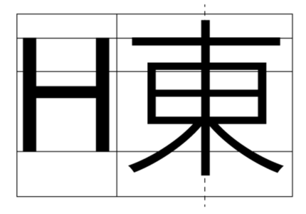

> Font editors usually support vertical layout metrics for Chinese and Japanese; support for vertical Mongolian is basically non-existant. (To be fair, horizontal Mongolian doesn't fare much better.) However, the W3C (Worldwide Web Consortium) has just released the [Writing Models Level 3](https://www.w3.org/TR/css-writing-modes-3/) specification for browser implementors, which should help with computer support of vertical writing - these days, it seems to be browsers rather than desktop publishing applications which are driving the adoption of new typographic technology!

### Advance and Positioning

The *advance*, whether horizontal or vertical, tells you how far to increment the cursor after drawing a glyph. But there are situations where you also want to change *where* you draw a glyph. Let's take an example: placing the fatha (mark for the vowel "a") over an Arabic consonant in the world ولد (boy):

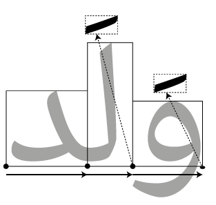

We place the first two glyphs (counting from the left, even though this is Arabic) normally along the baseline, moving the cursor forward by the advance distance each time. When we come to the fatha, though, our advance is zero - we don't move forward at all. At the same time, we don't just draw the fatha on the baseline; we have to move the "pen" up and to the left in order to place the fatha in the right place over the consonant that it modifies. Notice that when we come to the third glyph, we have to move the "pen" again but this time by a different amount - the fatha is placed higher over the lam than over the waw.

This tells us that when rendering glyphs, we need two concepts of where things go: *advance* tells us where the *next* glyph is to be placed, *position* tells us where the current glyph is placed. Normally, the position is zero: the glyph is simply placed on the baseline, and the advance is the full width of the glyph. However, when it comes to marks or other combining glyphs, it is normal to have an advance of zero and the glyph moved around using positioning information.

If you just perform layout using purely advance information, your mark positioning will go wrong; you need to use both advance and glyph position information provided by the shaper to correctly position your glyphs. Here is some pseudocode for a simple rendering process:

    def render_string(glyphString, xPosition, yPosition):
        cursorX = xPosition
        cursorY = yPosition
        for glyph in glyphString:
            drawGlyph(glyph,
                x = cursorX + glyph.xPosition,
                y = cursorY + glyph.yPosition)
            cursorX += glyph.horizontalAdvance
            cursorY += glyph.verticalAdvance

## Bézier curves

We've already mentioned that outlines in digital fonts are made out of lines and Bézier curves. I'm not going to spend a lot of time getting into the mathematics of how Bézier curves work, but if you're doing any kind of implementing -  rasterising, font editing or font manipulation - you would be wise to spend some time looking through Mike Kamerman's [A Primer on Bézier Curves](https://pomax.github.io/BezierInfo-2/).

What is worth considering, for our purposes, is the difference between *quadratic* and *cubic* Bézier curves. As we've seen, Bézier curves are specified by a start point, an end point, and one or more control points, which pull the curve towards them. A quadratic Bézier curve has one control point, whereas a cubic Bézier curve has two. (Higher order curves are possible, but not used in type design.)

TrueType outlines use quadratic Bézier curves, whereas PostScript fonts use cubic Bézier curves; it's possible to convert from a quadratic curve to a cubic curve and get the same shape, but it's not always possible to perfectly go from a cubic curve to a quadratic curve - you have to approximate it. Again, you'll find all the details in A Primer on Bézier Curves.

I've said that outlines are made out of Bézier curves, but a more accurate way to say that is that they are made of a series of Bézier curves joined together. When two Bézier curves meet, they can either meet in a *smooth* join or at a *corner*. You will use both of these types of join in type design; generally, you will want things to be smooth if they would form part of the same "stroke" of a pen or brush, but there are places where you'll need corner joins too. Here you see a portion of the top edge of a letter m, which contains a smooth join and a corner join.

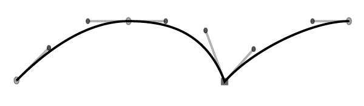

The main condition for a smooth join is that you can draw a straight line through an on-curve point and the both off-curve points (often called "handles" because you can pull on them to drag the curve around) to the left and right of it - as you can see in the first join above. The second join has handles at differing angles, so it is a corner join.

Your font editor will have ways of creating smooth and corner joins; the problem is that what we've called a "smooth" join, formed by aligning the angles of the handles (which is called *C1* continuity), isn't guaranteed to be *visually* smooth. Consider the following two paths:

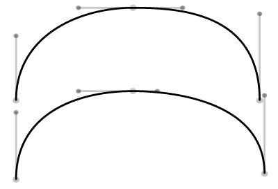

Do they look very similar? How about if you think of them as roads - which is easier to drive on? The upper path will require you to bring your steering wheel back to central for the straighter portion where the two Bézier curves join, before turning right again. The lower path continuously curves so that if you get your steering wheel in the right place at the start of the road, you hardly need to turn the wheel as you drive along it. Many font editors have facilities for matching the curvature on both sides of the on-curve point (which is known as G2 continuity), either natively or through add-ons like [SpeedPunk](https://yanone.de/software/speedpunk/) or [SuperTool](http://www.corvelsoftware.co.uk/software/supertool/).

## Color and bitmap fonts

We've seen that OpenType is now the leading font format in the digital world, and that it contains glyphs made out of Bézier curves. But you can actually draw glyphs in other ways and embed them in OpenType fonts too.

As we saw in the history chapter, the earliest fonts were bitmap fonts: all of the glyphs were pictures made out of pixels, which were not scalable. But the early fonts had quite small bitmaps, and so didn't look good when they were scaled up. If the bitmap picture inside your font is big enough, you would actually be scaling it *down* at most sizes, and that looks a lot better.

And of course, another thing that's happened since the 1960s is that computer displays support more than one colour. The rise of emoji means that we now expect to have fonts with multi-colored glyphs - meaning that the font determines the colors to paint the glyph in, instead of having the application specify the color.

OpenType gives you a range of options for embedding colored and bitmapped images into your fonts: monochrome bitmaps, color bitmaps, color fonts, "Apple-style color fonts", and SVG fonts. These options can be mixed and matched; you can use more than one of these technologies in the same font, to allow for a greater range of application compatibility. For example, at the time of writing, a font with "color font" (COLR) outlines and SVG outlines will have the SVG outlines displayed on Firefox and the COLR outlines displayed on Internet Explorer and Chrome (which do not support SVG). The color bitmap font format (CBDT) is only really used by Google for emoji on Android.

See ["Color Fonts! WTF?"](https://www.colorfonts.wtf) for the latest news on support for color fonts by applications and browsers.
