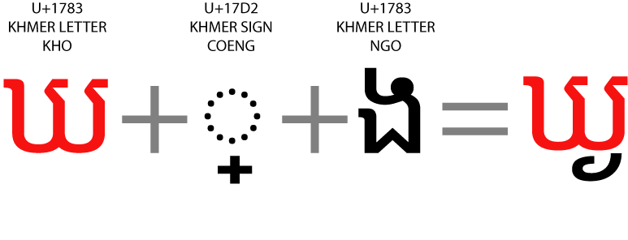
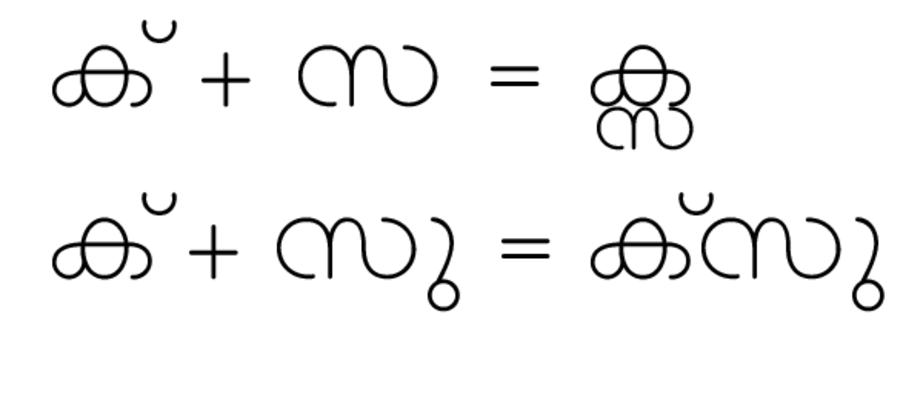
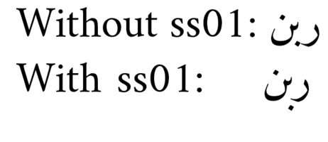
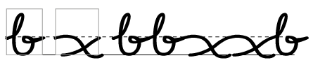
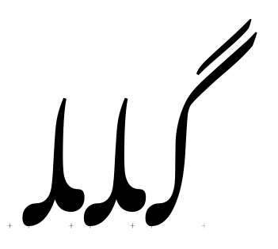
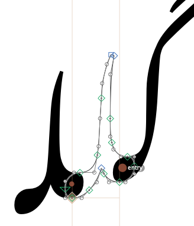
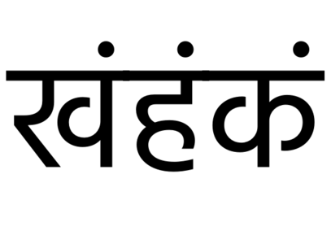
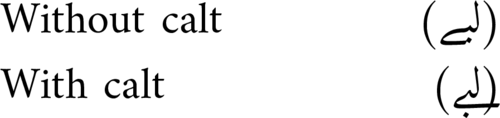

As we have seen, OpenType Layout involves first *substituting* glyphs to rewrite the input stream, and then *positioning* glyphs to put them in the right place. We do this by writing collections of *rules* (called lookups). There are several different types of rule, which instruct the shaper to perform the substitution or positioning in subtly different ways.

In this chapter, we'll examine each of these types of rule, by taking examples of how they can be used to layout global scripts. In the next chapter, we'll look at things the other way around - given something we want to do with a script, how can we get OpenType to do it? But to get to that stage, we need to be familiar with the possibilities that we have at our disposal.

## Types of Substitution Rule

The first stage in OpenType layout processing is to go through the appropriate lookups and rules in the substitution table (`GSUB`). These rules rewrite the input stream, substituting one glyph (or a series of glyphs) for other glyphs. The Arabic `medi` feature, for example, makes sure that a glyph in the middle of a word is replaced by the glyph representing its medial form.

For some of these features, your glyph editing software may do something clever on your behalf - for example, it may implement the `medi` feature automatically, by looking for specially-named glyphs whose names end with `.medi` and generating substitution rules for you. Although that's an incredibly powerful tool, it's important to understand what is actually going on underneath. If you understand the feature code that is being generated behind the scenes, you can customize it if it doesn't quite do what you want, and you can use it as building blocks from which to build up your own more sophisticated features.

### Single Substitution

The simplest type of substitution feature available in the `GSUB` table is a single, one-to-one substitution: when the feature is turned on, one glyph becomes another glyph. A good example of this is small capitals: when your small capitals feature is turned on, you substitute "A" by "A.sc", "B" by "B.sc" and so on. Arabic joining is another example: the shaper will automatically turn on the `fina` feature for the final glyph in a conjoined form.

The possible syntaxes for a single substitution are:

    sub <glyph> by <glyph>;
    substitute <glyphclass> by <glyph>;
    substitute <glyphclass> by <glyphclass>;

The first form is the simplest: just change this for that. The second form means "change all members of this glyph class into the given glyph". The third form means "substitute the corresponding glyph from class B for the one in class A". So to implement small caps, we could do this:

    feature smcp {
      substitute [a-z] by [A.sc - Z.sc];
    }

To implement Arabic final forms, we would do something like this:

    feature fina {
        sub uni0622 by uni0622.fina; # Alif madda
        sub uni0623 by uni0623.fina; # Alif hamza
        sub uni0624 by uni0624.fina; # Waw hamza
        ...
    }

Again, in these particular situations, your font editing software may pick up on glyphs with those "magic" naming conventions and automatically generate the features for you. Single substitutions are simple; let's move on to the next category.

### Multiple substitution

Single substitution was one-to-one. Multiple substitution is one-to-many: it decomposes one glyph into multiple different glyphs. The syntax is pretty similar, but with one thing on the left of the `by` and many things on the right.

This is a pretty rare thing to want to do, but it can be useful if you have situations where composed glyphs with marks are replaced by a decomposition of another glyph and a combining mark. For example, sticking with the Arabic final form idea, if you haven't designed a specific glyph for alif madda in final form, you can get around it by doing this:

    feature fina {
        # Alif madda -> final alif + madda above
        sub uni0622 by uni0627.fina uni0653;
    }

This tells the shaper to split up final alif madda into two glyphs; you have the final form of alif, and so long as your madda mark is correctly positioned, you are essentially synthesizing a new glyph out of the two others.

### Alternate substitution

After one-to-many, we have what OpenType calls "one from many"; that is, one glyph can be substituted by *one out of a set of* glyphs. On the face of it, this doesn't make much sense - how can the engine choose which "one out of the set" it should substitute? Well, the answer is: it doesn't. This substitution is designed for features where the shaping engine is expected to pass a set of glyphs to the user interface, so that the user can choose which one they want.

One such feature is `aalt`, "access all alternates", which is used by the "glyph palette" window in various pieces of design software. The idea behind this feature is that a user selects a glyph, and the design software asks the shaping engine to return the set of all possible glyphs that the user might want to use instead of that glyph - all the different swash, titling, small capitals or other variants:

    feature aalt {
      sub A from [A.swash A.ss01 A.ss02 A.ss03 A.sc];
      sub B from [B.swash B.ss01 B.ss02 B.ss03 B.sc];
      ...
    }

Again, this is the sort of thing your font editor might do for you automatically (this is why we use computers, after all).

Another use of this substitution comes in mathematics handling. The `ssty` feature returns a list of alternate glyphs to be used in superscript or subscript circumstances: the first glyph in the set should be for first-level sub/superscripts, and the second glyph for second-level sub/superscripts. (Any other glyphs returned will be ignored, as math typesetting models only recognise two levels of scripting.)

> If you peruse the registered feature tags list in the OpenType specification you might find various references to features which should be implemented by GSUB lookup type 3, but the dirty little secret of the OpenType feature tags list is that many of the features are, shall we say... *aspirational*. They were proposed, accepted, and are now documented in the specification, and frankly they seemed like a really good idea at the time. But nobody ever actually got around to implementing them.
> 
> The `rand` feature, for example, should perform randomisation, which ought to be an excellent use case for "choose one glyph from a set". The Harfbuzz shaper has only recently implemented that feature, but we're still waiting for any application software to request it. Shame, really.

### Ligature substitution

We've done one to one, and we've done one to many - *ligature substitution* is a many-to-one substitution. You substitute multiple glyphs on the left `by` the one on the right.

The classic example for Latin script is how the two glyphs "f" and "i" become the single glyph "fi", but let's take a more interesting example. In the Khmer script, when two consonants appear without a vowel between them, the second consonant is written below the first and in a special form. This consonant stack is called a "coeng", and the convention in Unicode is to encode the stack as CONSONANT 1, U+17D2 KHMER SIGN COENG, CONSONANT 2. (You need the explicit coeng because Khmer is written without word boundaries, and a word-ending consonant followed by a word-beginning consonant shouldn't trigger a stack.)

So, whenever we see U+17D2 KHMER SIGN COENG followed by a consonant, we should transform this into the special form of the consonant and tuck it below the base consonant.

As you can see from the diagram above, the first consonant doesn't change; we just need to transform the coeng sign plus the second consonant into the coeng form of that consonant, and then position it appropriately under the first consonant. We know how to muck about with positioning, but for now we need to turn those two glyphs into one glyph. We can use a ligature substitution lookup to do this. We create a `rlig` (required ligature) feature, which is a ligature that is "required to be used in normal conditions" and "important for some scripts to insure correct glyph formation", and replace the two glyphs U+17D2 KHMER SIGN COENG plus a consonant, with the coeng forms:

    feature rlig {
      sub uni17D2 uni1780 by uni1780.coeng;
      sub uni17D2 uni1781 by uni1781.coeng;
      ...
    }

### Contextual Substitution

The substitutions we've seen so far have applied globally - whenever the input glyph matches the rule, the substitution gets made. But what if we want to say that the rule should only apply in certain circumstances?

The next three lookups do just this. They set the *context* in which a rule applies, and then they either specify a substitution to be carried out when the context matches or they can refer to another lookup. The context is made up of what comes before the sequence we want to match (the prefix, or *backtrack*), the input sequence itself, and what comes after the input sequence (the suffix, or *lookahead*).

We'll start with a silly example to demonstrate the concept: suppose we want to apply the `f i -> f_i` ligature, but only after a capital letter. In this case, the *backtrack* is the set of capital letters, the *input* is `f i`, and the *lookahead* is empty (not provided). Here is the ordinary ligature substitution, which we would use if we didn't care about the context:

    sub f i by f_i;

To turn this into a contextual substitution, we write down the whole sequence - backtrack, input, lookahead - and mark each element of the input sequence with an apostrophe character. That gives us:

    sub [A - Z] f' i' by f_i;

Now the ligature substitution is conditioned on the upper-case letters. (Although we would probably want to use a glyph class rather than `[A-Z]` to allow for accented letters.)

Note carefully what the apostrophe characters do in this rule: they mark the sequence to be replaced. If you were to read it without thinking about the apostrophes, you might think that the rule substitutes the *capital* as well as the f and the i by the ligature. But that is not what happens. When apostrophes are present, we have a contextual substitution, and only those input glyphs which are marked will be replaced.

OK, now we are a bit more clear on the concept, let's try a more reasonable example. Devanagari is an abugida script, where each consonant has an implicit vowel "a" sound. If you want to change that vowel, you precede the consonant with a *matra*. The "i" matra looks a little bit like the Latin letter f, but its hook is normally designed to stretch across the length of the consonant it follows. Of course, this gives us a problem: the consonants have differing widths. What we need to do, then, is design a bunch of i-matra glyphs of different widths, and when i-matra is followed by a consonant, substitute it by the variant matra glyph with the appropriate width. For example:

    @width1_consonants = [ra-deva rra-deva];
    @width2_consonants = [ttha-deva tha-deva];
    @width3_consonants = [ka-deva nga-deva ...]
    ...

    feature pres {
      sub iMatra-deva' @width1_consonants by iMatra-deva.1;
      sub iMatra-deva' @width2_consonants by iMatra-deva.2;
      sub iMatra-deva' @width3_consonants by iMatra-deva.3;
      ...
    }

We put this in the `pres` (pre-base substitution) feature, which is designed for substituting pre-base vowels with their conjunct forms, and is normally turned on by shapers when handling Devanagari. The following figure shows the effect of the feature above:

At each text position, the contextual rules are tried in turn, and the first matching rule is applied. When the rule is matched, the processing of this feature ends.

In some cases, you may want to forego a substitution or set of substitutions in particular contexts. For example, in Malayalam, the sequence ka, virama, sa) should appear as a stacked Akhand character "Kssa" - except if the sa is followed by certain vowel sounds which change the form of the sa.

We'll achieve this in two steps. First, we'll put a contextual rule in the `akhn` feature to make the Kssa conjunct. Even though this is a simple substitution we need to write it in the contextual form (using apostrophes, but with an empty backtrack and empty lookahead):

    feature akhn {
      sub ka-malayalam' halant-malayalam' sa-malayalam' by kssa;
    }

This creates the kssa akhand form. Now we need another rule to say "but if you see ka, virama, sa and then a matra, don't do that substitution." To do this, we use the `ignore` keyword:

    @matras = [uMatra-malayalam uuMatra-malayalam ...];

    feature akhn {
      ignore sub ka-malayalam' halant-malayalam' sa-malayalam' @matras;
      sub ka-malayalam' halant-malayalam' sa-malayalam' by kssa;
    }

This `ignore` rule ends processing of the current lookup if the context matches. You can have multiple `ignore` rules: once one of them is matched, processing of the current lookup is terminated. For instance, we also want to forego the akhand form in the sequence "ksra" (because we're going to want to use the "sra" ligature in that sequence instead):

    feature akhn {
      ignore sub ka-malayalam' halant-malayalam' sa-malayalam' @matras;
      ignore sub ka-malayalam' halant-malayalam' sa-malayalam' halant-malayalam' 'ra-malayalam;
      sub ka-malayalam' halant-malayalam' sa-malayalam' by kssa;
    }

We said that `ignore` only terminates processing of a *lookup*. If you only want to skip over a given number of rules, but consider later rules in the same feature, you need to isolate the relevant `ignore`/`sub` rules inside their own lookup:

    feature akhn {
      lookup Ksa {
        ignore sub ka-malayalam' halant-malayalam' sa-malayalam' @matras;
        ignore sub ka-malayalam' halant-malayalam' sa-malayalam' halant-malayalam' 'ra-malayalam;
        sub ka-malayalam' halant-malayalam' sa-malayalam' by kssa;
        # "ksra" is ignored here.
      }
      # But could be matched here.
    }

When performing contextual substitutions, you may only be interested in certain kinds of glyph. For example, the Arabic font [Amiri](https://github.com/alif-type/amiri) has an optional stylistic feature whereby if the letter beh follows a waw or rah (for example, in the word ربن - the name "Rabban", or the word "ribbon" in Urdu) then the nukta on the beh is dropped down:

By now we know how to achieve this:

    feature ss01 {
      sub @RaaWaw @aBaaDotBelow' by @aBaaLowDotBelow;
    } ss01;

The problem is that the text might be vocalised. We still want this rule to apply even if, for example, there is a fatah placed above the rah (رَبَن). We could, of course, attempt to write a context which would apply to rah and waw plus marks all possible combinations of the mark characters, but the easier solution is to tell the shaper that we are not interested in mark characters when applying this rule, only base characters. It's time for those "lookup flags" I told you about:

    feature ss01 {
      lookupflag IgnoreMarks;
      sub @RaaWaw @aBaaDotBelow' by @aBaaLowDotBelow;
    } ss01;

This lookup flag tells the shaper that, when processing this lookup, it should skip over combining marks. There's also `ignoreBaseGlyphs` which does the opposite and skips over base glyphs and *only* processes marks (and ligatures), but it's unlikely you'll ever need that.

> How does the shaper know what's a base glyph and what's a mark? You (or, more likely, your font editor) has to tell it, of course! In the Glyphs editor, for example, glyphs are placed in the "Mark" section if their Unicode value suggests they should be a mark; if you want to assign an arbitrary glyph to the mark category, you can hit command-option-I in the font view when the glyph is selected, and change its category assignment.
> 
> The list of glyphs and their categories gets filed into the `GDEF` table in the font. It's also possible to assign glyphs to categories manually by writing AFDKO feature code which rewrites the `GDEF` table contents; see [the feature file specification](http://adobe-type-tools.github.io/afdko/OpenTypeFeatureFileSpecification.html#9.b).

### Chained Contextual Substitution

A chained contextual substitution is an extension of the contextual substitution rule that calls out to other lookups as it goes along. This allows you to perform more than one substitution for a given context; or choose from a range of substitutions to perform in a given context; or call lookups which call lookups which call lookups...

A simple example is found in the [Libertinus](https://github.com/alif-type/libertinus) fonts. When a Latin capital letter is followed by an accent, then we want to substitute *some* of those accents by specially designed forms to fit over the capitals:

    @capitals = [A B C D E F G H I J K L M N O P Q R S U X Z...];
    @accents  = [gravecomb acutecomb uni0302 tildecomb ...];

    lookup ccmp_cap_accents {
      sub acutecomb by acute.cap;
      sub gravecomb by grave.cap;
      sub uni0302 by circumflex.cap;
      sub uni0306 by breve.cap;
    } ccmp_cap_accents;

    feature ccmp {
        sub @capitals @accents' lookup ccmp_cap_accents;
    } ccmp;

What this says is: when we see a capital followed by an accent, we're going to substitute the accent (it's the replacement sequence, so it gets an apostrophe). But *how* we do the substitution depends on another lookup we now reference: acute accents for capital acutes, grave accents for capital graves, and so on. The tilde accent does not have a capital form, so is not replaced.

We can also use this trick to perform a *many to many* substitution, which OpenType does not directly support. Let's take another example from the Amiri font, which contains many calligraphic substitutions and special forms. At the end of a word, the sequence beh rah (بر) *and all similar forms based on the same shape* is replaced by another pair of glyphs with a better calligraphic cadence. How do we do this?

First, we declare our feature and say that we're not interested in mark glyphs. Then, when we see a beh-like glyph (which includes not only beh, but yeh, noon, beh with three dots, and so on) in its medial form and a rah-like glyph (or jeh, or zain...) in its final form, then *both* of those glyphs will be subject to a secondary lookup.

    @aBaa.medi = [ uni0777.medi uni0680.medi ... ];
    @aRaa.fina = [ uni0691.fina uni0692.fina ... ];

    feature calt {
      lookupflag IgnoreMarks;
      sub [@aBaa.medi]' lookup BaaRaaFina
          [@aRaa.fina]' lookup BaaRaaFina;
    } calt;

The secondary lookup will turn beh-like glyphs into a beh-rah ligature form of beh, and all of the rah-like glyphs into a beh-rah ligature form of rah:

    lookup BaaRaaFina {
      sub @aBaa.medi by @aBaa.medi_BaaRaaFina;
      sub @aRaa.fina by @aRaa.fina_BaaRaaFina;
    } BaaRaaFina;

Because this lookup will only be executed when beh and rah appear together, and because it will be executed twice in the rule we gave above, it will change both the beh-like glyph *and* the rah-like glyph for their contextual calligraphic variants.

### Extension Substitution

An extension substitution ("GSUB lookup type 7") isn't really a different kind of substitution so much as a different *place* to put your substitutions. If you have a very large number of rules in your font, the GSUB table will run out of space to store them. (Technically, it stores the offset to each lookup in a 16 bit field, so there can be a maximum of 65535 bytes from the lookup table to the lookup data. If previous lookups are too big, you can overflow the offset field.)

If your font is not compiling because it's running out of space in the GSUB or GPOS table, you can try adding the keyword `useExtension` to your largest lookups:

    lookup EXTENDED_KERNING useExtension {
      # Large number of kerning rules follow
    } EXTENDED_KERNING;

> Kerning tables are obviously an example of very large *positioning* lookups, but they're the most common use of extensions. I haven't seen a *substitution* lookup that's so big it needs to use an extension.

### Reverse chained contextual substitution

The final substitution type is extremely rare. I haven't found any recorded use of it outside of test fonts. It was designed for complex Arabic and Urdu calligraphic (nastaliq style) fonts where, although the input text is processed in right-to-left order, the calligraphic shape of the word is built up in left-to-right order: each glyph is determined by the glyph which *precedes* it in the input order but *follows* it in the writing order.

So reverse chained contextual substitution is a substitution that is applied by the shaper *backwards in time*: it starts at the end of the input stream, and works backwards, and the reason this is so powerful is because it allows you to contextually condition the "current" lookup based on the results from "future" lookups.

As an example, try to work out how you would convert *all* the numerator digits in a fraction into their numerator form. Tal Leming suggests doing something like this:

    lookup Numerator1 {
        sub @figures' fraction by @figuresNumerator;
    } Numerator1;

    lookup Numerator2 {
        sub @figures' @figuresNumerator fraction by @figuresNumerator;
    } Numerator2;

    lookup Numerator3 {
        sub @figures' @figuresNumerator @figuresNumerator fraction by @figuresNumerator;
    } Numerator3;

    lookup Numerator4 {
        sub @figures' @figuresNumerator @figuresNumerator @figuresNumerator fraction by @figuresNumerator;
    } Numerator4;
    # ...

But this is obviously limited: the number of digits processed will be equal to the number of rules you write. To write it for any number of digits, you have to think about the problem in reverse. Start thinking not from the position of the *first* digit, but from the position of the *last* digit and work backwards. If a digit appears just before a slash, it gets converted to its numerator form. If a digit appears just before a digit which has already been converted to numerator form, this digit also gets turned into numerator form. Applying these two rules in a reverse substitution chain gives us:

    rsub @figures' fraction by @figuresNumerator;
    rsub @figures' @figuresNumerator by @figuresNumerator;

> Notice that although the lookups are *processed* with the input stream in reverse order, they are still *written* with the input stream in normal order of appearance.

This would be a brilliant solution... if the software worked. One reason this lookup type is rare (other than the fact that it breaks your head to try to work out how lookups should be processed backwards) is because it is not as widely supported as the other types. Applications which use CoreText and Harfbuzz can process reverse contextual substitution chains, but those based on Adobe's shaping engine such as Illustrator and InDesign do not support these lookups at the time of writing. (Yes, Adobe wrote the AFDKO. I know.)

## Types of Positioning Rule

After all the substitution rules have been processed, we should have the correct sequence of glyphs that we want to lay out. The next job is to run through the lookups in the `GPOS` table in the same way, to adjust the positioning of glyphs. We have seen one example of positioning rules: a simple kerning rule. We will see in this section that a number of other ways to reposition glyphs are possible.

To be fair, most of these will be generated more easily and effectively by the user interface of your font editor - but not all of them. Let's dive in.

### Single adjustment

A single adjustment rule just repositions a glyph or glyph class, without contextual reference to anything around it. In Japanese text, all glyphs normally fit into a standard em width and height. However, sometimes you might want to use half-width glyphs, particularly in the case of Japanese comma and Japanese full stop. Rather than designing a new glyph just to change the width, we can use a positioning adjustment:

    feature halt {
      pos uni3001 <-250 0 -500 0>;
      pos uni3002 <-250 0 -500 0>;
    } halt;

Remember that this adjusts the *placement* (placing the comma and full stop) 250 units to the left of where it would normally appear and also the *advance*, placing the following character 500 units to the left of where it would normally appear: in other words we have shaved 250 units off both the left and right sidebearings of these glyphs when the `halt` (half-width alternates) feature is selected.

### Pair adjustment

We've already seen pair adjustment rules: they're called kerns. They take two glyphs or glyphclasses, and move one glyphs around. We've also seen that there are two ways to express a pair adjustment rule. First, you place the value record after the two glyphs/glyph classes, and this adjusts the spacing between them.

    pos A B -50;

Or you can put a value record after each glyph, which tells you how each of them should be repositioned:

    pos @longdescenders 0 uni0956 <0 -90 0 0>;

### Cursive attachment

One theme of this book so far has been the fact that digital font technology is based on the "Gutenberg model" of connecting rectangular boxes together on a flat baseline, and we have to work around this model to accomodate scripts which don't work in that way.

Cursive attachment is one way that this is achieved. If a script is to appear connected, with adjacent glyphs visually joining onto each other, there is an easy way to achieve this: just ensure that every single glyph has an entry stroke and an exit stroke in the same place. In a sense, we did this with the "headline" for our Bengali metrics in [chapter 2](concepts.md#Units). Indeed, you will see some script-style fonts implemented in this way:

But having each glyph have the same entry and exit profile can look unnatural and forced, especially as you have to ensure that the curves don't just have the same *height* but have the same *curvature* at each entry and exit point. (Noto Naskh Arabic somehow manages to make it work.)

A more natural way to do it, particularly for Nastaliq style fonts, is to tell OpenType where the entry and exit points of your glyph are, and have it sew them together. Consider these three glyphs: two medial lams and an initial gaf.

> (Outlines from Noto Nastaliq Urdu)

As they are, they all sit on the same baseline and don't connect up at all. Now we will add entry and exit anchors in our font editing software, and watch what happens.

Our flat baseline is no longer flat any more! The shaper has connected the exit anchor of the gaf to the entry anchor of the first lam, and the exit anchor of the first lam to the entry anchor of the second lam. This is cursive attachment.

Glyphs has done this semi-magically for us, but here is what is going on underneath. Cursive attachment is turned on using the `curs` feature, which is on by default for Arabic script. Inside the `curs` feature are a number of cursive attachment positioning rules, which define where the entry and exit anchors are:

    feature curs {
        position cursive lam.medi <anchor 643 386> <anchor -6 180>;
        position cursive gaf.init <anchor NULL>    <anchor 35 180>;
    } curs;

(The initial forms have a `NULL` entry anchor, and of course final forms will have a `NULL` exit anchor.) The shaper is responsible for overlaying the anchors to make the exit point and its adjacent entry point fit together.

### Mark-to-base

Anchors can also be used to position "mark" glyphs (such as accents) above "base" glyphs. The anusvara (nasalisation) mark in Devanagari is usually placed above a consonant, but where exactly does it go? It often goes above the descending stroke - but not always:

Again, your font editor will usually help you to create the anchors which make this work, but let's see what is going on underneath. (We're looking at the Hind font from Indian Type Foundry.)

According to Microsoft's [Devanagari script guidelines](https://docs.microsoft.com/en-us/typography/script-development/devanagari#shaping-engine), we should use the `abvm` feature for positioning the anusvara. First, we declare an anchor on the anusvara mark. We do this by asking for a mark class (even though there's only one glyph in this class), called `@MC_abvm.bindu`.

    markClass dvAnusvara <anchor -94 642> @MC_abvm.bindu;

This specifies a point (with coordinates -94,642) on the `dvAnusvara` glyph which we will use for attachment.

Next, in our `abvm` feature, we will declare how this mark is attached to the base glyphs, using the `pos base` (or `position base`) command: `pos base *baseGlyph* anchor mark *markclass*`

    feature abvm {
      pos base dvAA <anchor 704 642> mark @MC_abvm.bindu;
      pos base dvAI <anchor 592 642> mark @MC_abvm.bindu;
      pos base dvB_DA <anchor 836 642> mark @MC_abvm.bindu;
      #...
    } abvm;

This says "you can attach any marks in the class `MV_abvm.bindu` to the glyph `dvAA` at position 704,642; on glyph `dvAA`, they should be attached at position 592,642" and so on.

### Mark-to-ligature

XXX

### Mark-to-mark

Mark to mark positioning allows marks to have other marks attached to them. In Arabic, an alif can have a hamza mark attached to it, and can in turn have a damma attached to the hamza. We position this by defining a mark class for the damma as normal:

    markClass damma <anchor 189 -103> @dammaMark;

And then we specify, in the `mkmk` (mark-to-mark) feature, how to attach the hamza to the damma:

    feature mkmk {
      position mark hamza <anchor 221 301> mark @dammaMark;
    } mkmk;

The result: أُ

Once again, this is the kind of feature that is often automatically generated by defining anchors in your font editor.

### Contextual and chaining contextual positioning

These two lookup types operate in exactly the same way as their substitution cousins, except with the use of the `pos` command instead of `sub`. You provide (optional) backtrack, input marked with apostrophe, and (optional) lookahead as usual.

In a contextual positioning rule, your intersperse the input glyphs with value records. For example, you can create not just kern *pairs* but kern *triplets* (or more):

    position @number' -25 colon' -25 @number';

This rule reduces the space around a colon when it is surrounded by numbers.

As with a chained contextual substitution rule, in a chained contextual positioning rule, you can intersperse the input glyphs with other positioning lookups. This is where things get *very* clever. Let's take an example from the Amiri font. Suppose we have the sequence lam, beh, yeh barree (لبے). Amiri wants to wrap the yeh barree underneath the glyph sequence and to move the nukta of the beh out of the way for a more calligraphic feel.

It does this with a chained contextual substitution:

    lookup ToothYaaBariFina {
      sub @aBaa.medi          by @aBaa.medi_YaaBari; # Dropped nukta
      ...
      sub @aYaaBari.fina      by @aYaaBari.fina_PostToothFina; # Wrapped yeh
    } ToothYaaBariFina;

    feature calt {
      ...
      sub [@aBaa.medi]'     lookup ToothYaaBariFina
          [@aYaaBari.fina]' lookup ToothYaaBariFina;
    }

This almost works. The problem is that the barree of the yeh is now sticking out too far to the right for a narrow glyph like lam, and poking its nose into the words to the right of it. What we need to do is add some advance width to the lam in *this particular situation*. Let's reword that: if we have a narrow initial letter, followed by a beh in yeh-barree form, then we need to adjust the advance width of the initial letter. But we can't say exactly how much we need to adjust it by at this stage, because it depends on what the initial letter is; so we need to turn that into a lookup.

We can translate that description above into feature code. First, we set up the context for the positioning lookup:

    @narrowInit = [@aAyn.init @aFaa.init @aHeh.init @aLam.init @aMem.init @aSen.init @aTaa.init uni06BE.init]

    feature kern {
      pos @narrowInit' lookup AvoidYehBaree @aBaa.medi_YaaBari;
    }

Next we write a lookup which adjusts the advance width of each of the "narrow" initial characters appropriately to stop the yeh baree poking out:

    lookup AvoidYehBaree {
      pos @aAyn.init   <0 0 215 0>;
      ...
      pos @aLam.init   <0 0 466 0>;
      ...
    } AvoidYehBaree;

And here's the result of those two features - the contextual alternate, and the kerning feature - working together:

