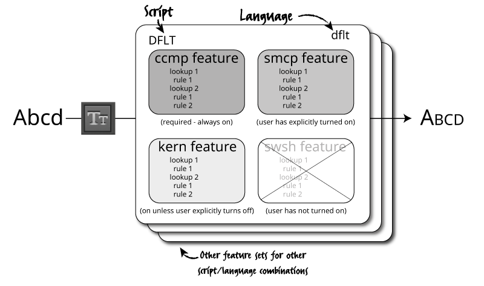
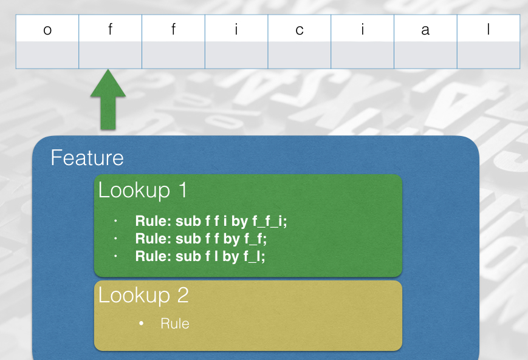

* TOC
{:toc}

In the previous chapter we looked at some of the data tables hiding inside an OpenType font. And let's face it, they weren't all that interesting - metrics, character mappings, a few Bézier splines or drawing instructions. The really cool part about OpenType (and its one-time rival, Apple Advanced Typography) is the ability to *program* the font. OpenType's collaborative model, which we discussed in our chapter on history, allows the font to give instructions to the shaping engine and control its operation.

> When I use the word "instruction" in this chapter, I'm using the term in the computer programming sense - programs are made up of instructions which tell the computer what to do, and we want to be telling our shaping engine what to do. In the font world, the word "instruction" also has a specific sense related to hinting of TrueType outlines, which we'll cover in the chapter on hinting.

"Smart fonts", such as those enabled by OpenType features, can perform a range of typographic refinements based on data within the font, from kerning, ligature substitution, making alternate glyphs available to the user, script-specific and language-specific forms, through to complete substitution, reordering and repositioning of glyphs.

Specifically, two tables within the font - the `GPOS` and `GSUB` tables - provide for a wide range of context-sensitive font transformations. `GPOS` contains instructions for altering the position of glyph. The canonical example of context-sensitive repositioning is *kerning*, which modifies the space between two glyphs depending on what those glyphs are, but `GPOS` allows for many other kinds of repositioning instructions.

The other table, `GSUB`, contains instructions for substituting some glyphs for others based on certain conditions. The obvious example here is *ligatures*, which substitutes a pair (or more) of glyphs for another: the user types "f" and then "i" but rather than displaying those two separate glyphs, the font tells the shaping engine to fetch the single glyph "fi" instead. But once again, `GSUB` allows for many, many interesting substitutions - some of which aren't merely typographic niceties but are absolutely essential when engineering fonts for complex scripts.

In this chapter, we're going to begin to look at these instructions, how we get them into our font, and how they work; in the following two chapters, we'll look more systematically at what instructions are available, and how we can use them to create fonts which support our global scripts.

## The Adobe feature language

OpenType instructions - more usually known as "rules" - are normally written in a language that doesn't exactly have a name; it's known variously as "AFDKO" (from the "Adobe Font Development Kit for OpenType", a set of software tools one of which reads this syntax and adds the rules into binary font files), "Adobe feature language", "fea", or "feature format". Other ways of representing rules are available, (and inside the font they are stored in quite a different representation) but this is the most common way that we can write the rules to program our fonts.

There are a number of alternatives to AFDKO for specifying OpenType layout features - Microsoft's VOLT (Visual OpenType Layout Tool), my own FLUX (Font Layout UX), and High Logic Font creator all allow you to create features and proof and preview them visually. Monotype also has their own internal editor, FontDame, which lays out OpenType features in a text file. (I've also written an alternative syntax called FEE, which allows for extensions and plugins to add higher-level commands to the language.)

But Adobe's language is the one that almost everyone uses, and as a font engineer, you're going to need to know it very well. So let's begin.

## Basic feature coding - substitutions and ligatures

Here is the simplest complete OpenType program:

```
feature liga {
  sub f f by f_f;
} liga;
```

Read this as "in the `liga` feature, substitute the glyphs `f f` by `f_f`." This assumes that we have at least two glyphs in our font, one of which is called `f` and another which is called `f_f`. Later on we'll see precisely what we mean by "feature" and why we made one called `liga`, but for now what you need to know is that we have created a rule that will be applied by the shaper whenever some text is set in our font.

The feature language has a simple syntax. The full details are available as part of the [AFDKO Documentation](http://adobe-type-tools.github.io/afdko/OpenTypeFeatureFileSpecification.html), but the basics are fairly easy to pick up by inspection; a feature is defined like so:

    feature <name> { ... } <name>;

We created a feature called `liga` and placed a rule inside it. The rules all start with a rule name and end with a semicolon, but what is in the middle depends on the nature of the rule. The rule we created will substitute one set of glyphs for another, so it is a `sub` rule (you can also spell this `substitution`, if you like). There are various kinds of `sub` rule, and we'll look at them systematically in the next chapter, but the one we're using has two parts to it: the *match*, which consists of one glyph name, and then the *replacement* which is introduced by the keyword `by` and consists of two glyph names. There are also `pos` (or `position`) rules to change the position of glyphs; `sub` rules go in the `GSUB` table and `pos` rules go in the `GPOS` table. Simple, really.

But how do we convert the textual rules we have written into the binary format of these tables? As a designer you might be used to using your font editor, which may also automate some or all of the process of creating OpenType rules and compiling them into the font. But this is often quite slow; it may take a few seconds to completely build and export a font, and when we're developing and testing complex layouts, we don't want to wait that long between tests. (We don't want to be installing fonts and resetting caches before generating our testing documents either, but we'll come to that later.) I like to have a nice quick build process which I can call from `Makefile` or in a command-line script, so that the font is rebuild with new layout rules every time I save the feature file.

One way to achieve this is to use the `fontTools` library, which has a command line script to add features to an existing font file. You can export a "dummy" version of your font from your editor - just the outlines with no layout rules - and use that as a base for adding feature files:

```
fonttools feaLib -o MyFont.otf features.fea MyFont-Dummy.otf
```

A similar utility, `makeotf`, comes as part of the Adobe Font Development Kit for OpenType:

```
makeotf -o MyFont.otf -f MyFont-Dummy.otf -ff features.fea
```

I prefer the `fontTools` version as it automatically handles the corrections needed to lay out very complex feature files.

Finally, if you're learning about OpenType layout and just want to test out rules in an interactive environment, my own `OTLFiddle` software might be helpful. It allows you to drop in a font, type some feature code and immediately see how it affects a given piece of text. In fact, if you're learning about OpenType feature syntax for the first time, I'd seriously encourage you to use OTLFiddle to explore the examples given in this chapter.

Download [OTLFiddle](https://github.com/simoncozens/otlfiddle), drop in a font with the `f` and `f_f` glyphs - [Open Sans](https://fonts.google.com/specimen/Open+Sans) is my favourite test Latin font - and type the feature above into the editor. Compile the font, and type the text "official" into the box on the right - although the visual difference is quite subtle, you should be able to see in the read-out of glyphs above the image that the two `f` glyphs have indeed become a single `f_f` glyph.

## Glyph Classes and Named Classes

Now let’s write a set of rules to turn lower case vowels into upper case vowels:

```
feature liga {
  sub a by A;
  sub e by E;
  sub i by I;
  sub o by O;
  sub u by U;
} liga;
```

That was a lot of work! Thankfully, it turns out we can write this in a more compact way. Glyph classes give us a way of grouping glyphs together and applying one rule to all of them:

```
feature liga {
    sub [a e i o u] by [A E I O U];
}  liga;
```

Try this in OTLFiddle too. You'll find that when a class is used in a substitution, corresponding members are substituted on both sides.

We can also use a glyph class on the "match" side, but not in the replacement side:

```
feature liga {
    sub f [a e i o u] by f_f;
}  liga;
```

This is the equivalent of:

```
feature liga {
    sub f a by f_f;
    sub f e by f_f;
    ...
}  liga;
```

Some classes we will use more than once, and it's tedious to write them out each time. We can *define* a glyph class, naming a set of glyphs so we can use the class again later:

```
@lower_vowels = [a e i o u];
@upper_vowels = [A E I O U];
```

Now anywhere a glyph class appears, we can use a named glyph class instead (including in the definition of other glyph classes!):

```
@vowels = [@lower_vowels @upper_vowels];

feature liga {
  sub @lower_vowels by @upper_vowels;
} liga;
```

## Features and lookups

We've been putting our *rules* into a *feature*. Features are part of the way that we signal to the shaper which rules to apply in which circumstances. For example, the feature called `liga` is the "ligatures" features, and is always processed in the case of text in the Latin script unless the user specifically requests it to be turned off; there is another feature (`rlig`) for required ligatures, those which should always be applied even if the user doesn't want explicit ligatures. Some features are *always* processed as a fundamental part of the shaping process - particularly the case when dealing with scripts other than Latin - while others are optional and aesthetic. We will introduce different features, and what they're recommended to be used for, as we come across them, but you can also look up any unfamiliar features in the [OpenType Feature Registry](https://docs.microsoft.com/en-us/typography/opentype/spec/featurelist)

We've only seen rules and features so far but it's important to know that there's another level involved too. Inside an OpenType font, rules are arranged into *lookups*, which are associated with features. Although the language we use to write OpenType code is called "feature language", the primary element of OpenType shaping is the *lookup*. So rules are grouped into sets called *lookups*, and lookups are placed into *features* based on what they're for. You might want to refine your typography in different ways at different times, and turning on or off different combinations of features allows you to do this.

For instance, if you hit the "small caps" icon in your word processor, the word processor will ask the shaping engine to turn on the `smcp` feature. The shaping engine will run through the list of features in the font, and when it gets to the `smcp` feature, it will look at the lookups inside that feature, look at each rule within those lookups, and apply them in turn. These rules will turn the lower case letters into small caps:



**To really understand OpenType programming, you need to think in terms of lookups, not features**.

 So far our lookups have been *implicit*; by not mentioning any lookups and simply placing rules inside a feature, the rules you specify are placed in a single, anonymous lookup. So this code which places rules in the `sups` feature, used when converting glyphs to their superscript forms (for example, in the case of footnote references):

    feature sups {
      sub one by onesuperior;
      sub two by twosuperior;
      sub three by threesuperior;
    } sups;

is equivalent to this:

    feature sups {
      lookup sups_1 {
        sub one by onesuperior;
        sub two by twosuperior;
        sub three by threesuperior;
        } sups_1;
    } sups;

We can manually organise our rules within a feature by placing them within named lookups, like so:

    feature pnum {
      lookup pnum_latin {
        sub zero by zero.prop;
        sub one by one.prop;
        sub two by two.prop;
        ...
      } pnum_latin;
      lookup pnum_arab {
        sub uni0660 by uni0660.prop;
        sub uni0661 by uni0661.prop;
        sub uni0662 by uni0662.prop;
        ...
      } pnum_arab;
    } sups;

In fact, I would strongly encourage *always* placing rules inside an explicit `lookup` statement like this, because this helps us to remember the role that lookups play in the shaping process. As we'll see later, that will in turn help us to avoid some rather subtle bugs which are possible when multiple lookups are applied, as well as some problems that can develop from the use of lookup flags.

Finally, you can define lookups outside of a feature, and then reference them within a feature. For one thing, this allows you to use the same lookup in more than one feature, sharing rules and reducing code duplication:

    lookup myAlternates {
      sub A by A.001; # Alternate form
      ...
    } myAlternates;

    feature salt { lookup myAlternates; } salt;
    feature ss01 { lookup myAlternates; } ss01;

The first clause *defines* the set of rules called `myAlternates`, which is then *used* in two features: `salt` is a general feature for stylistic alternates (alternate forms of the glyph which can be selected by the user for aesthetic reasons), and `ss01` which selects the first stylistic set. The ability to name and reference sets of rules in a lookup will come in extremely useful when we look at chaining rules - when one rule calls another.

## Scripts and languages

Lookups apply to particular combinations of *language* and *script*. You can, for example, substitute generic glyph forms for localised forms which are more appropriate in certain linguistic contexts: for example, the Serbian form of the letter be (б) is expected to look different from the Russian form. Both forms can be stored in the same font, and the choice of appropriate glyph made on the basis of the language of the text.

Again, so far we've handled this implicitly - any rules which are not tagged explicitly with the language and script combination that they refer to are considered to apply to the "default" script and "default" language. The script and language are described using four-character codes called "tags"; for example, the script tag for Malayalam is `mlm2`. You can find the list of [script tags](https://docs.microsoft.com/en-gb/typography/opentype/spec/scripttags) and [language tags](https://docs.microsoft.com/en-gb/typography/opentype/spec/languagetags) in the OpenType specification. The shaper is told, by the layout application, what language and script are being used by the input run of text. (It may also try guessing the script based on the Unicode characters in use.)

Inside the font, the GSUB and GPOS tables are arranged *first* by script, *then* by language, and finally by feature. But that's a confusing way for font designers to work, so AFDKO syntax allows you to do things the other way around: define your features and write script- and language-specific code inside them.

To make this work, however, you have to define your "language systems" at the start of the feature file. For example, here is a font which will have support for Arabic and Urdu, as well as Turkish and "default" (non-language-specific) handling of the Latin script, non-language-specific handling of Arabic *script* (for instance, if the font is used for documents written in Persian; "Arabic" in this case includes Persian letters), and it will also have some rules that apply generally:

    # languagesystem <script tag> <language tag>;
    languagesystem DFLT dflt;
    languagesystem arab dflt;
    languagesystem arab ARA;
    languagesystem arab URD;
    languagesystem latn dflt;
    languagesystem latn TRK;

Once we have declared what systems we're going to work with, we can specify that particular lookups apply to particular language systems. So for instance, the Urdu digits four, five and seven have a different form to the Arabic digits. If our font is to support both Arabic and Urdu, we should make sure to substitute the expected forms of the digits when the input text is in Urdu.

We'll do this using a `locl` (localisation) feature, which only applies in the case of Urdu:

    feature locl {
        script arab;
        language URD;
        # All lookups here apply to Urdu until the next script/language
        lookup urdu_digits {
          sub four-ar by four-ar.urd;
          sub five-ar by five-ar.urd;
          sub seven-ar by seven-ar.urd;
        } urdu_digits;
    } locl;

As mentioned above, any lookups which appear *before* the first `script` keyword in a setting are considered to apply to all scripts and languages. If you want to specify that they should *not* appear for a particular language environment, you need to use the declaration `exclude_dflt` like so:

    feature liga {
        script latn;
        lookup fi_ligature {
          sub f i by fi; # All Latin-based languages get this ligature
          } fi_ligature;

        language TRK exclude_dflt; # Except Turkish. Turkish doesn't.
    } locl;

You may also see `include_dflt` in other people's feature files. The default rules are included by, uh, default, so this doesn't actually do anything, but making that explicit can be useful documentation to help you figure out what rules are being applied. And speaking of what rules are being applied...

## How OpenType shaping works

While we could now carry on describing the syntax of the feature file language and giving examples of OpenType rules, this would not necessarily help us to transfer our knowledge to new situations - especially when we are dealing with scripts which have more complicated requirements and expectations. To get that transferable knowledge, we need to have a deeper understanding of what we're doing and how it is being processed by the computer.

So we will now pause our experiments with substitution rules, and before we get into other kinds of rule, we need to step back to look at how the process of OpenType shaping works. As we know, *shaping* is the application of the rules and features within a font to a piece of text. Let's break it down into stages.

### Mapping and reordering

The first thing the shaper does is map the Unicode characters in the input into a series of glyph IDs, internal to the font. (I call this resulting series the "glyph stream", but that's not a common expression. Shaper implementers may call it the *buffer*.) For some scripts, this mapping is easy. You simply uses the character map (`cmap` table) to turn Unicode characters into glyph IDs internal to the font. Most scripts, however, need a bit of help when moving from the Unicode world of characters to the OpenType world of glyphs. This “help” is the logic provided by complex shapers; there are a bunch of “complex shapers” as part of an OpenType shaping engine, each handling text in a different script or family of scripts.

So, for example, if your text is in Arabic, it will come in as a series of codepoints which don’t contain any “topographic” information: the string ججج is made up of the same Unicode code point three times (U+062C ARABIC LETTER JEEM). But it needs to come out as three different glyphs, one for “initial jeem”, one for “medial jeem” and one for “final jeem”. In this case, there’s a part of the shaping engine which specifically knows how to help process Arabic, and it goes through the Unicode input annotating it with what position the glyphs need to be in. It knows how Arabic “works”: it knows that if you have جاج (JEEM ALIF JEEM), the first JEEM goes in initial form because it links to the ALIF but the second JEEM stays how it is because the letter ALIF does not join to its left. After it has done this annotation, it will apply the rules you specify for initial form substitutions *only* to those parts of the glyph stream which are marked as being in initial form, and so on for medial, final and isolated forms.

Other scripts require different kinds of help to move from the Unicode world to the OpenType world. The way that Unicode defines the encoding of scripts is sometimes a little bit different from the order that those scripts are written in. As a simple example, the Devanagari sequence कि (“ki”) is encoded with the consonant ka (क) first and then the vowel i (ि) second. But visually - when you type or print - the vowel needs to appear first. So the shaping engine has to again “help” the font by reordering the glyph stream: it puts any vowels which need to visually appear first - "pre-base vowels" - before the base consonant. This is just a convenience; it’s much easier for us as the engineer to handle the glyphs `iMatra-deva ka-deva` than it would be to be handed `ka-deva iMatra-deva` as a straight Unicode-to-glyph conversion, and then be left having to shuffle the glyphs around in your font’s OpenType rules.

Notice also that when I showed you the vowel i on its own like this - ि - it was displayed with a dotted circle. The vowel mark can’t normally appear on its own - it needs to be attached to some consonant - so I have typed something that is orthographically impossible. To denote the missing consonant and to try and display something sensible, the shaping engine has inserted the dotted circle; that’s another job of the complex shaper. It knows what is a valid syllable and what isn’t, and adds dotted circles to tell you when a syllable is broken. (So if you ever see a dotted circle in the printed world, the input text was wrong.)

### Rule selection

Next then processes substitution rules from the GSUB table, and finally the positioning rules from the GPOS table. (This makes sense, because you need to know what glyphs you're going to draw before you position them...)

The first step in processing the table is finding out which rules to apply and in what order. The shaper does this by having a set of features that it is interested in processing.

The general way of thinking about this order is this: first, those "pre-shaping" features which change the way characters are turned into glyphs (such as `ccmp`, `rvrn` and `locl`); next, script-specific shaping features which, for example, reorder syllable clusters (Indic scripts) or implement joining behaviours (Arabic, N'ko, etc.), then required typographic refinements such as required ligatures (think Arabic again), discretionary typographic refinements (small capitals, Japanese centered punctuation, etc.), then positioning features (such as kerning and mark positioning).[^1]

More specifically, Uniscribe gathers the following features for the Latin script: `ccmp`, `liga`, `clig`, `dist`, `kern`, `mark`, `mkmk`. Harfbuzz does it in the order `rvrn`, either `ltra` and `ltrm` (for left to right contexts) or `rtla` and `rtlm` (for right to left context), then `frac`, `numr`, `dnom`, `rand`, `trak`, the private-use features `HARF` and `BUZZ`, then `abvm`, `blwm`, `ccmp`, `locl`, `mark`, `mkmk`, `liga`, and then either `calt`, `clig`, `curs`, `dist`, `kern`, `liga`, and `rclt` (for horizontal typesetting) or `vert` (for vertical typesetting).

For other scripts, the order in which features are processed (at least by Uniscribe, although Harfbuzz generally follows Uniscribe's lead) can be found in Microsoft's "Script Development Specs" documents. See, for instance, the specification for [Arabic](https://docs.microsoft.com/en-gb/typography/script-development/arabic); the ordering for other scripts can be accessed using the side menu.

After these default feature lists required for the script, we add any features that have been requested by the layout engine - for example, the user may have pressed the button for small capitals, which would cause the layout engine to request the `smcp` feature from the font; or the layout engine may see a fraction and turn on the `numr` feature for the numbers before the slash and the `dnom` feature for numbers after it.

Now that we have a set of features we are looking for, we need to turn that into a list of lookups. We take the language and script of the input, and see if there is a feature defined for that language/script combination; if so, we add the lookups in that feature to our list. If not, we look at the features defined for the input script and the default language for that script. If that's not defined, then we look at the features defined for the `dflt` script.

For example, if you have text that we know to be in Urdu (language tag `URD`) using the Arabic script (script tag `arab`), the shaper will first check if Arabic is included in the script table. If it is, the shaper will then look to see if there are any rules defined for Urdu inside the Arabic script rules; if there are, it will use them. If not, it will use the "default" rules for the Arabic script. If the script table doesn't have any rules for Arabic at all, it'll instead pretend that the script is called `DFLT` and use the feature list defined for that script.

### Lookup application

Now we have a list of lookups, which each contain rules. These rules are then applied to the glyph stream, lookup by lookup.

I think of the shaping process as being like an old punched-tape computer. (If you know what a Turing machine is, that's an even better analogy.) The input glyphs that are typed by the user are written on the "tape" and then a "read head" goes over the tape cell-by-cell, checking the current lookup matches at the current position.



If the lookup matches, the shaper takes the appropriate action (substitution in the cases we have seen so far). It then moves on to the next location. Once it has gone over the whole tape and performed any actions, the next lookup gets a go (we call this "applying" the lookup).

Notice we have said that the rules are applied lookup by lookup. This is where it becomes important to explicitly arrange our rules into lookups. Consider the difference between this:

```
feature liga {
    sub a by b;
    sub b by c;
} liga;
```

and

```
feature liga {
    lookup l1 { sub a by b; } l1;
    lookup l2 { sub b by c; } l2;
} liga;
```

How would these features be applied to the glyph stream `c a b b a g e`? In the first case, *both* rules are considered at each position and the first to match is applied. An `a` is substituted by a `b` and a `b` is substituted by a `c`, so the output would be `c b c c b g e`.

But in the second case, the first rule is applied at each position - leading to `c b b b b g e` - *and then* the tape is rewound and the second rule is applied at each position. The final output is `c c c c c g e`.

In short, rules in separate lookups act in sequence, rules in a single lookup act in parallel. Making your lookups explicit ensures that you get what you mean.

> There is another reason why it's good to put rules explicitly into lookups; in OpenType, there are sixteen different types of rule, and a lookup may only contain rules of the same type. The compiler which packs these rules into the font tries to be helpful and, if there are different types of rule in the same feature, splits them into separate lookups, without telling you. But we have seen that when you split rules into separate lookups, you can end up changing the effect of those rules. This can lead to nasty debugging issues.

### Lookup Flags

One more thing about the lookup application process - each lookup can have a set of *flags* which alters the way that it operates. These flags are *enormously* useful in controlling the shaping of global scripts.

For example, in Arabic, there is a required ligature between the letters lam and alef. We could try implementing this with a simple ligature, just like our `f_f` ligature:

```
feature liga {
  lookup lamalef-ligature {
      sub lam-ar alef-ar by lam_alef-ar;
  } lamalef-ligature;
} liga;
```

However, this would not work in all cases! It's possible for there to be  diacritical marks between the letters; the input glyph stream might be `lam-ar kasra-ar alef-ar`, and our rule will not match. No problem, we think; let's create another rule:

```
feature liga {
  lookup lamalef-ligature {
      sub lam-ar alef-ar by lam_alef-ar;
      sub lam-ar kasra-ar alef-ar by lam_alef-ar kasra-ar;
  } lamalef-ligature;
} liga;
```

Unfortunately, we find that this refuses to compile; it isn't valid AFDKO syntax. As we'll see in the next chapter, while OpenType supports more-than-one match glyphs and one replacement glyph (ligature), and one match glyph and more-than-one replacement glyphs (multiple substitution), it rather annoyingly *doesn't* support more-than-one match glyphs and more-than-one replacement glyphs (many to many substitution).

However, there's another way to deal with this situation. We can tell the shaper to skip over diacritical marks in when applying this lookup.

```
feature liga {
  lookup lamalef-ligature {
      lookupFlag IgnoreMarks;
      sub lam-ar alef-ar by lam_alef-ar;
  } lamalef-ligature;
} liga;
```

Now when this lookup is applied, the shaper only "sees" the part of the glyph stream that contains base characters - `lam-ar alef-ar` - and the kasra glyph is "masked out". This allows the rule to apply.

XXX image here.

How does the shaper know which are mark glyphs are which are not? We tell it! The `GDEF` table contains a number of *glyph definitions*, metadata about the properties of the glyphs in the font, and one of which is the glyph category. Each glyph can either be defined as a *base*, for an ordinary glyph; a *mark*, for a non-spacing glyph; a *ligature*, for glyphs which are formed from multiple base glyphs; or a *component*, which isn't used because nobody really knows what it's for. Glyphs which aren't explicitly in any category go into category zero, and never get ignored. The category definitions are normally set in your font editor, so if your `IgnoreMarks` lookups aren't working, check your categories in the font editor - in Glyphs, for example, you not only have to set the glyph to category `Mark` but also to subcategory `Nonspacing` for it to be placed in the mark category. You can also [specify the GDEF table](http://adobe-type-tools.github.io/afdko/OpenTypeFeatureFileSpecification.html#9.b) in feature code.

Other flags you can apply to a lookup (and you can apply more than one) are:

* `RightToLeft` (Only used for cursive attachment lookups in Nastaliq fonts. You almost certainly don't need this.)
* `IgnoreBaseGlyphs`
* `IgnoreLigatures`
* `IgnoreMarks`
* `MarkAttachmentType @class` (This has been effectively superceded by the next flag; you almost certainly don't need this.)
* `UseMarkFilteringSet @class`

`UseMarkFilteringSet` ignores all marks *except* those in the specified class. This will come in useful when you are, for example, repositioning glyphs with marks above them but you don't really care too much about marks below them.

## Positioning rules

We've talked a lot about substitution so far, but that's not the only thing we can use OpenType rules for. You will have noticed that in our "paper tape" model of OpenType shaping, we had two rows on the tape - the top row was the glyph names. What's the bottom row?

After all the substitution rules in our set of chosen lookups are processed from the `GSUB` table, the same thing is done with the `GPOS` table: feature selections and language/script selections are used to gather a set of lookups, which are then processed in turn.

In the positioning phase, the shaper associates four numbers with each glyph position. These numbers - the X position, Y position, X advance and Y advance - are called a *value record*, and describe how to draw the string of glyphs.

The shaper starts by taking the advance width from metrics of each glyph and placing that in the X advance section of the value record, and placing the advance height of each glyph into the Y advance section. (The X advance only applies in horizontal typesetting and the Y advance only applies in vertical typesetting.) As designer, we might think of the X advance as the width of the glyph, but when we come to OpenType programming, it's *much* better to think of this as "where to draw the *next* glyph".

Similarly the "position" should be thought of as "where this glyph gets shifted." Notice in this example how the `f` is first placed 1237 units after the `o` and then repositioning 100 units up and 100 units to the right of its default position:


In feature syntax, these value records are denoted as four numbers between angle brackets. As well as writing rules to *substitute* glyphs in the glyph stream, we can also write *positioning* rules to adjust these value records by adding a value to it. Let's write one now!

```
feature kern {
    lookup adjust_f {
        pos f <0 0 200 0>;
    } adjust_f;
} kern;
```

If you try this in `OTLFiddle` you'll find that this *adds* 200 units of advance positioning to the letter `f`, making it appear wider by shifting the *following* glyph to the right. Single positioning rules like this one adjust the existing positioning information by adding each component in the rule's value record to the corresponding component in the the value record in the glyph string.

This is a single positioning rule, which applies to *any* matching glyph in the glyph stream. This is not usually what we want - if we wanted to make the `f`s wider, we could have just given them a wider advance width in the editor. (However, single positioning rules do become useful when used in combination with chaining rules, which I promise we will get to soon.)

Another form of the positioning rule can take *two* input glyphs and add value records to one or both of them. Let's now see an example of a *pair positioning* rule where we will look for the glyphs `A B` in the glyph stream, and then change the positioning information of the `B`. I added the following stylistic set features to the test "A B" font from the previous chapter:

    feature ss01 { pos A B <150 0 0 0>; } ss01 ;
    feature ss02 { pos A B <0 150 0 0>; } ss02 ;
    feature ss03 { pos A B <0 0 150 0>; } ss03 ;
    feature ss04 { pos A B <0 0 0 150>; } ss04 ;

And now let's see what effect each of these features has:


From this it's easy to see that the first two numbers in the value record simply shift where the glyph is drawn, with no impact on what follows. Imagine the glyph "A" positioned as normal, but then after the surrounding layout has been done, the glyph is picked up and moved up or to the right.

The third example, which we know as kerning, makes the glyph conceptually wider. The advance of the "A" is extended by 150 units, increasing its right sidebearing; changing the advance *does* affect the positioning of the glyphs which follow it.

Finally, you should be able to see that the fourth example, changing the vertical advance, does absolutely nothing. You might have hoped that it would change the position of the baseline for the following glyphs, and for some scripts that might be quite a nice feature to have, but the sad fact of the matter is that applications doing horizontal layout don't take any notice of the font's vertical advances (and vice versa) and just assume that the baseline is constant. Oh well, it was worth a try.

To make this more globally relevant, let's look at the Devanagari glyph sequence "NA UUE LLA UUE DA UUE" (नॗ ळॗ दॗ) in Noto Sans Devangari:


You should be able to see that in the first two combinations ("NA UUE" and "LLA UUE"), the vowel sign UUE appears at the same depth; regardless of how far below the headline the base character reaches, the vowel sign is being positioned at a fixed distance below the headline. (So we're not using mark to base and anchors here, for those of you who have read ahead.)

However, if we attached the vowel sign to the "DA" at that same fixed position, it would collide with the DA's curly tail. So in a DA+UUE sequence, we have to do a bit of *vertical* kerning: we need to move the vowel sign down a bit when it's been applied to a long descender.

Here's the code to do that (which I've simplified to make it more readable):

    @longdescenders = [
      uni091D # JHA (झ)
      uni0926 # DA (द)
      # And various rakar form ligatures
      uni0916_uni094D_uni0930.rkrf uni091D_uni094D_uni0930.rkrf
      uni0926_uni094D_uni0930.rkrf
    ];
    feature dist {
      script dev2;
      language dflt;
      pos @longdescenders <0 0 0 0> uni0956 <0 -90 0 0>; # ॖ
      pos @longdescenders <0 0 0 0> uni0957 <0 -145 0 0>; # ॗ
    }

What are we doing here? Let's read it out from the top. First, we define a glyph class for those glyphs with long descenders. Next, we are putting our rules into a feature called `dist`, which is a little like `kern` but for adjusting the distances between pre- and post-base marks and their base characters. The rules will apply to the script "Devanagari v.2". (This is another one of those famous OpenType compromises; Microsoft's old Indic shaper used the script tag `deva` for Devanagari, but when they came out with a new shaper, the way to select the new behavior was to use a new language tag, `dev2`. Nowadays you almost certainly want the "version 2" behaviour for any Indic scripts you engineer.)

For any language system using this script, we apply the following rules: when we have a long descender and a UE vowel, the consonant is positioned normally (`0`), but the vowel sign gets its position shifted by 90 units downwards. When we have a long descender and a UUE vowel, the consonant is again positioned normally, but the vowel sign gets its position shifted by 145 units downwards. That should be enough to avoid the collision.

In the next chapter we will look at the full range of substitution and positioning rules, as well as chain and attachment rules.

## Building a testing environment

XXX

### Using hb-shape for feature testing

Now is a good time to introduce the `hb-shape` tool; it's a very handy utility for debugging and testing the application of OpenType features - how they affect the glyph stream, their effect on positioning, how they apply in different language and script combinations, and how they interact with each other. Learning to use `hb-shape`, which comes as part of the [HarfBuzz](http://harfbuzz.org) OpenType shaping engine, will help you with a host of OpenType-related problems.

> If you're on Mac OS X, you can install the Harfbuzz utilities using homebrew, by calling `brew install harfbuzz` on the terminal.

As we've mentioned, HarfBuzz is a shaping engine, typically used by layout applications. Shaping, as we know, is the process of taking a text, a font, and some parameters and producing a set of glyphs and their positions. `hb-shape` is a diagnostic tool which runs the shaping process for us and formats the output of the process in a number of different ways. We can use it to check the kern that we added in the previous section:

    $ hb-shape TTXTest-Regular.otf 'AA'
    [A=0+580|A=1+580]

This tells us that we have two "A" glyphs together. The first one is the first character in the input stream ("=0" - computer strings count from zero), and that it has a horizontal advance of 580 units ("+580"). The second one is the second character in the input stream ("=1") and also has an advance of 580 units.

But...

    $ hb-shape TTXTest-Regular.otf 'AB'
    [A=0+530|B=1+618]

when we have an "A" and a "B", the advance width of the "A" is only 530 units. In other words, the "B" is positioned 50 units left of where it would normally be placed; the "A" has, effectively, got 50 units narrower. In other other words, our kern worked.

We didn't need to tell HarfBuzz to do any kerning - the `kern` feature is on by default. We can explicitly turn it off by passing the `--features` option to `hb-shape`. `-<feature name>` turns off a feature and `+<feature name>` turns it on:

    $ hb-shape --features="-kern" TTXTest-Regular.otf 'AB'
    [A=0+580|B=1+618]

As you see in this case, the advance width of the "A" is back to 580 units, because the `ab` kern pair is not being applied in this case.

> We will see more of `hb-shape` in the next chapter, including examples of how it shows us positioning information.

## How features are stored

> You probably want to skip this section the first time you read this book. Come to think of it, you may want to skip it on subsequent reads, too.

We'll start our investigation of features once again by experiment, and from the simplest possible source. As we mentioned, the canonical example of a `GPOS` feature is kerning. (The `kern` feature - again one which is generally turned on by default by the font.)

> As with all things OpenType, there are two ways to do it. There's also a `kern` *table*, but that's a holdover from the older TrueType format. If you're using CFF PostScript outlines, you need to use the `GPOS` table for kerning as we describe here - and of course, using `GPOS` lets you do far more interesting things than the old `kern` table did. Still, you may still come across fonts with TrueType outlines and an old-style `kern` table.

We're going to take our test font from the previous chapter. Right now it has no `GPOS` table, and the `GSUB` table contains no features, lookups or rules; just a version number:

    <GSUB>
      <Version value="0x00010000"/>
    </GSUB>

Now, within the Glyphs editor we will add negative 50 points of kerning between the characters A and B:


We'll now dump out the font again with `ttx`, but this time just the `GPOS` table:

    $ ttx -t GPOS TTXTest-Regular.otf
    Dumping "TTXTest-Regular.otf" to "TTXTest-Regular.ttx"...
    Dumping 'GPOS' table...

Here is what we get:

    <GPOS>
      <Version value="0x00010000"/>
      <ScriptList>
        <!-- ScriptCount=1 -->
        <ScriptRecord index="0">
          <ScriptTag value="DFLT"/>
          <Script>
            <DefaultLangSys>
              <ReqFeatureIndex value="65535"/>
              <!-- FeatureCount=1 -->
              <FeatureIndex index="0" value="0"/>
            </DefaultLangSys>
            <!-- LangSysCount=0 -->
          </Script>
        </ScriptRecord>
      </ScriptList>
      <FeatureList>
        <!-- FeatureCount=1 -->
        <FeatureRecord index="0">
          <FeatureTag value="kern"/>
          <Feature>
            <!-- LookupCount=1 -->
            <LookupListIndex index="0" value="0"/>
          </Feature>
        </FeatureRecord>
      </FeatureList>
      <LookupList>
        <!-- LookupCount=1 -->
        <Lookup index="0">
          <!-- LookupType=2 -->
          <LookupFlag value="8"/>
          <!-- SubTableCount=1 -->
          <PairPos index="0" Format="1">
            <Coverage Format="1">
              <Glyph value="A"/>
            </Coverage>
            <ValueFormat1 value="4"/>
            <ValueFormat2 value="0"/>
            <!-- PairSetCount=1 -->
            <PairSet index="0">
              <!-- PairValueCount=1 -->
              <PairValueRecord index="0">
                <SecondGlyph value="B"/>
                <Value1 XAdvance="-50"/>
              </PairValueRecord>
            </PairSet>
          </PairPos>
        </Lookup>
      </LookupList>
    </GPOS>

Let's face it: this is disgusting. The hierarchical nature of rules, lookups, features, scripts and languages mean that reading the raw contents of these tables is incredibly difficult. (Believe it or not, TTX has actually *simplified* the real representation somewhat for us.) We'll break it down and make sense of it all later in the chapter.

The OpenType font format is designed above all for efficiency. Putting a bunch of glyphs next to each other on a screen is not meant to be a compute-intensive process (and it *is* something that happens rather a lot when using a computer); even though, as we've seen, OpenType fonts can do all kinds of complicated magic, the user isn't going to be very amused if *using a font* is the thing that's slowing their computer down. This has to be quick.

As well as speed and ease of access, the OpenType font format is designed to be efficient in terms of size on disk. Repetition of information is avoided (well, all right, except for when it comes to vertical metrics...) in favour of sharing records between different users. Multiple different formats for storing information are provided, so that font editors can choose the most size-efficient method.

But because of this focus on efficiency, and because of the sheer amount of different things that a font needs to be able to do, the layout of the font on the disk is... somewhat overengineered.

Here's an example of what actually goes on inside a `GSUB` table. I've created a simple font with three features. Two of them refer to localisation into Urdu and Farsi, but we're going to ignore them for now. We're only going to focus on the `liga` feature for the Latin script, which, in this font, does two things: substitutes `/f/i` for `/fi`, and `/f/f/i` for `/f_f_i`.

In Adobe feature language, that looks like:

    languagesystem DFLT dflt;
    languagesystem arab URD;
    languagesystem arab FAR;

    feature locl {
      script arab;
      language URD;
      ...
      language FAR;
      ...
    }

    feature liga {
      sub f i by fi;
      sub f f i by f_f_i;
    }

Now let's look at how that is implemented under the hood:


Again, what a terrible mess. Let's take things one at a time. On the left, we have three important tables. (When I say tables here, I don't mean top-level OpenType tables like `GSUB`. These are all data structures *inside* the `GSUB` table, and the OpenType standard, perhaps unhelpfully, calls them "tables".) Within the `GPOS` and `GSUB` table there is a *script list*, a *feature list* and a *lookup list*. There's only one of each of these tables inside `GPOS` and `GSUB`; the other data structures in the map (those without bold borders) can appear multiple times: one for each script, one for each language system, one for each feature, one for each lookup and so on.

When we're laying out text, the first thing that happens is that it is separated into runs of the same script and language. (Most documents are in a single script, after all.) This means that the shaper can look up the script we're using in the script list (or grab the default script otherwise), and find the relevant *script table*. Then we look up the language system in the language system table, and this tells us the list of features we need to care about.

Once we've looked up the feature, we're good to go, right? No, not really. To allow the same feature to be shared between languages, the font doesn't store the features directly "under" the language table. Instead, we look up the relevant features in the *feature list table*. Similarly, the features are implemented in terms of a bunch of lookups, which can also be shared between features, so they are stored in the *lookup list table*.

Now we finally have the lookups that we're interested in. Turning on the `liga` feature for the default script and language leads us eventually to lookup table 1, which contains a list of lookup "subtables". Here, the rules that can be applied are grouped by their type. (See the sections "Types of positioning feature" and "types of substitution feature" above.) Our ligature substitutions are lookup type 4.

The actual substitutions are then grouped by their *coverage*, which is another important way of making the process efficient. The shaper has, by this stage, gathered the features that are relevant to a piece of text, and now needs to decide which rules to apply to the incoming text stream. The coverage of each rule tells the shaper whether or not it's likely to be relevant by giving it the first glyph ID in the ligature set. If the shaper sees anything other than the letter "f", then we know for sure that our rules are not going to apply, so it can pass over this set of ligatures and look at the next subtable. A coverage table comes in two formats: it can either specify a *list* of glyphs, as we have here (albeit a list with only one glyph in it), or a *range* of IDs.

OK, we're nearly there. We've found the feature we want. We are running through its list of lookups, and for each lookup, we're running through the lookup subtables. We've found the subtable that applies to the letter "f", and this leads us to two more tables, which are the actual rules for what to do when we see an "f". We look ahead into the text stream and if the next input glyph (which the OpenType specification unhelpfully calls "component", even though that also means something completely different in the font world...) is the letter "i" (glyph ID 256), then the first ligature substitution applies. We substitute that pair of glyphs - the start glyph from the coverage list and the component - by the single glyph ID 382 ("fi"). If instead the next two input glyphs have IDs 247 and 256 ("f i") then we replace the three glyphs - the start glyph from the coverage list and both components - with the single glyph ID 380, or "ffi". That is how a ligature substitution feature works.

If you think that's an awful lot of effort to go to just to change the letters "f i" into "fi" then, well, you'd be right. It took, what, 11 table lookups? But remember that the GPOS and GSUB tables are extremely powerful and extremely flexible, and that power and flexibility comes at a cost. To represent all these lookups, features, languages and scripts efficiently inside a font means that there has to be a lot going on under the hood.

Thankfully, unless you're implementing some of these shaping or font editing technologies yourself, you can relax - it mostly all just works.

## Decompiling a font

We talked near the start of the chapter about how we could take our textual feature rules and compile them into a font. What about going the other way? Sometimes it's useful, when examining how other people have solved particular layout problems, to turn a font back into a set of layout instructions. There are a variety of ways we can do this.

One is a script using the FontTools library we mentioned in the previous chapter to decompile the `GPOS` and `GSUB` tables back into feature language such as Lasse Fisker's [ft2fea](https://github.com/Tarobish/Mirza/blob/gh-pages/Tools/ftSnippets/ft2fea.py). My own script is called `otf2fea`, and can be installed by installing the `fontFeatures` Python library (`pip install fontFeatures`).

XXX But while these worked nicely for more complex font files, neither of them worked on our simple test font, so instead, I went with the absolute easiest way - when exporting a file, Glyphs writes out a feature file and passes it to AFDKO to compile the features. Thankfully, it leaves these files sitting around afterwards, and so in `Library/Application Support/Glyphs/Temp/TTXTest-Regular/features.fea`, I find the following:

    table OS/2 {
      TypoAscender 800;
      TypoDescender -200;
      TypoLineGap 200;
      winAscent 1000;
      winDescent 200;
      WeightClass 400;
      WidthClass 5;
      WidthClass 5;
      FSType 8;
      XHeight 500;
      CapHeight 700;
    } OS/2;
    ...

Oh, it turns out that as well as specifying `GPOS` and `GSUB` features, the feature file is also used by font editors to get metrics and other information into the OpenType tables. But let's look down at the bottom of the file:

    feature kern {
      lookup kern1_latin {
        lookupflag IgnoreMarks;
        pos A B -50;
      } kern1_latin;
    } kern;

And here it is - our `kern` feature. This is precisely equivalent to the horrible piece of XML above.

[^1]: See John Hudson's paper [*Enabling Typography*](http://tiro.com/John/Enabling_Typography_(OTL).pdf) for an explanation of this model and its implications for particular features.

