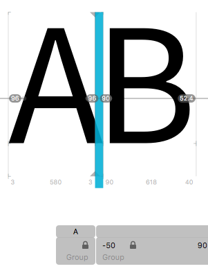
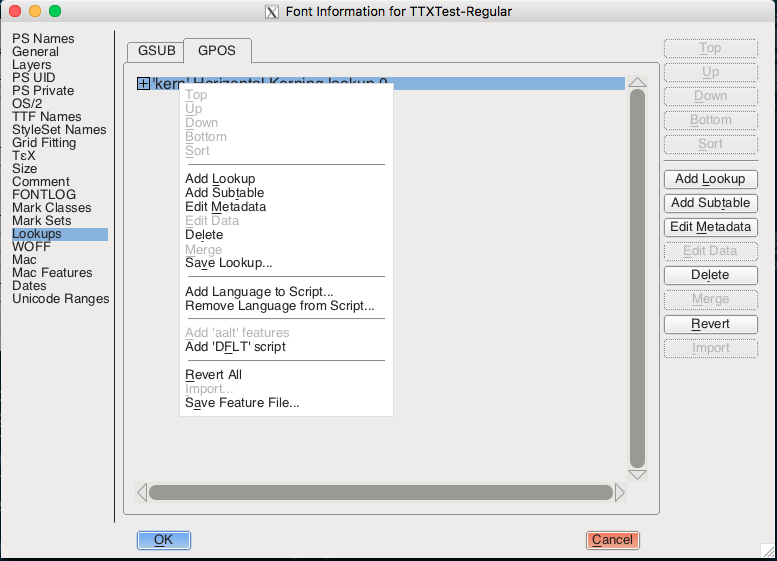
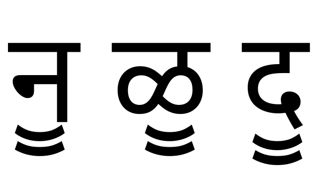
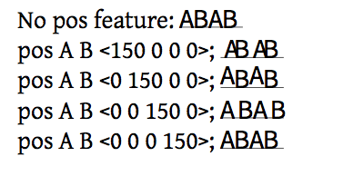

* TOC
{:toc}

In the previous chapter we looked at some of the data tables hiding inside an OpenType font. And let's face it, they weren't all that interesting - metrics, character mappings, a few Bézier splines or drawing instructions. The really cool part about OpenType (and its one-time rival, Apple Advanced Typography) is the ability to *program* the font. OpenType's collaborative model, which we discussed in our chapter on history, allows the font to give instructions to the shaping engine and control its operation.

> When I use the word "instruction" in this chapter, I'm using the term in the computer programming sense - programs are made up of instructions which tell the computer what to do, and we want to be telling our shaping engine what to do. In the font world, the word "instruction" also has a specific sense related to hinting of TrueType outlines, which we'll cover in the chapter on hinting.

Specifically, two tables within the font - the `GPOS` and `GSUB` tables - provide for a wide range of context-sensitive font transformations. `GPOS` contains instructions for altering the position of glyph. The canonical example of context-sensitive repositioning is *kerning*, which modifies the space between two glyphs depending on what those glyphs are, but `GPOS` allows for many other kinds of repositioning instructions. The other table, `GSUB`, contains instructions for substituting some glyphs for others based on certain conditions. The obvious example here is *ligatures*, which substitutes a pair (or more) of glyphs for another: the user types "f" and then "i" but rather than displaying those two separate glyphs, the font tells the shaping engine to fetch the single glyph "fi" instead. But once again, `GSUB` allows for many, many interesting substitutions - some of which help us designing fonts for complex scripts.

## Features, lookups and rules

OpenType instructions are arranged in a hierarchical fashion: an instruction which modify the position or content of some glyphs is called a *rule*. Rules are grouped into sets called *lookups*, and lookups are categorised into *features*. Features apply to particular combinations of *language* and *script*.

When a shaping engine processes a run of text, it first determines which features are in play for this run. While a feature can be called anything you like, layout applications will pass certain well-known feature names when the user asks for a particular typographic refinement. For instance, if you hit the "small caps" icon in your word processor, the word processor will ask the shaping engine to process the `smcp` feature. At the same time, the font itself can ask for certain features to be processed by default - the `liga` feature is often turned on by default to provide for standard ligature processing. The application will also tell the shaper what language and script is in use. So in our example, the shaping engine will run through all the lookups within the `smcp` and `liga` features for the language/script combination in use.

We'll start our investigation of features once again by experiment, and from the simplest possible source. As we mentioned, the canonical example of a `GPOS` feature is kerning. (The `kern` feature - again one which is generally turned on by default by the font.) We take our test font from the previous chapter. Right now it has no `GPOS` table, and the `GSUB` table contains no features, lookups or rules; just a version number:

    <GSUB>
      <Version value="0x00010000"/>
    </GSUB>

Now, within the Glyphs editor we will add negative 50 points of kerning between the characters A and B:

We'll now dump out the font again with `ttx`, but this time just the `GPOS` table:

    $ ttx -t GPOS TTXTest-Regular.otf
    Dumping "TTXTest-Regular.otf" to "TTXTest-Regular.ttx"...
    Dumping 'GPOS' table...

Here is what we get:

    <GPOS>
      <Version value="0x00010000"/>
      <ScriptList>
        <!-- ScriptCount=1 -->
        <ScriptRecord index="0">
          <ScriptTag value="DFLT"/>
          
        </ScriptRecord>
      </ScriptList>
      <FeatureList>
        <!-- FeatureCount=1 -->
        <FeatureRecord index="0">
          <FeatureTag value="kern"/>
          <Feature>
            <!-- LookupCount=1 -->
            <LookupListIndex index="0" value="0"/>
          </Feature>
        </FeatureRecord>
      </FeatureList>
      <LookupList>
        <!-- LookupCount=1 -->
        <Lookup index="0">
          <!-- LookupType=2 -->
          <LookupFlag value="8"/>
          <!-- SubTableCount=1 -->
          <PairPos index="0" Format="1">
            <Coverage Format="1">
              <Glyph value="A"/>
            </Coverage>
            <ValueFormat1 value="4"/>
            <ValueFormat2 value="0"/>
            <!-- PairSetCount=1 -->
            <PairSet index="0">
              <!-- PairValueCount=1 -->
              <PairValueRecord index="0">
                <SecondGlyph value="B"/>
                <Value1 XAdvance="-50"/>
              </PairValueRecord>
            </PairSet>
          </PairPos>
        </Lookup>
      </LookupList>
    </GPOS>

Let's face it: this is disgusting. The hierarchical nature of rules, lookups, features, scripts and languages mean that reading the raw contents of these tables is incredibly difficult. Instead, we're going to use a more readable format. The Adobe Font Development Kit for OpenType (AFDKO) is a set of tools for manipulating OpenType fonts, and it specifies a more human-friendly *feature language*. In almost all cases, we (or our font editing software) write features in this feature language, and this gets compiled into the `GPOS` and `GSUB` representations shown above. But it's possible, with a bit of work, to go the other way around and turn the `GPOS` and `GSUB` tables inside a font back into the feature language.

There are a few ways we could do this. One user-friendly way is to use the [FontForge](https://fontforge.github.io/en-US/) editor. Within the "Font info" menu for a font, we can choose the "lookups" tab, right-click on a lookup, and choose "Save Feature File...":

Another is to use a script using the FontTools library we mentioned in the previous chapter to decompile the `GPOS` and `GSUB` tables back into feature language; one such script is provided by Lasse Fisker, and called [ft2fea](https://github.com/Tarobish/Mirza/blob/gh-pages/Tools/ftSnippets/ft2fea.py).

But while these worked nicely for more complex font files, neither of them worked on our simple test font, so instead, I went with the absolute easiest way - when exporting a file, Glyphs writes out a feature file and passes it to AFDKO to compile the features. Thankfully, it leaves these files sitting around afterwards, and so in `Library/Application Support/Glyphs/Temp/TTXTest-Regular/features.fea`, I find the following:

    table OS/2 {
      TypoAscender 800;
      TypoDescender -200;
      TypoLineGap 200;
      winAscent 1000;
      winDescent 200;
      WeightClass 400;
      WidthClass 5;
      WidthClass 5;
      FSType 8;
      XHeight 500;
      CapHeight 700;
    } OS/2;
    ...

Oh, it turns out that as well as specifying `GPOS` and `GSUB` features, the feature file is also used by font editors to get metrics and other information into the OpenType tables. But let's look down at the bottom of the file:

    feature kern {
      lookup kern1_latin {
        lookupflag IgnoreMarks;
        pos A B -50;
      } kern1_latin;
    } kern;

And here it is - our `kern` feature. This is precisely equivalent to the horrible piece of XML above. The feature language has a simple syntax. The full details are available as part of the [AFDKO Documentation](http://www.adobe.com/devnet/opentype/afdko/topic_feature_file_syntax.html), but the basics are fairly easy to pick up by inspection; a feature is defined like so:

    feature <name> { <lookups> } <name>;

and a lookup like this:

    lookup <name> { <rules> } <name>;

The rules all start with a rule name and end with a semicolon, but what is in the middle depends on the nature of the rule. This kerning rule alters glyphs positions, so it is a `pos` rule (you can also spell this `position`, if you like). There are various kinds of `pos` rule, but the one we want has three parameters: after glyph "A" and before glyph "B", alter the horizontal advance by -50 units.

Now is a good time to introduce the `hb-shape` tool, which comes as part of [HarfBuzz](http://harfbuzz.org); it's a very handy utility for testing the application of OpenType features. HarfBuzz is an OpenType shaping engine, used by layout applications. Shaping, as we know, is the process of taking a text, a font, and some parameters and producing a set of glyphs and their positions. `hb-shape` runs the shaping process for us and formats the output of the process in a number of different ways. We can use it to check our kern:

    $ hb-shape TTXTest-Regular.otf 'AA'
    [A=0+580|A=1+580]

This tells us that when we have two "A" glyphs together, there is a 580 unit advance between the first and the second. But...

    $ hb-shape TTXTest-Regular.otf 'AB'
    [A=0+530|B=1+618]

when we have an "A" and a "B", the advance width of the "A" is only 530 units. In other words, the "B" is positioned 50 units left of where it would normally be placed; the "A" has, effectively, got 50 units narrower. In other other words, our kern worked.

We didn't need to tell HarfBuzz to do any kerning - the `kern` feature is on by default. We can explicitly turn it off by passing the `--features` option to `hb-shape`:

    $ hb-shape --features="-kern" TTXTest-Regular.otf 'AB'
    [A=0+580|B=1+618]

### Glyph classes

According to the specification in the AFDKO documentation, the full syntax for the positioning rule we have just applied is:

    position <glyph|glyphclass> <glyph|glyphclass> <valuerecord>;

Why does it say `glyphclass`? Well, if we had to write a rule like this for every single kerning pair, things would get extremely unwieldy. Many fonts have thousands of kern pairs these days. Glyph classes give us a way of grouping glyphs together and applying one rule to all of them.

Classes can be inline or named; an inline class is a number of glyphs surrounded by square brackets:

    pos [A Acircumflex Agrave Aacute Adiaresis Aring] B -50;

This applies the same (nonsensical) kerning between "AB", "ÂB", "ÀB", "ÁB", "ÄB" and "ÅB". This helps to compact our rules a little bit, but this set of characters is one that we may well use many times in a complete set of kern pairs. So, we can give it a name:

    @Alike = [A Agrave Aacute Adiaresis Aring];

Now we can use `@Alike` instead of `A` to refer to capital A and its diacritic friends:

    pos @Alike B -50;
    pos B @Alike -15;

### Value records

Let's look at another simple positioning feature, as way to understand the few more concepts, including that of a value record.

First, an example by Yannis Haralambous, in his *Fonts and Encodings*: 

Second, if we look at the Devanagari glyph sequence "NA UUE LLA UUE DA UUE " (नॗ ळॗ दॗ) in Noto Sans Devangari:

We see that in the case of the "NA UUE" and "LLA UUE" combinations, the vowel sign UUE is normally positioned at a fixed distance below the headline, regardless of the depth of the base character. (So we're not using mark to base and anchors here, for those of you who have read ahead.)

However, if we attached the vowel sign to the "DA", we'd get a collision with the DA's curly tail. So in a DA+UUE sequence, we have to do a bit of *vertical* kerning: move the vowel sign down a bit when applied to a long descender. Here's the code to do that (which I've simplified to make it more readable):

    feature dist {
      script dev2;
      language dflt;
      @longdescenders = [
        \uni091D # JHA (झ)
        \uni0926 # DA (द)
        # And various rakar form ligatures
        \uni0916_uni094D_uni0930.rkrf \uni091D_uni094D_uni0930.rkrf
        \uni0926_uni094D_uni0930.rkrf ];
      pos @longdescenders 0 \uni0956 <0 -90 0 0>; # ॖ
      pos @longdescenders 0 \uni0957 <0 -145 0 0>; # ॗ
    }

What are we doing here? We are defining a feature called `dist`, which is a little like `kern` but for adjusting the distances between pre- and post-base marks and their base characters. It applies to the script "Devanagari v.2" - this is another one of those famous OpenType compromises; Microsoft's old Indic shaper used the script tag `deva` for Devanagari, but when they came out with a new shaper, the way to select the new behavior was to use a new language tag, `dev2`. For any language system using this script, we apply the following rules: when a long descender has a UUE attached, the UUE mark is shifted by 145 units downwards.

When we kerned two characters horizontally, we did this:

  pos @Alike B -50;

The `-50` in that rule was a value record, a way of specifying a distance in Opentype feature rules. A bare number like this as a value record is interpreted as shifting the X advance by the given number of units.

Now we are using a different form of the `pos` instruction *and* a different form of the value record:

    pos @longdescenders 0 \uni0956 <0 -90 0 0>;

Let's take the different form of the `pos` instruction first. Whereas the three-argument form (`glyph glyph distance`) applied the value record to the first glyph, this four-argument form (`glyphA distanceA glyphB distanceB`) allows you to alter the position and advance of both glyphs (or glyph sets) independently. To take a stupid example:

    pos A 0 B 50

What does this do? When "B" follows "A" in a text, we add 50 units of advance to the "B", opening up the space between "B" and whatever glyph follows it.

But in our Devanagari example, we don't want to move the mark across - we want to move it down. Enter the second form of the value record:

    <xPos yPos xAdvance yAdvance>

Now we have much more flexibility than just altering the horizontal advance: we can change the glyph's position and advance, independently, in two dimensions. Let's have a look at some examples to see how this works. I added the following stylistic set features to the test "A B" font from the previous chapter:

    feature ss01 { pos A B <150 0 0 0>; } ss01 ;
    feature ss02 { pos A B <0 150 0 0>; } ss02 ;
    feature ss03 { pos A B <0 0 150 0>; } ss03 ;
    feature ss04 { pos A B <0 0 0 150>; } ss04 ;

And now see what effect each of these features has:

From this it's easy to see that the first two numbers in the value record simply shift where the glyph is drawn, with no impact on what follows. Imagine the glyph "A" positioned as normal, but then after the surrounding layout has been done, the glyph is picked up and moved up or to the right.

The third example, which we know as kerning, makes the glyph conceptually wider. The advance of the "A" is extended by 150 units, increasing its right sidebearing; changing the advance *does* affect the positioning of the glyphs which follow it.

Finally, you should be able to see that the fourth example, changing the vertical advance, does absolutely nothing. You might have hoped that it would change the position of the baseline for the following glyphs, and for some scripts that might be quite a nice feature to have, but the sad fact of the matter is that applications doing horizontal layout don't take any notice of the font's vertical advances (and vice versa) and just assume that the baseline is constant. Oh well, it was worth a try.

### More about the rule application process

### Lookups and Rules

f_i in feature language

### Ligatures
### Small caps
### Superscript / Subscript
### Stylistic Alternates
### Contextual Alternates
### Positioning

## How features are stored

## Other opentype tables (not related to internationalisation)
### Color fonts
