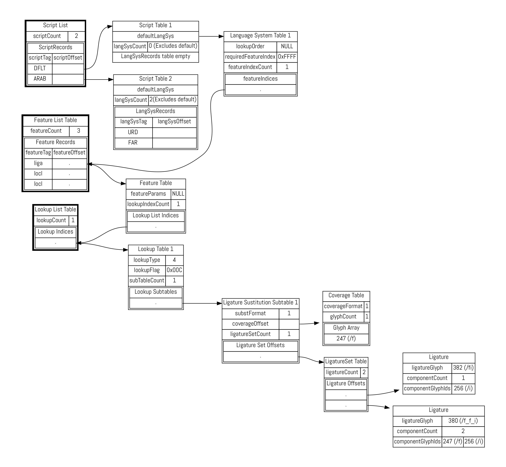

* TOC
{:toc}

In the previous chapter we looked at some of the data tables hiding inside an OpenType font. And let's face it, they weren't all that interesting - metrics, character mappings, a few Bézier splines or drawing instructions. The really cool part about OpenType (and its one-time rival, Apple Advanced Typography) is the ability to *program* the font. OpenType's collaborative model, which we discussed in our chapter on history, allows the font to give instructions to the shaping engine and control its operation.

> When I use the word "instruction" in this chapter, I'm using the term in the computer programming sense - programs are made up of instructions which tell the computer what to do, and we want to be telling our shaping engine what to do. In the font world, the word "instruction" also has a specific sense related to hinting of TrueType outlines, which we'll cover in the chapter on hinting.

"Smart fonts", such as those enabled by OpenType features, can perform a range of typographic refinements based on data within the font, from kerning, ligature substitution, making alternate glyphs available to the user, script-specific and language-specific forms, through to complete substitution, reordering and repositioning of glyphs.

Specifically, two tables within the font - the `GPOS` and `GSUB` tables - provide for a wide range of context-sensitive font transformations. `GPOS` contains instructions for altering the position of glyph. The canonical example of context-sensitive repositioning is *kerning*, which modifies the space between two glyphs depending on what those glyphs are, but `GPOS` allows for many other kinds of repositioning instructions.

The other table, `GSUB`, contains instructions for substituting some glyphs for others based on certain conditions. The obvious example here is *ligatures*, which substitutes a pair (or more) of glyphs for another: the user types "f" and then "i" but rather than displaying those two separate glyphs, the font tells the shaping engine to fetch the single glyph "fi" instead. But once again, `GSUB` allows for many, many interesting substitutions - some of which help us designing fonts for complex scripts.

## Features, lookups and rules

XXX Introduce by example first.

OpenType instructions are arranged in a hierarchical fashion: an instruction which modify the position or content of some glyphs is called a *rule*. Rules are grouped into sets called *lookups*, and lookups are categorised into *features*. Features apply to particular combinations of *language* and *script*.

When a shaping engine processes a run of text, it first determines which features are in play for this run. While a feature can be called anything you like, layout applications will pass certain well-known feature names when the user asks for a particular typographic refinement. For instance, if you hit the "small caps" icon in your word processor, the word processor will ask the shaping engine to process the `smcp` feature. At the same time, the font itself can ask for certain features to be processed by default - the `liga` feature is often turned on by default to provide for standard ligature processing. The application will also tell the shaper what language and script is in use. So in our example, the shaping engine will run through all the lookups within the `smcp` and `liga` features for the language/script combination in use.

We'll start our investigation of features once again by experiment, and from the simplest possible source. As we mentioned, the canonical example of a `GPOS` feature is kerning. (The `kern` feature - again one which is generally turned on by default by the font.)

> As with all things OpenType, there are two ways to do it. There's also a `kern` *table*, but that's a holdover from the older TrueType format. If you're using CFF PostScript outlines, you need to use the `GPOS` table for kerning as we describe here - and of course, using `GPOS` lets you do far more interesting things than the old `kern` table did. Still, you may still come across fonts with TrueType outlines and an old-style `kern` table.

We're going to take our test font from the previous chapter. Right now it has no `GPOS` table, and the `GSUB` table contains no features, lookups or rules; just a version number:

    <GSUB>
      <Version value="0x00010000"/>
    </GSUB>

Now, within the Glyphs editor we will add negative 50 points of kerning between the characters A and B:

We'll now dump out the font again with `ttx`, but this time just the `GPOS` table:

    $ ttx -t GPOS TTXTest-Regular.otf
    Dumping "TTXTest-Regular.otf" to "TTXTest-Regular.ttx"...
    Dumping 'GPOS' table...

Here is what we get:

    <GPOS>
      <Version value="0x00010000"/>
      <ScriptList>
        <!-- ScriptCount=1 -->
        <ScriptRecord index="0">
          <ScriptTag value="DFLT"/>
          
        </ScriptRecord>
      </ScriptList>
      <FeatureList>
        <!-- FeatureCount=1 -->
        <FeatureRecord index="0">
          <FeatureTag value="kern"/>
          <Feature>
            <!-- LookupCount=1 -->
            <LookupListIndex index="0" value="0"/>
          </Feature>
        </FeatureRecord>
      </FeatureList>
      <LookupList>
        <!-- LookupCount=1 -->
        <Lookup index="0">
          <!-- LookupType=2 -->
          <LookupFlag value="8"/>
          <!-- SubTableCount=1 -->
          <PairPos index="0" Format="1">
            <Coverage Format="1">
              <Glyph value="A"/>
            </Coverage>
            <ValueFormat1 value="4"/>
            <ValueFormat2 value="0"/>
            <!-- PairSetCount=1 -->
            <PairSet index="0">
              <!-- PairValueCount=1 -->
              <PairValueRecord index="0">
                <SecondGlyph value="B"/>
                <Value1 XAdvance="-50"/>
              </PairValueRecord>
            </PairSet>
          </PairPos>
        </Lookup>
      </LookupList>
    </GPOS>

Let's face it: this is disgusting. The hierarchical nature of rules, lookups, features, scripts and languages mean that reading the raw contents of these tables is incredibly difficult. (Believe it or not, TTX has actually *simplified* the real representation somewhat for us.) We'll break it down and make sense of it all later in the chapter.

Instead, we're going to use a more readable format. The Adobe Font Development Kit for OpenType (AFDKO) is a set of tools for manipulating OpenType fonts, and it specifies a more human-friendly *feature language*. In almost all cases, we (or our font editing software) write features in this feature language, and this gets compiled into the `GPOS` and `GSUB` representations shown above. But it's possible, with a bit of work, to go the other way around and turn the `GPOS` and `GSUB` tables inside a font back into the feature language.

There are a few ways we could do this. One user-friendly way is to use the [FontForge](https://fontforge.github.io/en-US/) editor. Within the "Font info" menu for a font, we can choose the "lookups" tab, right-click on a lookup, and choose "Save Feature File...":

Another is to use a script using the FontTools library we mentioned in the previous chapter to decompile the `GPOS` and `GSUB` tables back into feature language; one such script is provided by Lasse Fisker, and called [ft2fea](https://github.com/Tarobish/Mirza/blob/gh-pages/Tools/ftSnippets/ft2fea.py).

But while these worked nicely for more complex font files, neither of them worked on our simple test font, so instead, I went with the absolute easiest way - when exporting a file, Glyphs writes out a feature file and passes it to AFDKO to compile the features. Thankfully, it leaves these files sitting around afterwards, and so in `Library/Application Support/Glyphs/Temp/TTXTest-Regular/features.fea`, I find the following:

    table OS/2 {
      TypoAscender 800;
      TypoDescender -200;
      TypoLineGap 200;
      winAscent 1000;
      winDescent 200;
      WeightClass 400;
      WidthClass 5;
      WidthClass 5;
      FSType 8;
      XHeight 500;
      CapHeight 700;
    } OS/2;
    ...

Oh, it turns out that as well as specifying `GPOS` and `GSUB` features, the feature file is also used by font editors to get metrics and other information into the OpenType tables. But let's look down at the bottom of the file:

    feature kern {
      lookup kern1_latin {
        lookupflag IgnoreMarks;
        pos A B -50;
      } kern1_latin;
    } kern;

And here it is - our `kern` feature. This is precisely equivalent to the horrible piece of XML above. The feature language has a simple syntax. The full details are available as part of the [AFDKO Documentation](http://www.adobe.com/devnet/opentype/afdko/topic_feature_file_syntax.html), but the basics are fairly easy to pick up by inspection; a feature is defined like so:

    feature <name> { <lookups> } <name>;

and a lookup like this:

    lookup <name> { <rules> } <name>;

The rules all start with a rule name and end with a semicolon, but what is in the middle depends on the nature of the rule. This kerning rule alters glyphs positions, so it is a `pos` rule (you can also spell this `position`, if you like). There are various kinds of `pos` rule, but the one we want has three parameters: after glyph "A" and before glyph "B", alter the horizontal advance by -50 units.

Now, we've added a rule, and Glyphs has compiled it into our font. How do we know what it actually *did*?

### Using hb-shape for feature testing

Now is a good time to introduce the `hb-shape` tool; it's a very handy utility for debugging and testing the application of OpenType features - how they affect the glyph stream, their effect on positioning, how they apply in different language and script combinations, and how they interact with each other. Learning to use `hb-shape`, which comes as part of the [HarfBuzz](http://harfbuzz.org) OpenType shaping engine, will help you with a host of OpenType-related problems.

As we've mentioned, HarfBuzz is a shaping engine, typically used by layout applications. Shaping, as we know, is the process of taking a text, a font, and some parameters and producing a set of glyphs and their positions. `hb-shape` is a diagnostic tool which runs the shaping process for us and formats the output of the process in a number of different ways. We can use it to check the kern that we added in the previous section:

    $ hb-shape TTXTest-Regular.otf 'AA'
    [A=0+580|A=1+580]

This tells us that when we have two "A" glyphs together, there is a 580 unit advance between the first and the second. But...

    $ hb-shape TTXTest-Regular.otf 'AB'
    [A=0+530|B=1+618]

when we have an "A" and a "B", the advance width of the "A" is only 530 units. In other words, the "B" is positioned 50 units left of where it would normally be placed; the "A" has, effectively, got 50 units narrower. In other other words, our kern worked.

We didn't need to tell HarfBuzz to do any kerning - the `kern` feature is on by default. We can explicitly turn it off by passing the `--features` option to `hb-shape`. `-<feature name>` turns off a feature and `+<feature name>` turns it on:

    $ hb-shape --features="-kern" TTXTest-Regular.otf 'AB'
    [A=0+580|B=1+618]

As you see in this case, the advance width of the "A" is back to 580 units, because the `ab` kern pair is not being applied in this case.

### Glyph classes

According to the specification in the AFDKO documentation, the full syntax for the positioning rule we have just applied is:

    position <glyph|glyphclass> <glyph|glyphclass> <valuerecord>;

Why does it say `glyphclass`? Well, if we had to write a rule like this for every single kerning pair, things would get extremely unwieldy. Many fonts have thousands of kern pairs these days. Glyph classes give us a way of grouping glyphs together and applying one rule to all of them.

Classes can be inline or named; an inline class is a number of glyphs surrounded by square brackets:

    pos [A Acircumflex Agrave Aacute Adiaresis Aring] B -50;

This applies the same (nonsensical) kerning between "AB", "ÂB", "ÀB", "ÁB", "ÄB" and "ÅB". This helps to compact our rules a little bit, but this set of characters is one that we may well use many times in a complete set of kern pairs. So, we can give it a name:

    @Alike = [A Agrave Aacute Adiaresis Aring];

Now we can use `@Alike` instead of `A` to refer to capital A and its diacritic friends:

    pos @Alike B -50;
    pos B @Alike -15;

### Value records

Let's look at another simple positioning feature, as way to understand the few more concepts, including that of a value record.

First, an example by Yannis Haralambous, in his *Fonts and Encodings*: 

Second, if we look at the Devanagari glyph sequence "NA UUE LLA UUE DA UUE " (नॗ ळॗ दॗ) in Noto Sans Devangari:

We see that in the case of the "NA UUE" and "LLA UUE" combinations, the vowel sign UUE is normally positioned at a fixed distance below the headline, regardless of the depth of the base character. (So we're not using mark to base and anchors here, for those of you who have read ahead.) XXX Reword to make more clear

However, if we attached the vowel sign to the "DA", we'd get a collision with the DA's curly tail. So in a DA+UUE sequence, we have to do a bit of *vertical* kerning: move the vowel sign down a bit when applied to a long descender. Here's the code to do that (which I've simplified to make it more readable):

    feature dist {
      script dev2;
      language dflt;
      @longdescenders = [
        \uni091D # JHA (झ)
        \uni0926 # DA (द)
        # And various rakar form ligatures
        \uni0916_uni094D_uni0930.rkrf \uni091D_uni094D_uni0930.rkrf
        \uni0926_uni094D_uni0930.rkrf ];
      pos @longdescenders 0 \uni0956 <0 -90 0 0>; # ॖ
      pos @longdescenders 0 \uni0957 <0 -145 0 0>; # ॗ
    }

What are we doing here? We are defining a feature called `dist`, which is a little like `kern` but for adjusting the distances between pre- and post-base marks and their base characters. It applies to the script "Devanagari v.2" - this is another one of those famous OpenType compromises; Microsoft's old Indic shaper used the script tag `deva` for Devanagari, but when they came out with a new shaper, the way to select the new behavior was to use a new language tag, `dev2`. For any language system using this script, we apply the following rules: when a long descender has a UUE attached, the UUE mark is shifted by 145 units downwards.

When we kerned two characters horizontally, we did this:

    pos @Alike B -50;

The `-50` in that rule was a value record, a way of specifying a distance in Opentype feature rules. A bare number like this as a value record is interpreted as shifting the X advance by the given number of units.

Now we are using a different form of the `pos` instruction *and* a different form of the value record:

    pos @longdescenders 0 \uni0956 <0 -90 0 0>;

Let's take the different form of the `pos` instruction first. Whereas the three-argument form (`glyph glyph distance`) applied the value record to the first glyph, this four-argument form (`glyphA distanceA glyphB distanceB`) allows you to alter the position and advance of *both* glyphs (or glyph sets) independently. To take a stupid example:

    pos A 0 B 50

What does this do? When "B" follows "A" in a text, we add 50 units of advance to the "B", opening up the space between "B" and whatever glyph follows it.

But in our Devanagari example, we don't want to move the mark across - we want to move it down. Enter the second form of the value record:

    <xPos yPos xAdvance yAdvance>

Now we have much more flexibility than just altering the horizontal advance: we can change the glyph's position and advance, independently, in two dimensions. Let's have a look at some examples to see how this works. I added the following stylistic set features to the test "A B" font from the previous chapter:

    feature ss01 { pos A B <150 0 0 0>; } ss01 ;
    feature ss02 { pos A B <0 150 0 0>; } ss02 ;
    feature ss03 { pos A B <0 0 150 0>; } ss03 ;
    feature ss04 { pos A B <0 0 0 150>; } ss04 ;

And now see what effect each of these features has:

From this it's easy to see that the first two numbers in the value record simply shift where the glyph is drawn, with no impact on what follows. Imagine the glyph "A" positioned as normal, but then after the surrounding layout has been done, the glyph is picked up and moved up or to the right.

The third example, which we know as kerning, makes the glyph conceptually wider. The advance of the "A" is extended by 150 units, increasing its right sidebearing; changing the advance *does* affect the positioning of the glyphs which follow it.

Finally, you should be able to see that the fourth example, changing the vertical advance, does absolutely nothing. You might have hoped that it would change the position of the baseline for the following glyphs, and for some scripts that might be quite a nice feature to have, but the sad fact of the matter is that applications doing horizontal layout don't take any notice of the font's vertical advances (and vice versa) and just assume that the baseline is constant. Oh well, it was worth a try.

But at least we now have all the pieces we need to contextually move a mark down a bit from its usual position under a base character: a four-argument `pos` instruction which lets us move the second character in a pair, and a four-element value record which lets us move things up and down. Hence:

    pos @longdescenders 0 \uni0956 <0 -90 0 0>;

What does this say? When we have a long descender and a UE vowel, the consonent positioned normally (`0`), but the vowel sign gets its position shifted by 90 units downwards. That should be enough to avoid the collision.

## More about the rule application process

## Types of Positioning Rule

### Single adjustment
### Pair adjustment
### Cursive attachment
### Mark-to-base
### Mark-to-ligature
### Mark-to-mark
### Contextual positioning
### Chaining contextual positioning

## Types of Substitution Rule

XXX

For many of these features, your glyph editing software may do something clever behind the scenes - for example, interpreting specially-named glyphs - to automatically generate the feature code for you. But it's useful to understand what's actually going on underneath, so that you can customize it if it doesn't quite do what you want to it, and as building blocks from which you can build up your own more sophisticated features.

### Single Substitution

The simplest type of substitution feature available in the `GSUB` table is a single, one-to-one substitution: when the feature is turned on, one glyph becomes another glyph. A good example of this is small capitals: when your small capitals feature is turned on, you substitute "A" by "A.sc", "B" by "B.sc" and so on. Arabic joining is another example: the shaper will automatically turn on the `fina` feature for the final glyph in a conjoined form.

The possible syntaxes for a single substitution are:

    sub <glyph> by <glyph>;
    substitute <glyphclass> by <glyph>;
    substitute <glyphclass> by <glyphclass>;

The first form is the simplest: just change this for that. The second form means "change all members of this glyph class into the given glyph". The third form means "substitute the corresponding glyph from class B for the one in class A". So to implement small caps, we could do this:

    feature smcp {
      substitute [a-z] by [A.sc - Z.sc];
    }

To implement Arabic final forms, we would do something like this:

    feature fina {
        sub uni0622 by uni0622.fina; # Alif madda
        sub uni0623 by uni0623.fina; # Alif hamza
        sub uni0624 by uni0624.fina; # Waw hamza
        ...
    }

Again, in these particular situations, your font editing software may pick up on glyphs with those "magic" naming conventions and automatically generate the features for you. Single substitutions are simple; let's move on to the next category.

### Multiple substitution

Single substitution was one-to-one. Multiple substitution is one-to-many: it decomposes one glyph into multiple different glyphs. The syntax is pretty similar, but with one thing on the left of the `by` and many things on the right.

This is a pretty rare thing to want to do, but it can be useful if you have situations where composed glyphs with marks are replaced by a decomposition of another glyph and a combining mark. For example, sticking with the Arabic final form idea, if you haven't designed a specific glyph for alif madda in final form, you can get around it by doing this:

    feature fina {
        # Alif madda -> final alif + madda above
        sub uni0622 by uni0627.fina uni0653;
    }

This tells the shaper to split up final alif madda into two glyphs; you have the final form of alif, and so long as your madda mark is correctly positioned, you are essentially synthesizing a new glyph out of the two others.

### Alternate substitution

After one-to-many, we have what OpenType calls "one from many"; that is, one glyph can be substituted by *one out of a set of* glyphs. On the face of it, this doesn't make much sense - how can the engine choose which "one out of the set" it should substitute? Well, the answer is: it doesn't. This substitution is designed for features where the shaping engine is expected to pass a set of glyphs to the user interface, so that the user can choose which one they want.

One such feature is `aalt`, "access all alternates", which is used by the "glyph palette" window in various pieces of design software. The idea behind this feature is that a user selects a glyph, and the design software asks the shaping engine to return the set of all possible glyphs that the user might want to use instead of that glyph - all the different swash, titling, small capitals or other variants:

    feature aalt {
      sub A from [A.swash A.ss01 A.ss02 A.ss03 A.sc];
      sub B from [B.swash B.ss01 B.ss02 B.ss03 B.sc];
      ...
    }

Again, this is the sort of thing your font editor might do for you automatically (this is why we use computers, after all), and I can't think of any global-script type usage of this lookup type, but I'm including it here for completeness.

> If you peruse the registered feature tags list in the OpenType specification you might find various references to features which should be implemented by GSUB lookup type 3, but the dirty little secret of the OpenType feature tags list is that many of the features are, shall we say... *aspirational*. They were proposed, accepted, and are now documented in the specification, but nobody ever actually got around to implementing them. The `rand` feature, for example, should perform randomisation, which ought to be an excellent use case for "choose one glyph from a set". But no software ever turns that feature on, and no shaping engine returns a random glyph in response. Shame, really.

### Ligature substitution

We've done one to one, and we've done one to many - *ligature substitution* is a many-to-one substitution. You substitute multiple glyphs on the left `by` the one on the right.

The classic example for Latin script is how the two glyphs "f" and "i" become the single glyph "fi", but let's take a more interesting example. In the Khmer script, when two consonants appear without a vowel between them, the second consonant is written below the first and in a special form. This consonant stack is called a "coeng", and the convention in Unicode is to encode the stack as CONSONANT 1, U+17D2 KHMER SIGN COENG, CONSONANT 2. (You need the explicit coeng because Khmer is written without word boundaries, and a word-ending consonant followed by a word-beginning consonant shouldn't trigger a stack.)

So, whenever we see U+17D2 KHMER SIGN COENG followed by a consonant, we should transform this into the special form of the consonant and tuck it below the base consonant.

As you can see from the diagram above, the first consonant doesn't change; we just need to transform the coeng sign plus the second consonant into the coeng form of that consonant, and then position it appropriately under the first consonant. We know how to muck about with positioning, but for now we need to turn those two glyphs into one glyph. We can use a ligature substitution lookup to do this. We create a `rlig` (required ligature) feature, which is a ligature that is "required to be used in normal conditions" and "important for some scripts to insure correct glyph formation", and replace the two glyphs U+17D2 KHMER SIGN COENG plus a consonant, with the coeng forms:

    feature rlig {
      sub uni17D2 uni1780 by uni1780.coeng;
      sub uni17D2 uni1781 by uni1781.coeng;
      ...
    }

Another example is the Arabic lam alif.

### contextual substitution
### chained contextual substitution
### extended substitution
### reverse chained contextual substitution

## Features in Practice

XXX list of (implemented) OT features

(Refer to localization chapter)

### Superscript / Subscript
### Stylistic Alternates
### Contextual Alternates

### Positioning

## How features are stored

The OpenType font format is designed above all for efficiency. Putting a bunch of glyphs next to each other on a screen is not meant to be a compute-intensive process (and it *is* something that happens rather a lot when using a computer); even though, as we've seen, OpenType fonts can do all kinds of complicated magic, the user isn't going to be very amused if *using a font* is the thing that's slowing their computer down. This has to be quick.

As well as speed and ease of access, the OpenType font format is designed to be efficient in terms of size on disk. Repetition of information is avoided (well, all right, except for when it comes to vertical metrics...) in favour of sharing records between different users. Multiple different formats for storing information are provided, so that font editors can choose the most size-efficient method.

But because of this focus on efficiency, and because of the sheer amount of different things that a font needs to be able to do, the layout of the font on the disk is... somewhat overengineered.

Here's an example of what actually goes on inside a `GSUB` table. I've created a simple font with three features. Two of them refer to localisation into Urdu and Farsi, but we're going to ignore them for now. We're only going to focus on the `liga` feature for the Latin script, which, in this font, does two things: substitutes `/f/i` for `/fi`, and `/f/f/i` for `/f_f_i`.

In Adobe feature language, that looks like:

    languagesystem DFLT dflt;
    languagesystem arab URD;
    languagesystem arab FAR;

    feature locl {
      script arab;
      language URD;
      ...
      language FAR;
      ...
    }

    feature liga {
      sub f i by fi;
      sub f f i by f_f_i;
    }

Now let's look at how that is implemented under the hood:

Again, what a terrible mess. Let's take things one at a time. On the left, we have three important tables. (When I say tables here, I don't mean top-level OpenType tables like `GSUB`. These are all data structures *inside* the `GSUB` table, and the OpenType standard, perhaps unhelpfully, calls them "tables".) Within the `GPOS` and `GSUB` table there is a *script list*, a *feature list* and a *lookup list*. There's only one of each of these tables inside `GPOS` and `GSUB`; the other data structures in the map (those without bold borders) can appear multiple times: one for each script, one for each language system, one for each feature, one for each lookup and so on.

When we're laying out text, the first thing that happens is that it is separated into runs of the same script and language. (Most documents are in a single script, after all.) This means that the shaper can look up the script we're using in the script list (or grab the default script otherwise), and find the relevant *script table*. Then we look up the language system in the language system table, and this tells us the list of features we need to care about.

Once we've looked up the feature, we're good to go, right? No, not really. To allow the same feature to be shared between languages, the font doesn't store the features directly "under" the language table. Instead, we look up the relevant features in the *feature list table*. Similarly, the features are implemented in terms of a bunch of lookups, which can also be shared between features, so they are stored in the *lookup list table*.

Now we finally have the lookups that we're interested in. Turning on the `liga` feature for the default script and language leads us eventually to lookup table 1, which contains a list of lookup "subtables". Here, the rules that can be applied are grouped by their type. (See the sections "Types of positioning feature" and "types of substitution feature" above.) Our ligature substitutions are lookup type 4.

The actual substitutions are then grouped by their *coverage*, which is another important way of making the process efficient. The shaper has, by this stage, gathered the features that are relevant to a piece of text, and now needs to decide which rules to apply to the incoming text stream. The coverage of each rule tells the shaper whether or not it's likely to be relevant by giving it the first glyph ID in the ligature set. If the shaper sees anything other than the letter "f", then we know for sure that our rules are not going to apply, so it can pass over this set of ligatures and look at the next subtable. A coverage table comes in two formats: it can either specify a *list* of glyphs, as we have here (albeit a list with only one glyph in it), or a *range* of IDs.

OK, we're nearly there. We've found the feature we want. We are running through its list of lookups, and for each lookup, we're running through the lookup subtables. We've found the subtable that applies to the letter "f", and this leads us to two more tables, which are the actual rules for what to do when we see an "f". We look ahead into the text stream and if the next input glyph (which the OpenType specification unhelpfully calls "component", even though that also means something completely different in the font world...) is the letter "i" (glyph ID 256), then the first ligature substitution applies. We substitute that pair of glyphs - the start glyph from the coverage list and the component - by the single glyph ID 382 ("fi"). If instead the next two input glyphs have IDs 247 and 256 ("f i") then we replace the three glyphs - the start glyph from the coverage list and both components - with the single glyph ID 380, or "ffi". That is how a ligature substitution feature works.

If you think that's an awful lot of effort to go to just to change the letters "f i" into "fi" then, well, you'd be right. It took, what, 11 table lookups? But remember that the GPOS and GSUB tables are extremely powerful and extremely flexible, and that power and flexibility comes at a cost. To represent all these lookups, features, languages and scripts efficiently inside a font means that there has to be a lot going on under the hood.

Thankfully, unless you're implementing some of these shaping or font editing technologies yourself, you can relax - it mostly all just works.

## Other opentype tables (not related to internationalisation)
### Color fonts
