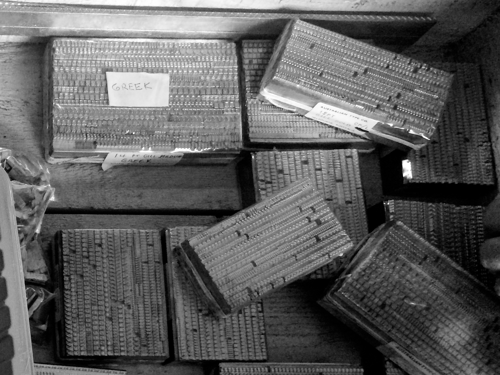
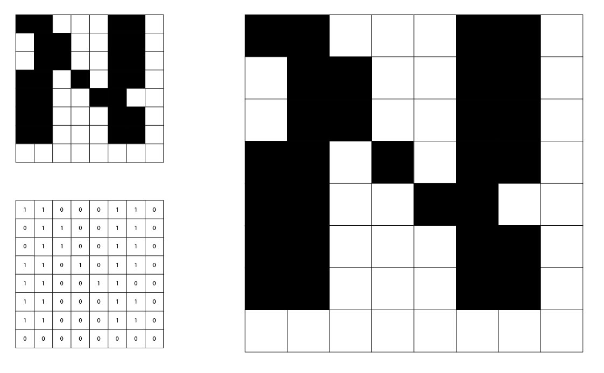
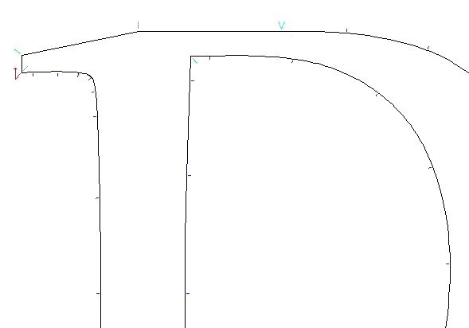
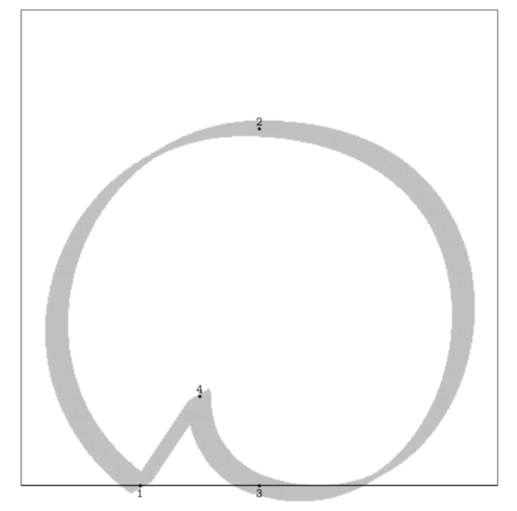
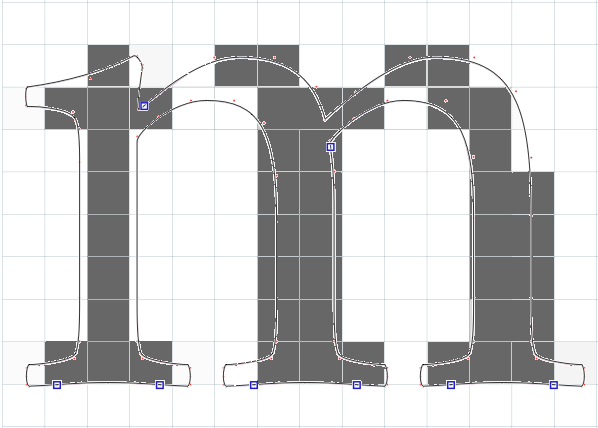

Once upon a time, a *font* was a bunch of pieces of metal. The first recorded use of metal type for printing comes from China. In 13th century, banknotes were printed with anti-counterfeit devices printed using blocks of bronze;[^2] the first metal type books were produced in Korea around the same time.[^1] Two hundred years later, Johannes Gutenberg came up with a similar system for creating metal type that would spread rapidly over Europe and continue to be the most common means of printing until the 19th century.

To create type for printing, engravers would work the images of letters, numbers and so on into punches. Punches would then be struck into a mold called a *matrix*. The typemaker would then use the matrices to cast individual pieces of type (also known as *sorts*). A complete set of type sorts in the same size and style was collected together into a *font* of type.



> A box of fonts cast by the Australian Type Foundry. The font on the top left is a 14pt Greek typeface by Eric Gill.

Complete fonts of type would be placed into type cases, from which compositors would then select the sorts required to print a page and arrange them into lines and pages. Next, the printer would cover the face of the metal with ink and impress it onto the paper. With the advent of hot metal typesetting, which combined casting and compositing into one automated activity, the idea of a font of type fell out of fashion.

The idea was revived with the advent of digital typography. In 1964, the IBM 2260 Display Station provided one of the first text-based visual interfaces to a computer.[^3] The mainframe computer would generate the video signal and send it to the terminal, pixel by pixel: each character was 9 pixels wide and 14 pixels tall. The choice of bitmaps for each character, what we would now call the font, was hard-wired into the mainframe, and could not be changed.

Much has changed since the early bitmap fonts, but in a sense one thing has not. The move from Gutenberg's rectangular metal sorts to rectangular 9x14 digital bitmaps ensured that computer typography would be dominated by the alignment of rectangles along a common baseline - an unfortunate situation for writing systems which don't consist of a straight line of rectangles.


> No OpenType for you!

We can see the historical reasons why this situation has come about. But what this means, for the type designer working with global scripts, is that a common challenge will be to find ways of usefully mapping the computer's Latin-centered model of baselines, bounding boxes, and so on, onto a design in which these structures may not necessarily apply. Some of these challenges can be overcome through developments in the technology; some of them will need to be worked around. We will look at these challenges in more detail over the course of the book.

## Digital fonts go vector

As we saw, the first computer fonts were stored in *bitmap* (also called *raster*) format. What this means is that their design was based on a rectangular grid of square pixels. For a given glyph, some portion of the grid was turned on, and the rest turned off. The computer would store each glyph as a set of numbers, 1 representing a pixel turned on and 0 representing a pixel turned off - a one or zero stored in a computer is called a *bit*, and so the instructions for drawing a letter were expressed as a *map* of *bits*:



> Capital aleph, from the Hebrew version of the IBM CGA 8x8 bitmap font.

This design, however, is not *scalable*. The only way to draw the letter at a bigger point size is to make the individual pixels bigger squares, as you can see on the right. The curves and diagonals, such as they are, become more "blocky" at large sizes, as the design does not contain any information about how they could be drawn more smoothly. Perhaps we could mitigate this by designing a new aleph based on a bigger grid with more pixels, but we would find ourselves needing to design a new font for every single imaginable size at which we wish to use our glyphs. Surely we use computers to delegate this kind of work to them.

At some point, when we want to see our glyphs on the screen, they will need to become bitmaps: screens are rectangular grids of square pixels, and we will need to know which ones to turn on and which ones to turn off. But we've seen that, while this is necessary to represent a *particular* glyph at a *particular* size, this is a bad way to represent the *design* of the glyph. We want instead to tell the computer about the outlines, the contours, the shapes that we want to see, and let the computer work out how to turn that into a series of ones and zeros, on pixels and off pixels. Because we want to represent the design not in turns of ones and zeros but in terms of lines and curves, geometric operations, we call this kind of representation a *vector* representation. The process of going from a vector representation of a design to a bitmap representation to be displayed is called *rasterization*, and we will look into it in more detail later.

The first system to represent typographical information in geometrical, vector terms - in terms of the lines and curves which make up the abstract design, not the ones and zeros of a concrete instantiation of a letter - was Dr Peter Karow's IKARUS system in 1972.[^4] The user of IKARUS (so called because it frequently crashed) would trace over a design using a graphics tablet, periodically clicking along the outline to add *control points* to mark the start point, a sharp corner, a curve, or a tangent (straight-to-curve transition):



> A glyph in IKARUS, showing start points (red), straight lines (green), curve-to-straight tangents (cyan) and curves (blue).

The system would join the line sections together and use circular arcs to construct the curves. By representing the *ideas* behind the design, IKARUS could automatically generate whole systems of fonts: not just rasterizing designs at multiple sizes, but also adding effects such as shadows, outlines and deliberate distortions of the outline which Karow called "antiquing". By 1977, IKARUS also supported interpolation between multiple masters; a designer could draw the same glyph in, for example, a normal version "A" and a bold version "B", and the software would generate a semi-bold by computing the corresponding control points some proportion of the way between A and B.

In that same year, 1977, the Stanford computer scientist Don Knuth began work on a very different way of representing font outlines. His METAFONT system describes glyphs *algorithmically*, as a series of equations. The programmer - and it does need to be a programmer, rather than a designer - states that certain points have X and Y coordinates in certain relationships to other points; unlike IKARUS which describes outer and inner outlines and fills in the interior of the outline with ink, METAFONT uses the concept of a *pen* of a user-defined shape to trace the curves that the program specifies. Here, for example, is a METAFONT program to draw a "snail":

```
% Define a broad-nibbed pen held at a 30 degree angle.
pen mypen;
mypen := pensquare xscaled 0.05w yscaled 0.01w rotated 30;

% Point 1 is on the baseline, a quarter of the way along the em square.
x1 = 0.25 * w; y1 = 0;

% Point 2 is half-way along the baseline and at three-quarter height.
x2 = 0.5 * w; y2 = h * 0.75;

% Point 3 is below point 2 and parallel with point 1.
x3 = x2; y3 = y1;

% Point 4 is half way between 1 and 3 on the X axis and a quarter of
% the way between 2 and 1 on the Y axis.
x4 = (x1 + x3) / 2;
y4 = y1 + (y2-y1) * 0.25;

% Use our calligraphic pen
pickup mypen;

% Join 1, 2, 3 and 4 with smooth curves, followed by a line back to 1.
draw z1..z2..z3..z4--z1;
```

The glyph generated by this program looks like so:



> A METAFONT snail.

The idea behind METAFONT was that, by specifying the shapes as equations, fonts then could be *parameterized*. For example, above we declared `mypen` to be a broad-nibbed pen. If we change this one line to be `mypen := pencircle xscaled 0.05w yscaled 0.05w;`, the glyph will instead be drawn with a circular pen, giving a low-contrast effect. Better, we can place the parameters (such as the pen shape, serif length, x-height) into a separate file, create multiple such parameter files and generate many different fonts from the same equations.

However, METAFONT never really caught on, for two reasons. The first is that it required type designers to approach their work from a *mathematical* perspective. As Knuth himself admitted, "asking an artist to become enough of a mathematician to understand how to write a font with 60 parameters is too much." Another reason was that, according to Jonathan Hoefler, METAFONT's assumption that letters are based around skeletal forms filled out by the strokes of a pen was "flawed";[^5] and while METAFONT does allow for defining outlines and filling them, the interface to this is even clunkier than the `draw` command shown above. However, Knuth's essay on "the concept of a meta-font"[^6] can be seen as sowing the seeds for today's variable font technology.

As a sort of bridge between the bitmap and vector worlds, the Linotron 202 phototypesetter, introduced in 1978, stored its character designs digitally as a set of straight line segments. A design was first scanned into a bitmap format and then turned into outlines. Linotype-Paul's non-Latin department  almost immediately began working with the Linotron 202 to develop some of the first Bengali outline fonts; Fiona Ross' PhD thesis describes some of the difficulties faced in this process and how they were overcome.[^10]

## A post script

Also in 1978, John Warnock was working at Xerox PARC in Palo Alto. His research project, on which he worked together with Chuck Geschke, was to develop a way of driving laser printers, describing way that the graphics and text should be laid out on a page and how they should look. Prior to this point, every printer manufacturer had their own graphics format; the idea behind the Interpress project was to create a language which could be shared between different printers. However, other manufacturers were not interested in the Interpress idea, and it also had a "careful silence on the issue of fonts",[^7] so the project was shelved.

Still, it was a good idea, and Geschke and Warnock left Xerox in 1982 to found their own company to further develop the ideas of Interpress into a system called PostScript. The company was named after a small stream at the back of Warnock's house: Adobe. Adobe PostScript debuted in 1984, with the first PostScript printer appearing in 1985.

The first version of PostScript was not *at all* silent on the issue of fonts, and contained a number of innovations which have shaped font technology to this day. The first is the development of *hinting*. Although vector fonts can be scaled up and down in ways that bitmap fonts cannot, we mentioned that at some point, they need to be rasterized. This is evidently the case for on-screen view, where the screen is made up of discrete phosphor-coated glass, liquid crystal or LED cells; but it is also the case when the designs are printed: digital printers also work on the concept of discrete "dots" of ink.

One way to rasterize would be to simply say that a pixel is "on" if more than a certain proportion - 50%, for example - of its surface is covered by the outline. Unfortunately, when the pixels are quite large compared to the outline (when the font is being displayed at small sizes), this strategy leads to quite unattractive results.



> The perils of simplistic rasterization

We see that key parts of serifs and strokes are missing, and that stem widths have become uneven. Rasterization can also lead to points which should be aligned (such as the tops of the downstrokes of the m) becoming misaligned, although this has not happened in this example.

*Hinting* is a way of giving information to the rasterization process to help communicate what is important about the design: which stems need to be preserved and have the same width as others, where the baselines, x-heights, cap heights and other important places are that pixels should align in nice straight lines. PostScript's hinting improved the rasterization of fonts at small point sizes.

The second innovation was the way that PostScript implemented curves. Whereas IKARUS used sections of circles joined together[^8] and METAFONT used cleverly computed cubic splines,[^9] PostScript represented shapes in terms of *Bézier curves*.

### The Bézier Curve

Pierre Bézier was an engineer at Renault who specializing in the design of tools; initially these were manual tools, but in the mid 1950s he became interested in automated tools for precise drilling and milling. As manager of the technical development divison of Renault, he began work on a CADCAM (computed-aided design and manufacturing system) called UNISURF. UNISURF needed a way to allow designers to draw and manipulate curves and surfaces on a computer, both for technical drawing and design and for conversion into programs for computer-controlled machine tools.

To do this, Bézier adapted an algorithm invented by Paul de Casteljau, who was doing the same kind of things as Bézier was but over at the *other* French car company, Citroën. De Casteljau's algorithm takes a mathematical description of a curve and - essentially - rasterizes it: turning the *equation* which describes the curve into a *set of points* which can be joined together to draw the curve. Bézier's contribution - as well as popularising the de Casteljau algorithm - was to made it suitable for designers to manipulate by introducing the notion of *control points*. Bézier curves have a start point and an end point and then one or more *offcurve points* which "pull" the curve towards them.

Here is a Bézier curve of order three (start and end, and two off-curve points). It also known as a cubic Bézier curve because it is described using an equation which is a cubic polynomial.


> A cubic Bézier curve

I have also shown three points generated by applying de Casteljau's algorithm in three places, and an approximation of the curve generated by joining the de Casteljau points with straight lines - in a sense, doing something similar to what the Linotron 202 did with the outlines of its font data.

Bézier curves were found to give the designer of curves - such as those used for Renault's car bodies - an easy and intuitive way to express the shapes they wanted. By dragging around control points, designers can "sculpt" a curve. The cubic Bézier curve, with its start and end point and two off-curve control points, was adopted into PostScript as a command for graphics drawing, and from there, it made its way into the design of digital fonts.

## PostScript Fonts, TrueType and OpenType

1987 idea for TrueType, introduced Microsoft/Apple 1991.
OpenType developed 1996-1999. David Lemon, Adobe.
PostScript. In 1985, PostScript Type 1 fonts. (cubic beziers)

PostScript Type 3 used full programming environment. (Image: Beowulf)

## Multiple masters, GX, and variable fonts

## The OT Co-operative model
## Would be remiss not to mention emoji here

[^1]: Hye Ok Park, 2014. "The History of Pre-Gutenberg Woodblock and Movable Type Printing in Korea", *International Journal of Humanities and Social Science*, 4:9.
[^2]: Pan Jixing, 2001. *A History of Moveable Type Printing in China*. Beijing: Institute for History of Science, Academy of Science, 273.
[^3]: See http://www.columbia.edu/cu/computinghistory/2260.html
[^4]: See Karow, 2013, *Digital Typography and Artifical Intelligence*, Dutch Type Library (available at https://www.dutchtypelibrary.nl//PDF/Miscellaneous/Digital_Typography_and_AI.pdf) for the history.
[^5]: https://twitter.com/HoeflerCo/status/655557339987226624
[^6]: Knuth, 1982, "The Concept of a Meta-Font", *Visible Language* 17.
[^7]: Brian Reid, 1985, "PostScript and Interpress: a comparison", https://tech-insider.org/unix/research/1985/0301.html
[^8]: Known technically as a "biarc" curve; see https://en.wikipedia.org/wiki/Biarc
[^9]: Look, I'm having to simplify here. METAFONT84 used cubic Bézier curves just like PostScript does, but with the off-curve control points being implicit and automatically generated using John Hobby's algorithm, rather than explicitly specified as in the PostScript case. I don't know how METAFONT79 worked.
[^10]: Fiona Ross, 1988, *The Evolution of the Printed Bengali Character from 1778 to 1978*, PhD Thesis, School of Oriental and African Studies. Joe Condon, Brian Kernighan and Ken Thompson's Bell Labs Technical Memorandum *Experience with the Mergenthaler Linotron 202 Phototypesetter, or, How We Spent Our Summer Vacation* is a fascinating technical look at the insides of the 202. (https://www.cs.princeton.edu/~bwk/202/)