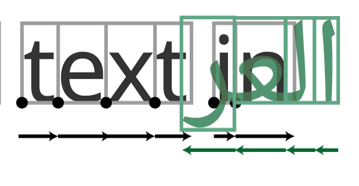

The previous chapters have been mainly aimed at font designers, but with some nods to those implementing shaping and layout systems. In this second half of the book, our discussion will be mainly aimed at font *consumers* - shapers, layout engines, and applications - rather than font producers, but with some nods to font designers.

As I may have mentioned once or twice by this point, the historical development of computers and the way that text has been handled has prioritized Latin assumptions about text layout. In the Latin model, things are very simple: a glyph is a square box, you line up each of the square boxes in your string of glyphs next to each other on a horizontal line in left to right order until they more or less fit on a line, you break the line at a space, and then you (possibly) make some adjustments to the line to make it fit nicely, and finally you move onto the next line which is underneath the previous one.

But every single one of those assumptions fails in one or other script around the world. Telugu boxes don't line up next to each other. Hebrew boxes don't go left to right. Japanese boxes sometimes line up on a vertical line, sometimes on a horizontal one. Nastaleeq boxes don't line up on a perpendicular line at all. Thai lines don't break at spaces. The next line in Mongolian is to the right of the previous one, not underneath it; but in Japanese it's to the left.

What we want to do in this chapter is gain a more sophisticated understanding of the needs of complex scripts as they relate to text layout, and think about how to cater for these needs.

> I'm going to moralize for a moment here, and it's my book, so I can. Once upon a time, a company made a [racist soap dispenser](https://gizmodo.com/why-cant-this-soap-dispenser-identify-dark-skin-1797931773). It looked for skin reflection to see if it needed to dispense soap, and because it didn't see reflection from darker skin, it didn't work for black people. I'm sure they didn't intend to be racist, but that doesn't actually matter because [racism isn't about intention, it's about bias](https://edition.cnn.com/2014/11/26/us/ferguson-racism-or-racial-bias/index.html).
> Because they didn't think about situations beyond their own experience, and clearly didn't *test* situations beyond their own experience, those involved ended up creating a system that discriminated. What's this got to do with text layout? As it turns out, quite a lot.
> Now you're reading this book, which is a good start, because it probably means you care about global scripts. But so many programmers coming to layout think "I don't need to use an external library for this. I'll just do it myself. See, it's easy to get something working. We can add the complicated stuff later". So they write some code that works with *their* script (usually Latin), and yes, it is quite easy. They feel very pleased with themselves. Then later a user requires Arabic or Hebrew support, and they look at the problem again, and they realise it's actually not easy. So they put it off, and it never happens.
> What's the moral of this story? 1) It's no more acceptable to write a text layout system that only works for one minority script than it is to make a soap dispenser that only works for white people. 2) Don't write half-assed text layout code until you've read this chapter and realised how big a deal this global scripts stuff is, and then go and use one of the libraries we'll discuss in further chapters instead.

## Bidirectionality

Let's begin with the idea that the boxes are lined up left to right. Clearly, in scripts like Hebrew and Arabic, that's not correct: they go right to left. Hebrew and Arabic between them have half a billion users, so supporting right-to-left text isn't really optional, but what about other scripts?

There are a number of other scripts in the Semitic family - some living, such as Mandaic, and others which are mainly of historic interest, such as Samaritan, Phoenician and Lydian; then there are scripts like N'Ko, which represents a Mande language of West Africa but whose design was heavily influenced by Arabic, and Adlam, a recently constructed script for Fulani. The point is, you can't just check if a text is Hebrew or Arabic to see if it needs special processing - you need (as with everything) to check the Unicode Character Database instead, which has a field for each character's directionality.

When you have determined that a text is actually in a right-to-left script, what special processing is needed? Unfortunately, it is not just as simple as flipping the direction and taking away numbers from the X coordinate instead of adding them. The reasons for this is that, while handling *directionality* is conceptually simple, the problems come when you have to handle *bidirectionality* (often called *bidi*): documents containing text in more than one direction. That might sound obscure, but it's actually exceptionally common. A document in Arabic may refer to the name of a foreign person or place, and do so in Latin script. Or a document like this in English might be deliberately refer to some text in العربية. When this happens, just flipping the direction has disastrous results:

"I know," you might think, "I'll just work out how long the Arabic bit is, move the cursor all the way to the end of it, and then work backwards from there." But of course *that* won't work either, because there might be a line break in the middle. Worse still, line breaks do *interesting* things to bidirectional texts. The following example shows the same text, "one two שלוש (three) ארבע (four) five", set at two different line widths:

Notice how the word "שלוש (three)" appears as the *second* Hebrew word on the wider line, and the *first* Hebrew word on the narrower line? This is because we're thinking left to right; if you think about the lines from right to left, it's the first Hebrew word each time.

Thankfully, this is a solved problem, and the answer is the Unicode Bidirectionality Algorithm.

> I'm not going to describe how the Unicode Bidirectionality Algorithm works, because if I do you'll try and implement it yourself, which is a mistake - it's tricky, it has a lot of corner cases, and it's also a solved problem. if you are implementing text layout, you need to support bidi, and the best way to do that is to use either the [ICU Bidi library](https://unicode-org.github.io/icu-docs/apidoc/released/icu4c/ubidi_8h.html), [fribidi](https://github.com/fribidi/fribidi), or an existing layout engine which already supports bidi (such as [libraqm](https://github.com/HOST-Oman/libraqm)).

Oh, all *right*. I'll tell you a *bit* about how it works, because the process contains some important pieces of terminology that you'll need to know.

First, let's establish the concept of a *base direction*, also called a *paragraph direction*. In this document, the base direction is left to right. In a Hebrew or Arabic document, the base direction could will be right to left. The base direction will also determine how your cursor will move.

Unicode text is always stored on disk or in memory in *logical order*, which is the "as you say it" order. So the word "four" in Hebrew ארבע is always stored as aleph (א) resh (ר) bet (ב) ayin (ע). The task of the bidi algorithm is to swap around the characters in a text to convert it from its logical order into its *visual order* - the visual order being the order the characters will be written as the cursor tracks along the paragraph. The bidi algorithm therefore runs sometime after the text has been retrieved from wherever it is stored, and sometime before it is handed to whatever is going to draw it, and it swaps around the characters in the input stream so that they are in visual order. You can do this before the characters are handed to the shaper, but it's best to do it after they have been shaped - it's a bit more complicated this way, because after characters have been shaped they're no longer characters but glyph IDs, but your shaper will also tell you which position in the input stream refers to which glyph ID, so you can go back and map each glyph to characters for bidi processing purposes.

For example, in this paragraph, we have the words "Hebrew ארבע". You say (and store) the aleph first, but we want the aleph to visually appear at the end:

    Logical order: H e b r e w   ע ב ר א
    Visual order:  H e b r e w   א ר ב ע

The first step in the algorithm is to split up the input into a set of *runs* of text of the same *embedding level*. Normally speaking, text which follows the *base direction* is embedding level 0, and any text which goes the opposite direction is marked as being level 1. This is a gross simplification, however. Let's consider the case of an English paragraph which contains an Arabic quotation, which has within it a Greek aside. In terms of solving the bidirectionality problem, you could think of this as four separate runs of text:

However, Unicode defines ways of specifying that the Greek is embedded within the Arabic which is in turn embedded within the English, through the addition of U+202A LEFT-TO-RIGHT EMBEDDING and U+202B RIGHT-TO-LEFT EMBEDDING characters. While it is visually equivalent to the above, this maintains the semantic distinction between the levels:

> There are a bunch of other similar bidi control characters defined by the Unicode standard, which we're not going to mention here, but which a conformant bidi algorithm will need to deal with.

Once the bidi algorithm has established the embedding levels, it can re-order
the glyphs such that the text appears in visual order. Hooray - we're done with bidirectionality! Except that we're not, of course: for example, groups of numbers embedded in RTL text should *not* be swapped around; brackets and other paired characters should be *mirrored* rather than reordered:

    Logical order:          H e b r e w  ( 1 2 3 ע ב ר א )
    Incorrect visual order: H e b r e w  ) 3 2 1 ע ב ר א (
    Correct visual order:   H e b r e w  ( 1 2 3 א ר ב ע )

The Unicode Character Database contains information about which characters have *weak* directionality, such as numerals, which should be treated specially by the bidirectionality algorithm, and also which characters have mirrored pairs. The Unicode Bidirectionality Algorithm specifies the rules for handling this data correctly so that all the nasty corner cases work out fine.

So, as a layout system implementer, how should you proceed? The recommendation in the UAX #9 which specifies the algorithm recommends that text is first handed to the bidi algorithm to resolve the levels, then the runs identified by the algorithm are passed to the shaper to be shaped independently, and then the reordering should take place. But that's just the recommendation. In reality, it doesn't actually matter *when* you shape the runs. `libraqm` resolves the levels, then reorders, then shapes; the SILE typesetter shapes, then resolves the levels, then reorders. So long as you perform all the steps on the appropriate runs, it will all work out.

For example, using `fribidi`, the routine would look something like this:

    /* Resolve levels*/
    FriBidiCharType* btypes = calloc(string_l, sizeof (FriBidiCharType));
    FriBidiBracketType *bracket_types = calloc(string_l, sizeof(FriBidiBracketType);
    FriBidiLevel *embedding_levels = calloc(string_l, sizeof(FriBidiLevel));

    FriBidiParType base_dir = FRIBIDI_PAR_LTR; // Or ..._RTL
    fribidi_get_bidi_types(string, string_l, &btypes);
    fribidi_get_bracket_types(string, string_l, btypes, &bracket_types);
    fribidi_get_par_embedding_levels_ex(btypes,
                                        bracket_types,
                                        string_l,
                                        &base_dir,
                                        &embedding_levels);

        /* Shape each run */
      for (size_t i = 0; i < run_count; i++)

## Other directionality (vertical etc.)
## Shaping challenges (Bengali etc.)
## Arabic connection
## Line breaking & word detection
### CJK
### South Asian scripts
