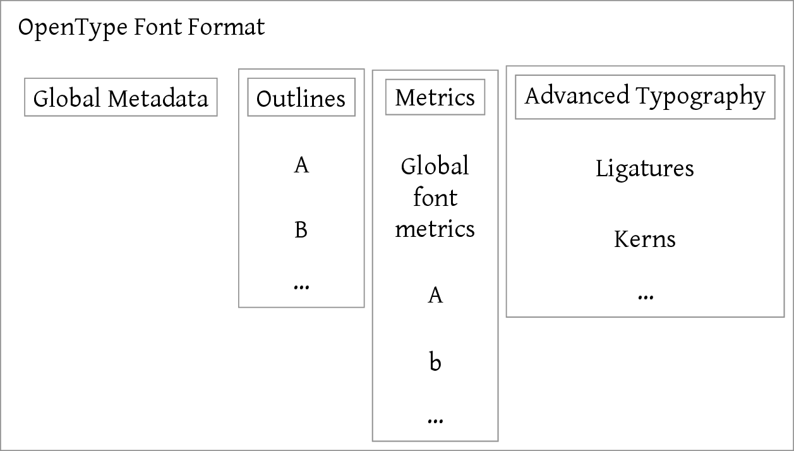
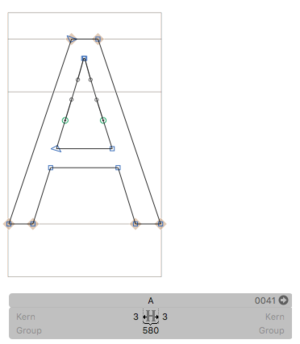
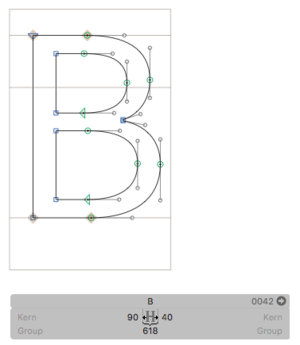

How OpenType Works
==================

They say that if you enjoy sausages, you shouldn't look too carefully into how they are made, and the same is true of OpenType fonts.

In this chapter we're going to look in some depth about the OpenType font format: how it actually converts the outlines, metrics and advanced typographic features of a font into a file that a computer can interpret. In an ideal world, this would be information that programmers of layout systems and font handling libraries would need, but implementation details that font designers could safely ignore.

But we are not in an ideal world, and as we will see when we start discussing the metrics tables, the implementation details matter for font designers too - different operating systems, browsers and applications will potentially interpret the information contained within a font file in different ways leading to different layout.

So put on your overalls, grab your bucket, and let's take a look inside the font sausage factory.

## What is a font?

From a computer's perspective, a font is a database. It's a related collection of *tables* - lists of information. Some of the information is global, in the sense that it refers to the font as a whole, and some of the information refers to individual glyphs within the font. A simplified schematic representation of a font file would look like this:



In other words, most of the information in a font is not the little black shapes that you look at; aside from having to deal with how to draw the glyphs, the computer is much more concerned with details about how the font is formatted, the glyphs that it supports, the heights, widths and sidebearings of those glyphs, how to lay them out relative to other glyphs, and what clever things in terms of kerns, ligatures and so on need to be applied. Each of these pieces of information is stored inside a table, which is laid out in a binary (non-human-readable) representation inside your OTF file.

## FontTools and ttx

To crack open that OTF file and look at the tables inside, we're going to use a set of Python programs called `fonttools`. `fonttools` was originally written by Just van Rossum, but is now maintained by Behdad Esfahbod and a cast of hundreds. If you don't have `fonttools` already installed, you can get hold of it by issuing the following commands at a command prompt:

XXX sidenote explaining terminals here

    easy_install pip
    pip install fonttools

If you have the Homebrew package manager installed, which is highly recommended for developing on Mac computers, you can get fonttools through Homebrew:

    brew install fonttools

XXX sidenote on Homebrew

The core of the `fonttools` package is a library, some code which helps Python programmers to write programs for manipulating font files. But `fonttools` includes a number of programs already written using the library, and one of these is called `ttx`.

As we mentioned above, an OpenType font file is a database. The database, with its various tables, is stored in a file using a format called SFNT, which stands for "spline font" or "scalable font". OpenType, TrueType, PostScript and a few other font types all use the SFNT representation to lay out their tables into a binary file. But because the SFNT representation is binary - that is to say, not human readable - it's not very easy for us either to investigate what's going on in the font or to make changes to it. The `ttx` utility helps us with that. It is used to turn an SFNT database into a textual representation, XML, and back again. The XML format is still designed primarily to be read by computers rather than humans, but it at least allows us to peek inside the contents of an OpenType font which would otherwise be totally opaque to us.

## Exploring OpenType with `ttx`

To begin investigating how OpenType works, I started by creating a completely empty font in Glyphs, turned off exporting all glyphs apart from the letter "A" - which has no paths - and exported it as an OpenType file. Now let's prod at it with `ttx`.

First, let's list what tables we have present in the font:

    $ ttx -l TTXTest-Regular.otf
    Listing table info for "TTXTest-Regular.otf":
        tag     checksum   length   offset
        ----  ----------  -------  -------
        CFF   0x187D42BC      292     1088
        GSUB  0x00010000       10     1380
        OS/2  0x683D6751       96      280
        cmap  0x00140127       72      984
        head  0x091C432A       54      180
        hhea  0x05E10189       36      244
        hmtx  0x044C005D        8      236
        maxp  0x00025000        6      172
        name  0x6BFD9C8F      606      376
        post  0xFFB80032       32     1056

All apart from the first two tables in our file are required in every TrueType and OpenType font. Here is what these tables are for:

-------   --------------------------
`OS/2`    glyph metrics used historically by OS/2 and Windows platforms
`cmap`    mapping between characters and glyphs
`head`    basic font metadata
`hhea`    basic information for horizontal typesetting
`hmtx`    horizontal metrics (width and left sidebearing) of each character
`maxp`    information used by for the font processor when loading the font
`name`    a table of "names" - textual descriptions and information about the font
`post`    information used when downloading fonts to PostScript printers
------------------------------------

The first table, `CFF`, is required if the outlines of the font are represented as PostScript CFF; a font using TrueType representation will have a different set of tables instead (`cvt`, `fpgm`, `glyf`, `loca` and `prep`). The second table in our list, `GSUB`, is one of the more exciting ones; it's the glyph substitution font which, together with `GPOS` (glyph positioning), stores most of the OpenType smarts.

So those are the tables available to us. Now let us examine those tables by turning the whole font into an XML document:

    $ ttx TTXTest-Regular.otf
    Dumping "TTXTest-Regular.otf" to "TTXTest-Regular.ttx"...
    Dumping 'GlyphOrder' table...
    Dumping 'head' table...
    Dumping 'hhea' table...
    Dumping 'maxp' table...
    Dumping 'OS/2' table...
    Dumping 'name' table...
    Dumping 'cmap' table...
    Dumping 'post' table...
    Dumping 'CFF ' table...
    Dumping 'GSUB' table...
    Dumping 'hmtx' table...

This produces a `ttx` file, which is the XML representation of the font, containing the tables mentioned above. But first, notice we have a new table, which did not appear in our list - `GlyphOrder`. This is the mapping that TTX has used between the Glyph IDs in the font and some human readable names. Looking at the file we see the table as follows:

```
  <GlyphOrder>
    <!-- The 'id' attribute is only for humans; it is ignored when parsed. -->
    <GlyphID id="0" name=".notdef"/>
    <GlyphID id="1" name="A"/>
  </GlyphOrder>
```

Here we see our exported glyph `A`, and the special glyph `.notdef` which is used when the font is called upon to display a glyph that is not present. The Glyphs software provides us with a default `.notdef` which looks like this: 

The `post` and `maxp` tables are essentially *aides memoire* for the computer; they are a compilation of values automatically computed from other parts of the font, so we will not examine them any more. The `GSUB` table in our font is empty, so we will not deal with it here, but will return to it when we consider OpenType features.

### The `head` table

`head` is a general header table with some computed metadata and other top-level information about the font as a whole:

    <head>
      <!-- Most of this table will be recalculated by the compiler -->
      <tableVersion value="1.0"/>
      <fontRevision value="1.0"/>
      <checkSumAdjustment value="0x9fe5c40f"/>
      <magicNumber value="0x5f0f3cf5"/>
      <flags value="00000000 00000011"/>
      <unitsPerEm value="1000"/>
      <created value="Tue Sep 20 15:02:17 2016"/>
      <modified value="Tue Sep 20 15:02:17 2016"/>
      <xMin value="93"/>
      <yMin value="-200"/>
      <xMax value="410"/>
      <yMax value="800"/>
      <macStyle value="00000000 00000000"/>
      <lowestRecPPEM value="3"/>
      <fontDirectionHint value="2"/>
      <indexToLocFormat value="0"/>
      <glyphDataFormat value="0"/>
    </head>

The most interesting values here for font designers and layout programmers are `unitsPerEm` through `macStyle`.

The `unitsPerEm` value, which defines the scaling of the font to an em, must be a power of two for fonts using TrueType outlines. The most common values are 1000 for CFF fonts and 1024 for TrueType fonts; you may occasionally come across fonts with other values. (Open Sans, for instance, has an upem of 2048.) If you are writing a font renderer, you should not make assumptions about this value!

`created` and `modified` are mostly self-explanatory; in OpenType's binary representation they are actually stored as seconds since January 1st 1904, (Mac versions prior to OS X used this as their *epoch*, or reference point.) but `ttx` has kindly converted this to a more readable time value.

`xMin` through `yMax` represent the highest and lowest coordinates used in the font. In this case, the `.notdef` glyph - the only glyph with any outlines - stretched from -200 below the baseline to 800 units above it, has a left sidebearing of 93, and its right edge falls at X coordinate 410.

The `macStyle` value is a bit field, used, as its name implies, to determine the style of the font on Mac systems. It consists of two bytes; the one on the left is not used, and the bits in the one of the right have the following meanings:

-  ----------
0  Bold 
1  Italic 
2  Underline 
3  Outline 
4  Shadow 
5  Condensed 
6  Extended 
7  (unused) 
--------------

So a bold italic condensed font should have a `macStyle` value of `00000000 00100011` (remember that we count from the right in binary).

### `hhea` and `OS/2`

Before this next test, we will actually add some outlines to our font: a capital A and a capital B:



(Outlines taken from Paul Hunt's "Source Sans Pro".)

After exporting the new font and converting the font again using TTX, let's have a look at the `hhea` and `OS/2` tables. These tables are used to set the global defaults when using this font in horizontal typesetting. They represent one of the more unfortunate compromises of the OpenType standard, which brought together font files from both the Windows and Mac platforms. It's a cardinal rule of data handling that you shouldn't store the same value in two different places, because then they will eventually end up either going out of sync or being used in different ways, or, as in the case of OpenType, both.

First, here's the `hhea` table:

```
  <hhea>
    <tableVersion value="1.0"/>
    <ascent value="1000"/>
    <descent value="-200"/>
    <lineGap value="0"/>
    <advanceWidthMax value="618"/>
    <minLeftSideBearing value="3"/>
    <minRightSideBearing value="3"/>
    <xMaxExtent value="578"/>
    <caretSlopeRise value="1"/>
    <caretSlopeRun value="0"/>
    <caretOffset value="0"/>
    <reserved0 value="0"/>
    <reserved1 value="0"/>
    <reserved2 value="0"/>
    <reserved3 value="0"/>
    <metricDataFormat value="0"/>
    <numberOfHMetrics value="3"/>
  </hhea>
```

The ascent and descent values (the OpenType specification calls them "Ascender" and "Descender") will be used ... XXX actually this is all horrible and I can't face writing it now. Start with http://typedrawers.com/discussion/1705 when I come back to it.

### The `hmtx` table

Let's go back onto somewhat safer ground, with the `hmtx` table, containing the horizontal metrics of the font's glyphs. As we can see in the screenshots from Glyphs above, we are expecting our /A to have an LSB of 3, an RSB of 3 and a total advance width of 580, while the /B has LSB 90, RSB 40 and advance of 618.

Mercifully, that's exactly what we see:

```
  <hmtx>
    <mtx name=".notdef" width="500" lsb="93"/>
    <mtx name="A" width="580" lsb="3"/>
    <mtx name="B" width="618" lsb="90"/>
  </hmtx>
```

There are vertical counterparts to the `hhea` and `hmtx` tables (called, unsurprisingly, `vhea` and `vmtx`), but we will discuss those when we look at implementing global typography in OpenType.

### The `name` table

    Dumping 'name' table...
    Dumping 'cmap' table...

### The `CFF` table

Finally, let's look at the table which is of least interest to typography and layout software, although font designers seem to rather obsess over it: the actual glyph outlines themselves. The CFF table - as we mentioned above, for fonts using PostScript outlines - begins with a header before it launches into the outline definitions. This gives some :

```
  <CFF>
    <CFFFont name="TTXTest-Regular">
      <version value="001.000"/>
      <Notice value="copyright missing"/>
      <FullName value="TTX Test Regular"/>
      <Weight value="Regular"/>
      <isFixedPitch value="0"/>
      <ItalicAngle value="0"/>
      <UnderlineThickness value="50"/>
      <PaintType value="0"/>
      <CharstringType value="2"/>
      <FontMatrix value="0.001 0 0 0.001 0 0"/>
      <FontBBox value="3 -200 578 800"/>
      <StrokeWidth value="0"/>
      <!-- charset is dumped separately as the 'GlyphOrder' element -->
      <Encoding name="StandardEncoding"/>
      <Private>
        <BlueScale value="0.037"/>
        <BlueShift value="7"/>
        <BlueFuzz value="0"/>
        <ForceBold value="0"/>
        <LanguageGroup value="0"/>
        <ExpansionFactor value="0.06"/>
        <initialRandomSeed value="0"/>
        <defaultWidthX value="0"/>
        <nominalWidthX value="0"/>
      </Private>
```

## TrueType Collections

## Font variations