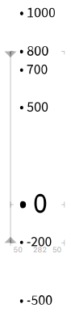
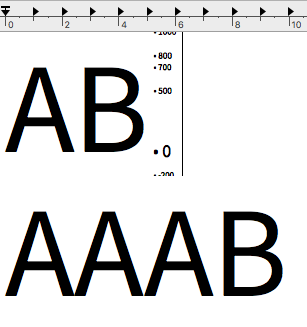
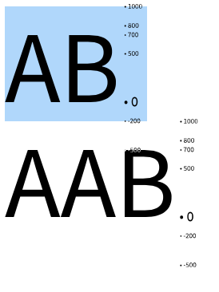
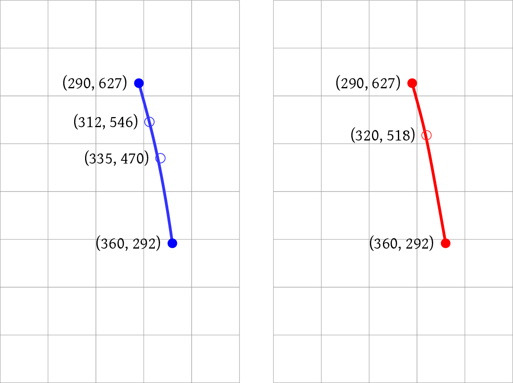
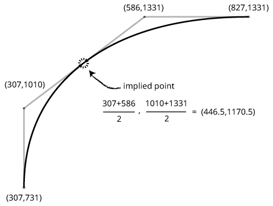
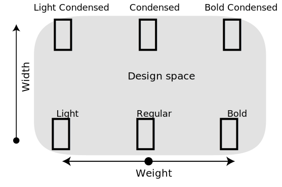
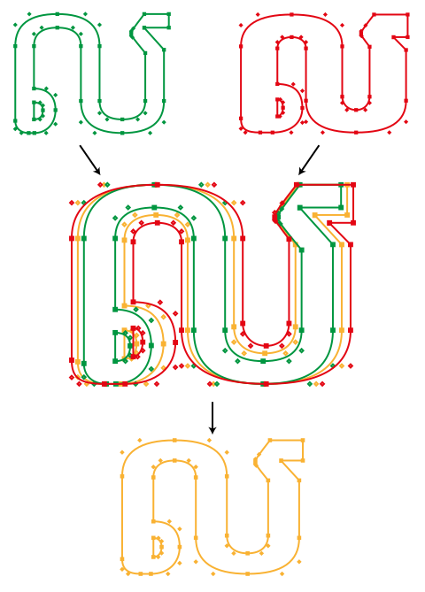
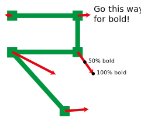
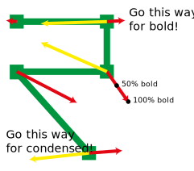

* TOC
{:toc}

They say that if you enjoy sausages, you shouldn't look too carefully into how they are made, and the same is true of OpenType fonts.

In this chapter we're going to look in some depth about the OpenType font format: how it actually converts the outlines, metrics and advanced typographic features of a font into a file that a computer can interpret. In an ideal world, this would be information that programmers of layout systems and font handling libraries would need, but implementation details that font designers could safely ignore.

But we are not in an ideal world, and as we will see when we start discussing the metrics tables, the implementation details matter for font designers too - different operating systems, browsers and applications will potentially interpret the information contained within a font file in different ways leading to different layout.

So put on your overalls, grab your bucket, and let's take a look inside the font sausage factory.

## What is a font?

From a computer's perspective, a font is a database. It's a related collection of *tables* - lists of information. Some of the information is global, in the sense that it refers to the font as a whole, and some of the information refers to individual glyphs within the font. A simplified schematic representation of a font file would look like this:

In other words, most of the information in a font is not the little black shapes that you look at; they're *easy*. The computer is much more concerned with details about how the font is formatted, the glyphs that it supports, the heights, widths and sidebearings of those glyphs, how to lay them out relative to other glyphs, and what clever things in terms of kerns, ligatures and so on need to be applied. Each of these pieces of information is stored inside a table, which is laid out in a binary (non-human-readable) representation inside your OTF file.

## FontTools and ttx

To crack open that OTF file and look at the tables inside, we're going to use a set of Python programs called `fonttools`. `fonttools` was originally written by Just van Rossum, but is now maintained by Cosimo Lupo and a cast of hundreds. If you don't have `fonttools` already installed, you can get hold of it by issuing the following commands at a command prompt:

> If you're a Mac user and you're not familiar with using a terminal emulator, pick up a copy of *Learning Unix for OS X* by Dave Taylor. If you're a Windows user, I'm afraid you're on your own; Windows has never made it particularly easy to operate the computer through the command prompt, and it's too painful to explain it here. If you're on Linux, you already know what you're doing.

    easy_install pip
    pip install fonttools

If you have the Homebrew package manager installed, which is highly recommended for developing on Mac computers, you can get `fonttools` through Homebrew:

    brew install fonttools

> Homebrew is a system which allows you to easily install and manage a number of useful free software packages on Mac OS X. You can get it from http://brew.sh/

The core of the `fonttools` package is a library, some code which helps Python programmers to write programs for manipulating font files. But `fonttools` includes a number of programs already written using the library, and one of these is called `ttx`.

As we mentioned above, an OpenType font file is a database. The database, with its various tables, is stored in a file using a format called SFNT, which stands for "spline font" or "scalable font". OpenType, TrueType, PostScript and a few other font types all use the SFNT representation to lay out their tables into a binary file. But because the SFNT representation is *binary* - that is to say, not human readable - it's not very easy for us either to investigate what's going on in the font or to make changes to it. The `ttx` utility helps us with that. It is used to turn an SFNT database into a textual representation, XML, and back again. The XML format is still designed primarily to be read by computers rather than humans, but it at least allows us to peek inside the contents of an OpenType font which would otherwise be totally opaque to us.

## Exploring OpenType with `ttx`

To begin investigating how OpenType works, I started by creating a completely empty font in Glyphs, turned off exporting all glyphs apart from the letter "A" - which has no paths - and exported it as an OpenType file. Now let's prod at it with `ttx`.

First, let's list what tables we have present in the font:

    $ ttx -l TTXTest-Regular.otf
    Listing table info for "TTXTest-Regular.otf":
        tag     checksum   length   offset
        ----  ----------  -------  -------
        CFF   0x187D42BC      292     1088
        GSUB  0x00010000       10     1380
        OS/2  0x683D6751       96      280
        cmap  0x00140127       72      984
        head  0x091C432A       54      180
        hhea  0x05E10189       36      244
        hmtx  0x044C005D        8      236
        maxp  0x00025000        6      172
        name  0x6BFD9C8F      606      376
        post  0xFFB80032       32     1056

All apart from the first two tables in our file are required in every TrueType and OpenType font. Here is what these tables are for:

|---
| | |
|-------|--------------------------|
|`OS/2`|glyph metrics used historically by OS/2 and Windows platforms|
|`cmap`|mapping between characters and glyphs|
|`head`|basic font metadata|
|`hhea`|basic information for horizontal typesetting|
|`hmtx`|horizontal metrics (width and left sidebearing) of each character|
|`maxp`|information used by for the font processor when loading the font|
|`name`|a table of "names" - textual descriptions and information about the font|
|`post`|information used when downloading fonts to PostScript printers|
|------|-----------------------------|

OpenType fonts have two distinct ways of representing glyph outline data: PostScript strings and TrueType outlines. In general, PostScript strings are used, but TrueType is also an option. (You will see a lot of this dual nature of OpenType throughout the chapter, based on the dual heritage of OpenType fonts.)

So the first table, `CFF`, is required if the outlines of the font are represented as PostScript CFF strings; a font using TrueType outlines will have a different set of tables instead (`cvt`, `fpgm`, `glyf`, `loca` and `prep`, which we will look at later).

The second table in our list, `GSUB`, is one of the more exciting ones; it's the *glyph substitution* table which, together with `GPOS` (*glyph positioning*), stores most of the OpenType smarts. We will discuss these two tables and what they can do in the next chapter.

So those are the tables in our completely empty font. Now let us examine those tables by turning the whole font into an XML document:

    $ ttx TTXTest-Regular.otf
    Dumping "TTXTest-Regular.otf" to "TTXTest-Regular.ttx"...
    Dumping 'GlyphOrder' table...
    Dumping 'head' table...
    Dumping 'hhea' table...
    Dumping 'maxp' table...
    Dumping 'OS/2' table...
    Dumping 'name' table...
    Dumping 'cmap' table...
    Dumping 'post' table...
    Dumping 'CFF ' table...
    Dumping 'GSUB' table...
    Dumping 'hmtx' table...

This produces a `ttx` file, which is the XML representation of the font, containing the tables mentioned above. But first, notice we have a new table, which did not appear in our list - `GlyphOrder`. This is not actually part of the font; it's an artefact of TTX, but it's pretty helpful. It tells us the mapping that TTX has used between the Glyph IDs in the font and some human readable names. Looking at the file we see the table as follows:

    <GlyphOrder>
      <!-- The 'id' attribute is only for humans; it is ignored when parsed. -->
      <GlyphID id="0" name=".notdef"/>
      <GlyphID id="1" name="A"/>
    </GlyphOrder>

Here we see our exported glyph `A`, and the special glyph `.notdef` which is used when the font is called upon to display a glyph that is not present. The Glyphs software provides us with a default `.notdef` which looks like this: 

The `post` and `maxp` tables are essentially *aides memoire* for the computer; they are a compilation of values automatically computed from other parts of the font, so we will skip over them. The `GSUB` table in our font is empty, so we will not deal with it here, but will return to it when we consider OpenType features.

### The `head` table

`head` is a general header table with some computed metadata and other top-level information about the font as a whole:

    <head>
      <!-- Most of this table will be recalculated by the compiler -->
      <tableVersion value="1.0"/>
      <fontRevision value="1.0"/>
      <checkSumAdjustment value="0x9fe5c40f"/>
      <magicNumber value="0x5f0f3cf5"/>
      <flags value="00000000 00000011"/>
      <unitsPerEm value="1000"/>
      <created value="Tue Sep 20 15:02:17 2016"/>
      <modified value="Tue Sep 20 15:02:17 2016"/>
      <xMin value="93"/>
      <yMin value="-200"/>
      <xMax value="410"/>
      <yMax value="800"/>
      <macStyle value="00000000 00000000"/>
      <lowestRecPPEM value="3"/>
      <fontDirectionHint value="2"/>
      <indexToLocFormat value="0"/>
      <glyphDataFormat value="0"/>
    </head>

The most interesting values here for font designers and layout programmers are `unitsPerEm` through `macStyle`.

The `unitsPerEm` value, which defines the scaling of the font to an em, must be a power of two for fonts using TrueType outlines. The most common values are 1000 for CFF fonts and 1024 for TrueType fonts; you may occasionally come across fonts with other values. (Open Sans, for instance, has an upem of 2048.)

> If you are writing a font renderer, you should not make assumptions about this value!

`created` and `modified` are mostly self-explanatory; in OpenType's binary representation they are actually stored as seconds since January 1st 1904, (Mac versions prior to OS X used this as their *epoch*, or reference point.) but `ttx` has kindly converted this to a more readable time value.

`xMin` through `yMax` represent the highest and lowest coordinates used in the font. In this case, the `.notdef` glyph - the only glyph with any outlines - stretched from -200 below the baseline to 800 units above it, has a left sidebearing of 93, and its right edge falls at X coordinate 410.

The `macStyle` value is a bit field, used, as its name implies, to determine the style of the font on Mac systems. It consists of two bytes; the one on the left is not used, and the bits in the one of the right have the following meanings:

|||
|-|----------|
|0|Bold |
|1|Italic |
|2|Underline |
|3|Outline |
|4|Shadow |
|5|Condensed |
|6|Extended |
|7|(unused) |
|-|-----------|

So a bold italic condensed font should have a `macStyle` value of `00000000 00100011` (remember that we count from the right in binary).

### Vertical metrics: `hhea` and `OS/2`

Before this next test, we will actually add some outlines to our font: a capital A and a capital B:

(Outlines taken from Paul Hunt's "Source Sans Pro".)

After exporting the new font and converting it to XML again using TTX, let's have a look at the `hhea` and `OS/2` tables. These tables are used to set the global defaults that a rendering engine needs to know when using this font in horizontal typesetting. They represent one of the more unfortunate compromises of the OpenType standard, which brought together font files from both the Windows and Mac platforms. It's a cardinal rule of data handling that you shouldn't store the same value in two different places; if you do, they are practically guaranteed to end up either going out of sync, or being used in different ways. OpenType manages to display *both* of these failure modes.

First, here's some of the `hhea` table:

    <hhea>
      ...
      <ascent value="1000"/>
      <descent value="-200"/>
      <lineGap value="0"/>
      <advanceWidthMax value="618"/>
      ...
    </hhea>

At this point let's pause and skip down to the parts of the `OS/2` table which deal with glyph metrics. Because you can't say `OS/2` in valid XML, `ttx` writes it funny:

    <OS_2>
      ...
      <fsSelection value="00000000 01000000"/>
      <sTypoAscender value="800"/>
      <sTypoDescender value="-200"/>
      <sTypoLineGap value="200"/>
      <usWinAscent value="1000"/>
      <usWinDescent value="200"/>
      <sxHeight value="500"/>
      <sCapHeight value="700"/>
      ...
    </OS_2>

Immediately you should see that the font editor (I used Glyphs to produce this font) has chosen to provide different values for things that seem to be the same: `ascent` in `hhea` is 1000, and so is `usWinAscent` in `OS/2`, but we also have `sTypoAscender` which is set to 800. `descent` and `sTypoDescender` are -200, but `usWinDescent` is 200. Most confusingly, `lineGap` in `hhea` is 0 but `sTypoLineGap` in `OS/2` is 200, but if you look into the OpenType specification, you will find that `lineGap` in `hhea` is described as "typographic line gap" and `sTypoLineGap` is described as "the typographic line gap for this font". Sounds like the same thing, doesn't it?

Finally, bit 7 of the `fsSelection` flag is set. The description of bit 7 in the OpenType standard reads "if set, it is strongly recommended to use `OS/2.sTypoAscender - OS/2.sTypoDescender + OS/2.sTypoLineGap` as a value for default line spacing for this font."

What on earth is going on?

The problem, once again, is that not only did Macintosh and Windows have their own font formats, they each had their own interpretation of how the metrics of a font should be interpreted. Things were bad enough when the only consumers of fonts were the Windows and Mac operating systems, but now word processors, page layout programs, web browsers and a wide range of other software peek into the metrics of fonts and interpret the values in their own special way.

In particular, when we are talking about global scripts with glyph proportions and line spacing that can differ significantly from Latin glyphs, the default mechanisms of font browsers for computing these values may not be ideal, and they may not provide identical results across platforms. So you may well need to play with some of these values yourself.

How are they used? To see what's going on, I made this special glyph in position `C`:

On my Mac, the TextEdit application seemed to struggle with this, sometimes clipping off the top of the `1000` and anything below the center of the `-200`, and sometimes maintaining it:

Safari, Firefox and Illustrator all do this:

(Although when I select the glyph in Illustrator, the selection extends to slightly *more* than 500 points below the baseline. I have no idea why this is.)

The `usWinAscent` and `usWinDescent` values are used for text *clipping* on Windows. In other words, any contours above 1000 or below -200 units will be clipped on Windows applications. On a Mac, the relevant values for clipping are `hhea`'s `ascender` and `descender`. Mac uses `hhea`'s `lineGap` to determine line spacing. As we can see from our Safari example, there is no gap between the lines: the first line's descender at -200 units lines up perfectly with the second line's ascender at 1000 units. Finally, the `typo` values are used by layout applications to position the first baseline of a text block and set the default line spacing.

So how should actually we set these values? Unfortunately, there is not a real consensus on the "right" way to do this - the major foundries each have their own strategies - but hopefully by being aware of what the relevant values do, you should now know what to test for and how to adjust your font's metrics where there are problems. To get you started, here is our recommended method (distilled from a discussion on [Typedrawers](http://typedrawers.com/discussion/1705)):

* The `sTypoAscender` minus the `sTypoDescender` should equal the unit square. (Usually 1000 units.)

* `sTypoLinegap` should be the default linespacing distance for your intended language environment.

* `lineGap` should be zero.

* `usWinAscent` and `usWinDescent` should be set so that no clipping occurs. If your font contains glyphs with tall, stacked accents - for instance, the Vietnamese letter LATIN CAPITAL LETTER A WITH BREVE AND HOOK ABOVE (Ẳ) - you will need to ensure that these values can accommodate the highest (and lowest) *possible* values of your shaped text. They should also be set so that they sum to *at least* the value of `sTypoAscender - sTypoDescender + sTypoLinegap`.

* `ascent` and `descent` should be set to the same values as `usWinAscent` and `usWinDescent`, remembering that `usWinDescent` is positive and `descent` is negative.

* Bit 7 of `fsSelection` should be turned on.

If you don't like this strategy, there are plenty of others to choose from. The [Glyphs web site](https://www.glyphsapp.com/tutorials/vertical-metrics) describes the strategies used by Adobe, Microsoft and web fonts; [Google fonts](https://github.com/googlefonts/gf-docs/tree/main/VerticalMetrics) has another. Karsten Lucke has a [guide](https://kltf.de/files/FontMetrics-kltf.pdf) which goes into all of this in excruciating detail but finally lands on the strategy mentioned above.

Yes, this is a complete hot mess. Sorry.

### The `hmtx` table

Let's go back onto somewhat safer ground, with the `hmtx` table, containing the horizontal metrics of the font's glyphs. As we can see in the screenshots from Glyphs above, we are expecting our /A to have an LSB of 3, an RSB of 3 and a total advance width of 580, while the /B has LSB 90, RSB 40 and advance of 618.

Mercifully, that's exactly what we see:

    <hmtx>
      <mtx name=".notdef" width="500" lsb="93"/>
      <mtx name="A" width="580" lsb="3"/>
      <mtx name="B" width="618" lsb="90"/>
    </hmtx>

There are vertical counterparts to the `hhea` and `hmtx` tables (called, unsurprisingly, `vhea` and `vmtx`), but we will discuss those when we look at implementing global typography in OpenType.

### The `name` table

Any textual data stored within a font goes in the `name` table; not just the name of the font itself, but the version, copyright, creator and many other strings are found inside a font. For our purposes, one of the loveliest things about OpenType is that these strings are localisable, in that they can be specified in multiple languages; your bold font can appear as Bold, Gras, Fett, or Grassetto depending on the user's language preference.

Unfortunately, as with the rest of OpenType, the ugliest thing is that it is a compromise between multiple font platform vendors, and all of them need to be supported in different ways. Multiple platforms times multiple languages means a proliferation of entries for the same field. So, for instance, there may be a number of entries for the font's designer: one entry for when the font is used on the Mac (platform ID 1, in OpenType speak) and one for when it is used on Windows (platform ID 3).

> There's also a platform ID 0, for the "Unicode platform", and platform ID 2, for ISO 10646. Yes, these platforms are technically identical, but politically distinct. But don't worry; nobody ever uses those anyway.

There may be further entries *for each platform* if the creator's name should appear differently in different scripts: a Middle Eastern type designer may wish their name to appear in Arabic when the font is used in an Arabic environment, or in Latin script otherwise.

Name entry records on the Mac platform are usually entered in the Latin script. While it's *in theory* possible to create string entries in other scripts, nobody really seems to do this. For the Windows platform (`platformID=3`), if you're using a script other than Latin for a name record, encode your strings in UTF-16BE, choose the appropriate [language ID](https://www.microsoft.com/typography/otspec180/name.htm) from the OpenType specification, and you should be OK.

### The `cmap` table

A font can contain whatever glyphs, in whatever encoding and order, it likes. If you want to start your font with a Tibetan letter ga (ག) as glyph ID 1, nothing is going to stop you. But for the font to work, you need to provide information about how users should access the glyphs they want to use - or in other words, how your glyph IDs map to the Unicode (or other character set) code points that their text consists of. The `cmap` table is that character map.

If a user's text has the letter `A` (Unicode code point `0x41`), which glyph in the font should be used? Here's how it looks in our dummy font:

    <cmap>
      <tableVersion version="0"/>
      <cmap_format_4 platformID="0" platEncID="3" language="0">
        <map code="0x41" name="A"/><!-- LATIN CAPITAL LETTER A -->
        <map code="0x42" name="B"/><!-- LATIN CAPITAL LETTER B -->
      </cmap_format_4>
      <cmap_format_6 platformID="1" platEncID="0" language="0">
        <map code="0x41" name="A"/>
        <map code="0x42" name="B"/>
      </cmap_format_6>
      <cmap_format_4 platformID="3" platEncID="1" language="0">
        <map code="0x41" name="A"/><!-- LATIN CAPITAL LETTER A -->
        <map code="0x42" name="B"/><!-- LATIN CAPITAL LETTER B -->
      </cmap_format_4>
    </cmap>

The `ttx` software used to generate the textual dump of the font has been overly helpful in this case - it has taken the mapping of characters to glyph *ID*s, and has then replaced the IDs by names. The `cmap` table itself just contains glyph IDs.

Looking back at the `GlyphOrder` pseudo-table that `ttx` has generated for us:

    <GlyphOrder>
      <!-- The 'id' attribute is only for humans; it is ignored when parsed. -->
      <GlyphID id="0" name=".notdef"/>
      <GlyphID id="1" name="A"/>
      <GlyphID id="2" name="B"/>
    </GlyphOrder>

We see that if the user wants Unicode codepoint `0x41`, we need to use glyph number 1 in the font. The shaping engine will use this information to turn code points in input documents into glyph IDs.

### The `CFF` table

Finally, let's look at the table which is of least interest to typography and layout software, although font designers seem to rather obsess over it: the actual glyph outlines themselves. First, we'll look at the `CFF` table which, as mentioned above, represents OpenType fonts with PostScript outlines.

What's interesting about the `CFF` table is that its representation is "alien" to OpenType. CFF is a data format borrowed wholesale from elsewhere - Adobe invented the Compact Font Format in 1996 as a "compact" (binary) way to represent its PostScript Type 1 fonts, as opposed to the longform way of representing font data in the PostScript language. It was used since PDF version 1.2 to represent font subsets within PDF documents, and later introduced into OpenType as the representation for PS outlines.

In other words, CFF is an *independent* font format. You actually have another whole font file inside your font file. This CFF font file begins with its own "public" header before it launches into the outline definitions, giving some general information about the font:

    <CFF>
      <CFFFont name="TTXTest-Regular">
        <version value="001.000"/>
        <Notice value="copyright missing"/>
        <FullName value="TTX Test Regular"/>
        <Weight value="Regular"/>
        <isFixedPitch value="0"/>
        <ItalicAngle value="0"/>
        <UnderlineThickness value="50"/>
        <PaintType value="0"/>
        <CharstringType value="2"/>
        <FontMatrix value="0.001 0 0 0.001 0 0"/>
        <FontBBox value="3 -200 578 800"/>
        <StrokeWidth value="0"/>
        <!-- charset is dumped separately as the 'GlyphOrder' element -->
        <Encoding name="StandardEncoding"/>

From an OpenType perspective, much of this is information we already know, but which has to be filled in to make this table conform to the CFF format. Font production software will generally copy this information from other parts of the font: the copyright notice and font name find their native OpenType home in the `name` table, the weight value can be found in the `OS/2` table, the bounding box information comes from the `head` table, and so on.

It's not clear if any software cares too much about the values in this header. As an experiment, I tried modifying the paint type and stroke width to attempt to create an outline font (recompiling the XML representation back into OpenType, again using `ttx`), and embedding this in a PDF document, but nothing changed.

After the public header comes a private header, which is very much used:

      <Private>
        <BlueScale value="0.037"/>
        <BlueShift value="7"/>
        <BlueFuzz value="0"/>
        <ForceBold value="0"/>
        <LanguageGroup value="0"/>
        <ExpansionFactor value="0.06"/>
        <initialRandomSeed value="0"/>
        <defaultWidthX value="0"/>
        <nominalWidthX value="0"/>
      </Private>

These mainly have to do with hinting, which we will deal with in the appropriate chapter.

Finally we get to the good stuff:

      <CharStrings>
        ...
        <CharString name="A">
          580 213 72 342 73 hstem
          3 574 vstem
          240 700 rmoveto
          -237 -700 rlineto
          91 hlineto
          67 213 rlineto
          255 hlineto
          66 -213 rlineto
          95 hlineto
          -237 700 rlineto

          -157 -415 rmoveto
          33 107 24 79 24 75 22 81 rlinecurve
          4 hlineto
          22 -81 23 -76 25 -78 34 -107 rcurveline
          endchar

The definition of the characters themselves, in the PostScript language, begins with some hinting information: the total width is 580, and there's a horizontal stem that starts at 213 and goes for 72 units to 285; (the crossbar of the A) then another which goes from 285+342=627 to 627+73=700 to represent the apex of the A. The vertical stem goes from the left side bearing (3 units) all the way across the glyph.

Then there are a series of moving and drawing operations: we `rmoveto` the left side of the apex, and draw the left outmost stroke of the A, a diagonal `rlineto` the position (3,0). (PostScript uses relative coordinates: we move left 237 units and down 700 units, so we end up at (3,0).) Now we're at the bottom left corner of the A, about to draw the horizontal line at the bottom of the left leg. PostScript has a special drawing instruction, `hlineto`, for horizontal lines, which omits the vertical coordinate, which means that `91 hlineto` takes us from (3,0) to (94,0).

We go around the outline until `-237 700` takes us back to the top *right* of the apex. (I've added a blank line here for clarity, although it would not be in the actual TTX outline.) This is almost the end of the outer outline. We haven't actually drawn the line between the top right of the apex and the top left where we started, but it turns out we don't need to. When we pick up the pen and move it somewhere else, which will be our next instruction, the outline gets closed for us.

We've just been dealing with straight lines so far, but moving us left 157 units and down 415 units places us in the middle of the counter of the A, where we start to see some curves - there are subtle flexes within the diagonals of the aperture. (You font designers are *clever* people.) `rlinecurve` specifies the relative positions of the start, first control point, second control point and end point of our cubic Bézier curve. We move across to the right a bit, have a curve that comes down, and that concludes our letter A.

### The `post` table

While we're on the subject of PostScript Type 1 representation, let's briefly look at the `post` table, which is used to assemble data for downloading fonts onto PostScript printers:

    <post>
      <formatType value="3.0"/>
      <italicAngle value="0.0"/>
      <underlinePosition value="-75"/>
      <underlineThickness value="50"/>
      <isFixedPitch value="0"/>
      <minMemType42 value="0"/>
      <maxMemType42 value="0"/>
      <minMemType1 value="0"/>
      <maxMemType1 value="0"/>
    </post>

The `post` table has been through various revisions; in previous versions, it would also include a list of glyph names, but as of version 3.0, no glyph names are provided to the PostScript processor. The final four values are hints to the driver as to how much memory this font requires to process. Setting it to zero doesn't do any harm; it just means that the driver has to work it out for itself. The italic angle is specified in degrees *counter*clockwise, so a font that leans forward 10 degrees will have an italic angle of -10. `isFixedPitch` specifies a monospaced font, and the remaining two values are irrelevant because nobody should ever use underlining for anything, am I right?

## TrueType Representation

So that was the PostScript format, which is the normal way of exporting OpenType fonts. But Glyphs allows us to output our test font with TrueType outlines, and if we do that, we see that things have changed:

    $ ttx -l TTXTest-Regular.ttf
    Listing table info for "TTXTest-Regular.ttf":
        tag     checksum   length   offset
        ----  ----------  -------  -------
        DSIG  0x00000001        8     1960
        GSUB  0x00010000       10     1948
        OS/2  0x683D6762       96      764
        cmap  0x007700CF       74      860
        cvt   0x00000000        6     1416
        fpgm  0x47A67342      479      936
        gasp  0x001A0023       16     1932
        glyf  0xABA0B11E      368      252
        head  0x09740B40       54      660
        hhea  0x062F01A9       36      728
        hmtx  0x06A200BA       12      716
        loca  0x00840118        8      652
        maxp  0x00780451       32      620
        name  0xDF876A4F      465     1424
        post  0xFFDE0057       40     1892

An OpenType font with TrueType outlines does not have a `CFF` table, but instead contains a number of other tables; two of which contain data about the glyphs themselves:

|||
|-|-|
|`glyf`|Glyph data|
|`loca`|Index to location|
|-|-|

And four which are used for hinting and rasterizing, which we will deal with in the appropriate chapter:

|||
|-|-|
|`prep`|The Control Value "pre-program"|
|`fpgm`|Font program|
|`cvt`|Data values used by the hint program|
|`gasp`|Information about how to render the font on grayscale devices|
|-|-|

The names of the first two of these hinting tables are somewhat misleading. The "font program" (`fpgm`) is run once before the font is used, in order to set up definitions and functions for hinting, whereas the "pre-program" (`prep`) actually contains the size-specific font hinting instructions and is executed every time the font changes size. Yes, this is completely brain-dead.

How are glyphs represented in TrueType outlines? The binary representation in the table is in a series of fixed-width arrays, containing instructions, relative coordinates and flags, (see the OpenType specification if you need to deal with the binary tables) but `ttx` expands them to a very friendly format for us:

    <TTGlyph name="A" xMin="3" yMin="0" xMax="577" yMax="700">
      <contour>
        <pt x="240" y="700" on="1"/>
        <pt x="340" y="700" on="1"/>
        <pt x="577" y="0" on="1"/>
        <pt x="482" y="0" on="1"/>
        <pt x="416" y="213" on="1"/>
        <pt x="161" y="213" on="1"/>
        <pt x="94" y="0" on="1"/>
        <pt x="3" y="0" on="1"/>
      </contour>
      <contour>
        <pt x="394" y="285" on="1"/>
        <pt x="360" y="392" on="1"/>
        <pt x="320" y="518" on="0"/>
        <pt x="290" y="627" on="1"/>
        <pt x="286" y="627" on="1"/>
        <pt x="258" y="527" on="0"/>
        <pt x="233" y="449" on="1"/>
        <pt x="228" y="430" on="0"/>
        <pt x="216" y="392" on="1"/>
        <pt x="183" y="285" on="1"/>
      </contour>
      <instructions><assembly>
        </assembly></instructions>
    </TTGlyph>

Here we can see the two contours of our A, as a series of on-curve and off-curve points. Remember that TrueType uses *quadratic* Bézier curves, so within our aperture we only see one off-curve point between the on-point curves. Glyphs has converted our Béziers for us:

Sometimes you might open up a `glyf` table and find something confusing:

    <TTGlyph name="C" xMin="125" yMin="-20" xMax="1231" yMax="1483">
      <contour>
        <pt x="827" y="1331" on="1"/>
        <pt x="586" y="1331" on="0"/>
        <pt x="307" y="1010" on="0"/>
        <pt x="307" y="731" on="1"/>
        ...

There are two off-curve points between the on-curves! Does this mean that we're suddenly using cubic Bézier curves in our TrueType outlines? Nope, the font is doing something clever here to save space: there is an "implied" on-curve point located half-way between the off-curves points. Software handling these curves needs to insert the implied on-curve point.

What about the `loca` table? The `glyf` table contains all contours for all the glyphs, one after another as a big long binary lump. When you're trying to find a glyph, you look up its glyph index in the `loca` table, and it'll tell you which byte of the `glyf` table you need to jump to.

## And more tables!

We've looked at all of the compulsory tables in an OpenType font; there are many other tables which can also be present. There are tables which handle vertical typesetting, and tables which allow you to position the baseline at different places for different scripts; tables which give hints on how to justify lines, or resize mathematical symbols; tables which help with hinting, and tables which contain bitmaps, vector graphics, and color font information. For more on how these tables work, it's best to read the [OpenType specification itself](https://docs.microsoft.com/en-us/typography/opentype/spec/).

In fact, why stop there? There's nothing to stop you defining your own table structure and adding it to your font; the font is just a database. If you want to add a `SHKS` table which contains the complete works of Shakespeare, you can do that; software which doesn't recognise the table will simply ignore it, so it'll still be a perfectly valid font. (Yes, I have tried this.) TTX will even happily dump it out for you, even if it doesn't know how to interpret it. The Graphite font rendering software, developed by SIL, uses this method to embed advanced features inside the fonts, such as automatic collision avoidance and word kerning (character kerning across a space boundary), in custom Graphite-specific tables.

Finally, there is one more table which we haven't mentioned, but without which nothing would work: the very first table in the font, called the Offset Table, tells the system which tables are contained in the font file and where they are located within the file. If we were to look at our dummy OpenType font file in a hex editor, we would see some familiar names at the start of the file:

    00000000: 4f54 544f 000a 0080 0003 0020 4346 4620  OTTO....... CFF
    00000010: 400e 39a4 0000 043c 0000 01de 4753 5542  @.9....<....GSUB
    00000020: 0001 0000 0000 061c 0000 000a 4f53 2f32  ............OS/2
    00000030: 683d 6762 0000 0110 0000 0060 636d 6170  h=gb.......`cmap
    00000040: 0017 0132 0000 03d0 0000 004a 6865 6164  ...2.......Jhead
    00000050: 0975 3eb0 0000 00ac 0000 0036 6868 6561  .u>........6hhea
    00000060: 062f 01a9 0000 00e4 0000 0024 686d 7478  ./.........$hmtx
    00000070: 06a2 00ba 0000 0628 0000 000c 6d61 7870  .......(....maxp

`OTTO` is a magic string to tell us this is an OpenType font. Then there is a few bytes of bookkeeping information, followed by the name of each table, a checksum of its content, its offset within the file, and its length. So here we see that the `CFF ` table lives at offset `0x0000043c` (or byte 1084) and stretches for `0x000001de` (478) bytes long.

## Font Collections

In OpenType, each instance of a font's family lives in its own file. So Robert Slimbach's Minion Pro family - available in two widths, four weights, four optical sizes, and roman and italic styles - ships as $$ 2 * 4 * 4 * 2 = 64 $$ separate `.otf` files. In many cases, some of the information contained in the font will be the same in each file - the character maps, the ligature and other substitution features, and so on.

Font collections provide a way of both sharing this common information and packaging families more conveniently to the user. Originally called TrueType Collections, a font collection is a single file (with the extension `.ttc`) containing multiple fonts. Each font within the collection has its own Offset Table, and this naturally allows it to share tables. For instance, a collection might share a `GSUB` table between family members; in this case, the `GSUB` entry in each member's Offset Table would point to the same location in the file.

A collection is, then, a bunch of TrueType fonts all welded together, with a header on top telling you where to locate the Offset Table of each font. Here's the start of Helvetica Neue:

    00000000: 7474 6366 0002 0000 0000 000b 0000 0044  ttcf...........D
    00000010: 0000 0170 0000 029c 0000 03c8 0000 04f4  ...p............

`ttcf` tells us that this is a TrueType collection, then the next four bytes tell us this is using version 2.0 of the TTC file format. After that we get the number of fonts in the collection (`0x0000000b` = 11), followed by 11 offsets: the Offset Table of the first font starts at byte 0x44 of this file, the next at 0x170, and so on.

## OpenType Font Variations

Another, more flexible way of putting multiple family members in the same file is provided by OpenType Font Variations. Announced at the ATypI conference in 2016 as part of the OpenType 1.8 specification, font variations fulfill the dream of a font whereby the end user can dynamically make the letterforms heavier or lighter, condensed or expanded, or whatever other axes of variation are provided by the font designer; in other words, not only can you choose between a regular and a bold, but the user may be able to choose any point in between - semibolds, hemi-semibolds and everything else suddenly become available. (Whether or not you believe that users really *ought* to have access to infinite variations of a font is entirely another matter.)

As with everything OpenType, variable fonts are achieved through additional tables; and as with everything OpenType, legacy compromises means that things are achieved in different ways depending on whether you're using PostScript or TrueType outlines. TrueType outlines are the easiest to understand, so we'll start with these.

But first, we have to understand interpolation and deltas. From a designer's perspective, what you do when you design a variable font doesn't really change much from an ordinary multiple master font. First, you decide on your design axes and the points on those axes that you will design; the most common axis is the weight axis - perhaps you will go from regular to bold, or you may design thin, regular and black weights and interpolate between those points. Or you may choose to work on the width axis, designing condensed, regular and extended masters. Then you draw your glyphs, and five years later you have a font.

> Italic isn't a design axis; it's usually handled separately, for two reasons: first, you don't really want people to be producing semi-italic fonts, and second, often the italic shapes of characters are quite different to the upright shapes, so it's not possible or sensible to interpolate between them. I mean, you *could*. But you probably shouldn't.

Once you have designed your masters, you can then interpolate instances in between those extremes; for instance, if we wanted to create a semibold instance of this font, (Noto Sans Khmer) we would take the regular and the bold masters and, for each point on the glyph, compute a position that lays some proportion of the way between the corresponding points on the two masters.

How does this work? In the diagram below, the green (regular) and red (bold) outlines represent our two different input masters. To form the semibold, we "take the average" of each point between the green and red, ending up with the yellow points, which is the outline of our semibold instance:

But there's another way to think about masters and interpolation. When *designing* your font, you design with two distinct masters for each axis. Each master represents an "end" of the axis - one master for the thickest and one for the thinnest; one master for the widest, and one for the narrowest, and so on. Nothing changes here. But when the font is assembled as an OpenType variation font, it only has one set of outlines as normal. The outlines in the `CFF` or `glyf` tables represent the Ur-Outline, the One True Master, essentially a "normal" or "average" form of each glyph. The *axes* (such as width or weight) are represented in terms of how we should vary the shape of the One True Master. For each point, we have a set of *deltas*. For example, the bold axis will be given as a set of vector coordinates for each point on each glyph, describing how to get from the One True Master to the bold form:

The reason for using a single master and multiple deltas is that you can then *blend* together motion along multiple design axes. Instead of having separate regular, condensed, bold, and bold condensed masters, the font is represented internally as having a single master and two sets of deltas, one which makes the font more bold and one which makes it more condensed:

Creating a semibold condensed instance of this font requires you to do some vector mathematics. If we say that "semibold" means 50% of full bold, and "condensed" is 100% of the way down the condensed axis, then for each point, we need to compute its "semibold condensed" vector. We multiply the red *weight* vector for that point by 50%, then take the product of that vector with 100% of the yellow *condensed* vector. Then we add the resulting vector to the original position of the point on the green master.

> That was a simplification, as we'll see a bit later.

So let's see how this is actually looks inside the file. We've been using Noto Sans Khmer, so let's break that open in `ttx`:

    $ ttx NotoSansKhmer-GX.ttf
    Dumping "NotoSansKhmer-GX.ttf" to "NotoSansKhmer-GX.ttx"...
    Dumping 'GlyphOrder' table...
    Dumping 'head' table...
    Dumping 'hhea' table...
    Dumping 'maxp' table...
    Dumping 'OS/2' table...
    Dumping 'hmtx' table...
    Dumping 'cmap' table...
    Dumping 'loca' table...
    Dumping 'glyf' table...
    Dumping 'name' table...
    Dumping 'post' table...
    Dumping 'GDEF' table...
    Dumping 'GPOS' table...
    Dumping 'GSUB' table...
    Dumping 'fvar' table...
    Dumping 'gvar' table...

We've got a couple more tables this time: `fvar` and `gvar`. The `fvar` table describes the design axes, their range, and where the One True Master is situated on that axis:

    <fvar>
      <Axis>
        <AxisTag>wdth</AxisTag>
        <MinValue>70.0</MinValue>
        <DefaultValue>100.0</DefaultValue>
        <MaxValue>100.0</MaxValue>
        <AxisNameID>256</AxisNameID>
      </Axis>
      <Axis>
        <AxisTag>wght</AxisTag>
        <MinValue>26.0</MinValue>
        <DefaultValue>90.0</DefaultValue>
        <MaxValue>190.0</MaxValue>
        <AxisNameID>257</AxisNameID>
      </Axis>

This font has two design axes, width and weight. (There's also a third axis in the font, a custom axis which doesn't seem to be used. So I've removed it for clarity.)

The names of the axes are localised in the `name` table so that they can be displayed to users in the appropriate language. The width axis runs from compressed=70 to regular=100, and the One True Master represents the regular width; the weight axis runs from 26 to 190, with the One True Master located at 90.

> There are two types of axes in the Font Variations specification: registered axes and custom axes. The idea behind a registered axis is that everyone should be able to use the axis in the same way. Weight and width are registered axes, because they're the kind of thing that a lot of fonts are going to use. So the specification also defines some semantics for the values on these axes, so that applications can produce an interface and user experience that is common across fonts. The width axis is defined as a percentage value of compression, with "100" representing the default font neither compressed nor expanded. The weight axis is supposed to work like CSS weights, with a standard regular master having a value of 400. (Noto is being naughty here.)

> For custom axes, where you start and end your values and where you put your default is up to you; the numbers on custom axes are dimensionless quantities that are only interpreted in relation to each other.

> In both cases, when we come to looking at the deltas, these values get normalized: -1 represents the bottom end of the axis, 1 represents the top end, and 0 represents the *default*. (not the middle!)

While the purpose of Variable Fonts is to allow the user infinite flexibility, we still want the user to have access to particular instances of the font that the designer thinks work particularly well or define a good typographic hierarchy. So the `fvar` table also includes definitions for named instances, located at specific points on the design space:

    <!-- Thin -->
    <NamedInstance subfamilyNameID="259">
      <coord axis="wdth" value="100.0"/>
      <coord axis="wght" value="26.0"/>
    </NamedInstance>

    ...

    <!-- Condensed ExtraLight -->
    <NamedInstance subfamilyNameID="269">
      <coord axis="wdth" value="79.0"/>
      <coord axis="wght" value="39.0"/>
    </NamedInstance>

Noto Sans Khmer Thin is all the way down the bottom of the weight axis, and Condensed ExtraLight is part of the way down the weight axis and almost all the way down the bottom of the width axis.

Now we come to the `gvar` table, which in a TrueType outline font, stores the deltas themselves. We've been playing with KHMER LETTER LO (ល), which goes by the glyph name "uni179B". (I'm sure you can work out why.)

    <gvar>
      <version value="1"/>
      <reserved value="0"/>
      ...
      <glyphVariations glyph="uni179B">
        <tuple>
          <coord axis="wdth" value="-1.0"/>
          <delta pt="0" x="-141" y="-9"/>
          <delta pt="1" x="-141" y="0"/>
          ...
        </tuple>
        <tuple>
          <coord axis="wght" value="-1.0"/>
          <delta pt="0" x="-53" y="7"/>
          <delta pt="1" x="-53" y="0"/>
          ...
        </tuple>

Here are the full deltas for the bottom end of the width axis (completely condensed) and the bottom end of the weight axis (thin). To create a thin version of the letter LO, start with the regular version, and move the first point left 53 units and up 7 units. To create a condensed version, move the first point down 9 units.

If you read on to the next few tuples, you will discover that our initial explanation of deltas was a little bit of a simplification, in a number of ways. First, rather than a single delta for weight, you may have find that a font gets thinner or bolder at different rates. So the delta above tells you how to make the font thin, but making the font bold is not just a matter of inverting the delta. One delta is used to travel from the regular into the light direction, but there's a separate delta used for travelling from the default in the boldness direction:

      <tuple>
        <coord axis="wght" value="1.0"/>
        <delta pt="0" x="74" y="-5"/>
        <delta pt="1" x="74" y="0"/>
        ...
      </tuple>

As well as that, creating a bold condensed font is not simply a matter of blindly multiplying a bold weight delta with a condensed width delta; you may have design-specific adjustments which need to happen when your font is both bold and condensed. This can be represented as another vector: "go this way for both bold and condensed":

     <tuple>
        <coord axis="wdth" value="-1.0"/>
        <coord axis="wght" value="1.0"/>
        <delta pt="0" x="-17" y="13"/>
        <delta pt="1" x="-17" y="0"/>
        ...
      </tuple>
    </glyphVariations>

In other words, you have a variety of deltas, and each delta is associated with a position in the design space. When the instances are generated, each set of deltas is given a weight representing how useful it is in getting to the point in design space you're aiming at. So if you want a semibold instance, deltas which make the font lighter are no use at all, so have their weight set to zero. If you want a semibold condensed, deltas which make the font bold, condensed and both bold and condensed at the same time will all be taken into account in varying proportions according to their usefulness. The vectors multiplied by their weights, and applied to the default point, and it all works out in the end.

> Another simplification I've made is that your glyphs may change shape completely as they pass particular thresholds: when a dollar sign ($) goes from regular to bold, it sometimes loses the line through the middle of the curve, opting for just protrusions at the top and bottom. Variable fonts lets you flip over to another glyph after a particular threshold on the axis, but I'm not going to go into that.

> If you actually need to implement variable fonts, print out the [font variations overview](https://www.microsoft.com/typography/otspec/otvaroverview.htm) and sit down with it over a cup of coffee. It's not too hard to understand.

We've looked at TrueType outlines; what about PostScript outlines? Well, the old CFF font format didn't have support for deltas and variations, so a new format was needed. CFF2 introduces new operators `blend` and `vsindex` to handle deltas. (There are a number of other changes between CFF and CFF2, but we are not going to go into them here.)

The `blend` operator tells the renderer to apply a variation across multiple axes. The following example is taken from the [CFF2 CharString Format specification](https://docs.microsoft.com/en-us/typography/opentype/spec/cff2charstr). Imagine you have an outline which starts at co-ordinate (100,200) in the One True Master, but which starts at the following co-ordinates in the other masters:

|---|
| Master | Co-ordinate | Delta |
|-------|----:|----:|
| Regular | (100,200) | |
| Light | (100,150) | (0,-50) |
| Bold | (100,300) | (0, +100) |
| Condensed | (50,100) | (-50,-100) |

Let's also imagine we want to find the bold condensed instance of this font.

In a non-variable font, we would start the CFF program with:

    100 200 rmoveto

But we want instead want to *compute* the appropriate co-ordinate to move to, based on the deltas. So the program is written using the `blend` operator like so:

    (One True Master) (X deltas) (Y deltas) (num of operands) blend (command)

In this case:

    (100 200) (0 0 -50) (-50 100 -100) 2 blend rmoveto

(I've added parentheses so you can see how the arguments are grouped, but in the font program it would just appear as `100 200 0 0 -50 ...`)

When this font program is executed by the PostScript implementation, the `blend` command runs first, before the `rmoveto` command. `blend` applies the bold (second) and condensed (third) deltas to the One True Master outline, does the computation leaving behind two operands to the next command, and then disappears off the stack. What we then have left to execute is:

    (100+0-50) (200+100-100) rmoveto

i.e.

    50 200 rmoveto

which puts us in the right place for the bold condensed instance.
